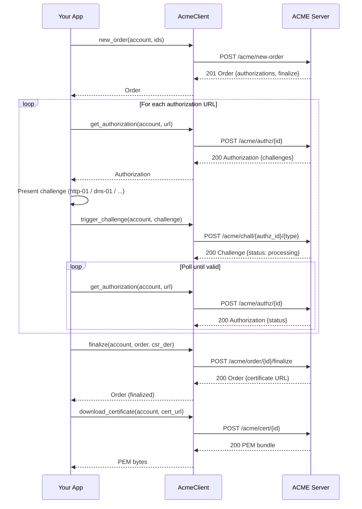

# akamu-client — ACME Client Library

`akamu-client` is an async Rust library that implements the full RFC 8555 ACME client lifecycle. It targets applications that need to obtain and renew certificates programmatically without shelling out to certbot or acme.sh.

## Overview

The library covers:

- ACME directory discovery and nonce management (automatic)
- Account registration with optional External Account Binding (EAB)
- Account deactivation
- Order creation, authorization retrieval, challenge triggering, and status polling
- CSR construction (`build_csr`)
- Order finalization and certificate download
- Built-in http-01 challenge solver (`Http01Solver`)
- DNS challenge helpers (`Dns01Helper`, `DnsPersist01Helper`)
- A `ChallengeSolver` trait for custom solvers

Dependencies: `tokio`, `hyper`, `akamu-jose`. No database or server dependencies.

## End-to-end example: P-256 key, http-01 challenge

```rust
use akamu_client::{
    AccountKey, AccountOptions, AcmeClient,
    Http01Solver, Identifier, build_csr,
};
use std::time::Duration;

#[tokio::main]
async fn main() -> Result<(), Box<dyn std::error::Error>> {
    // 1. Account key
    let key = AccountKey::generate("ec:P-256")?;

    // 2. Connect to the ACME server
    let client = AcmeClient::new("https://acme.example.com/acme/directory").await?;

    // 3. Register an account
    let opts = AccountOptions {
        contacts: vec!["mailto:ops@example.com".to_string()],
        agree_tos: true,
        eab: None,
    };
    let account = client.new_account(&key, opts).await?;

    // 4. Place an order
    let ids = vec![Identifier::Dns("example.com".to_string())];
    let order = client.new_order(&account, ids).await?;

    // 5. Solve each authorization
    let solver = Http01Solver::new(80);
    solver.start().await?;

    for authz_url in &order.authorizations {
        let authz = client.get_authorization(&account, authz_url).await?;
        let challenge = authz
            .challenges
            .into_iter()
            .find(|c| c.challenge_type == "http-01")
            .expect("http-01 challenge not offered");

        // Present the key authorization
        let key_auth = account.key_authorization(&challenge.token);
        solver.present(&challenge.token, &key_auth).await?;

        // Signal readiness
        client.trigger_challenge(&account, &challenge).await?;

        // Wait for validation
        loop {
            tokio::time::sleep(Duration::from_secs(2)).await;
            let updated = client.get_authorization(&account, authz_url).await?;
            if updated.status == "valid" { break; }
            if updated.status == "invalid" {
                return Err("authorization failed".into());
            }
        }
        solver.cleanup(&challenge.token).await?;
    }

    // 6. Finalize
    let cert_key = AccountKey::generate("ec:P-256")?;
    let csr_der = build_csr(&["example.com"], &cert_key)?;
    let finalized = client.finalize(&account, &order, &csr_der).await?;

    // 7. Download
    let pem = client.download_certificate(&account, &finalized.certificate.unwrap()).await?;
    std::fs::write("cert.pem", &pem)?;
    println!("Certificate written to cert.pem");
    Ok(())
}
```

## AccountKey

`AccountKey` holds the ACME account private key. It wraps a `BackendPrivateKey` from `synta-certificate`.

### Generating a key

```rust
let key = AccountKey::generate("ec:P-256")?;   // or "rsa:2048", "ed25519", "ml-dsa-65", ...
```

Supported key types: `ec:P-256`, `ec:P-384`, `ec:P-521`, `rsa:2048`, `rsa:3072`, `rsa:4096`, `ed25519`, `ed448`, `ml-dsa-44`, `ml-dsa-65`, `ml-dsa-87`.

### Saving and loading

```rust
let pem = key.to_pem()?;
std::fs::write("account.key", &pem)?;

let loaded = AccountKey::from_pem(&pem)?;
```

### Thumbprint and key authorization

```rust
let thumb = key.thumbprint()?;                       // base64url SHA-256 of JWK
let key_auth = key.key_authorization("some-token");  // "<token>.<thumb>"
```

### JWS algorithm

```rust
let alg = key.alg();   // "ES256", "EdDSA", "ML-DSA-65", etc.
```

## AcmeClient

### Directory discovery

`AcmeClient::new` fetches the ACME directory and caches the endpoint URLs. It stores the nonce from the new-nonce endpoint and refreshes it automatically after each POST.

```rust
let client = AcmeClient::new("https://acme.example.com/acme/directory").await?;
```

### Nonce management

Nonces are managed automatically. Each `POST` consumes the current nonce and fetches a fresh one. You do not need to call any nonce-related method directly.

### Account registration

```rust
let opts = AccountOptions {
    contacts: vec!["mailto:admin@example.com".to_string()],
    agree_tos: true,
    eab: None,
};
let account = client.new_account(&key, opts).await?;
```

The returned `Account` contains:

- `account.url` — the account URL (a.k.a. kid), used in subsequent requests
- `account.status` — `"valid"`, `"deactivated"`, or `"revoked"`
- `account.contacts` — the contact URIs registered

## External Account Binding (EAB)

Some ACME servers require EAB before accepting new accounts. EAB proves that the account request is authorized by an out-of-band credential.

Pass an `EabOptions` inside `AccountOptions`:

```rust
use akamu_client::{AccountOptions, EabOptions};

let eab_key_bytes = base64::decode_url_safe_no_pad("your-hmac-key-in-base64url")?;

let opts = AccountOptions {
    contacts: vec!["mailto:admin@example.com".to_string()],
    agree_tos: true,
    eab: Some(EabOptions {
        kid: "eab-key-id-from-your-ca".to_string(),
        hmac_key: &eab_key_bytes,   // raw bytes, NOT base64
        alg: "HS256".to_string(),   // HS256, HS384, or HS512
    }),
};
let account = client.new_account(&key, opts).await?;
```

The library builds the EAB JWS internally, signs it with the HMAC key, and embeds it in the new-account request as `externalAccountBinding`.

## Account deactivation

```rust
client.deactivate_account(&account).await?;
```

After deactivation the account status becomes `"deactivated"`. The server will reject all future requests signed with that account key.

## Order lifecycle



### new_order

```rust
let ids = vec![
    Identifier::Dns("example.com".to_string()),
    Identifier::Dns("www.example.com".to_string()),
];
let order = client.new_order(&account, ids).await?;
// order.authorizations — Vec<String> of authz URLs
// order.finalize       — finalize URL
// order.status         — "pending"
```

### get_authorization

```rust
let authz = client.get_authorization(&account, &authz_url).await?;
// authz.identifier   — Identifier
// authz.status       — "pending", "valid", "invalid", ...
// authz.challenges   — Vec<Challenge>
```

### trigger_challenge

```rust
client.trigger_challenge(&account, &challenge).await?;
```

Sends an empty POST to the challenge URL signaling that the client is ready. The server begins validation asynchronously.

### poll_order

```rust
let order = client.poll_order(&account, &order_url).await?;
```

Fetches the current order status. Poll until `order.status` is `"ready"` or `"valid"`, or fail on `"invalid"`.

### finalize

```rust
let csr_der = build_csr(&["example.com", "www.example.com"], &cert_key)?;
let finalized = client.finalize(&account, &order, &csr_der).await?;
```

Submits the CSR. Returns the updated order which, when the server is done, contains a `certificate` URL.

### download_certificate

```rust
let pem = client.download_certificate(&account, &cert_url).await?;
// pem is a Vec<u8> containing a PEM bundle (leaf + intermediates)
```

## ChallengeSolver trait

Implement this trait to provide a custom challenge solver (for example, a DNS-01 solver that calls your registrar's API):

```rust
#[async_trait]
pub trait ChallengeSolver: Send + Sync {
    async fn present(&self, token: &str, key_auth: &str) -> Result<(), ClientError>;
    async fn cleanup(&self, token: &str) -> Result<(), ClientError>;
}
```

`present` is called before `trigger_challenge`. `cleanup` is called after the authorization reaches a terminal state.

## Http01Solver

The built-in http-01 solver starts a small HTTP server that serves key authorization values at `/.well-known/acme-challenge/<token>`.

```rust
let solver = Http01Solver::new(80);  // listen port
solver.start().await?;               // spawns a background task
```

Port 80 requires elevated privileges on most Linux systems. Either run as root, use `CAP_NET_BIND_SERVICE`, or configure an iptables redirect from port 80 to a high port.

`Http01Solver` implements `ChallengeSolver`. Call `present` before triggering and `cleanup` after validation completes.

## DNS helpers

### Dns01Helper

Computes the TXT record value for dns-01. Does not modify DNS — you must add and remove the record yourself.

```rust
use akamu_client::Dns01Helper;

let txt = Dns01Helper::txt_value(&key_auth);
// Add TXT record: _acme-challenge.example.com  TXT  <txt>
```

### DnsPersist01Helper

Same computation, for the dns-persist-01 challenge variant:

```rust
use akamu_client::DnsPersist01Helper;

let txt = DnsPersist01Helper::txt_value(&key_auth);
```

## build_csr

Generates a PKCS#10 CSR in DER format. The first element of the domains slice becomes the CN; all elements become Subject Alternative Names.

```rust
let csr_der = build_csr(&["example.com", "www.example.com"], &cert_key)?;
```

Wildcard domains are supported: pass `"*.example.com"`. The CSR key type is independent of the account key type.

## ClientError

```rust
pub enum ClientError {
    Jose(JoseError),          // JWK/JWS error from akamu-jose
    Http(String),             // HTTP transport error (hyper)
    Acme { acme_type: String, detail: String },  // server returned problem+json
    Crypto(String),           // key generation or CSR error
    Io(String),               // I/O error
}
```

Handle `Acme` errors by inspecting `acme_type`:

```rust
match err {
    ClientError::Acme { acme_type, detail } => {
        eprintln!("ACME error {acme_type}: {detail}");
        // acme_type examples:
        //   "urn:ietf:params:acme:error:badNonce"
        //   "urn:ietf:params:acme:error:unauthorized"
        //   "urn:ietf:params:acme:error:incorrectResponse"
    }
    _ => eprintln!("Other error: {err}"),
}
```
