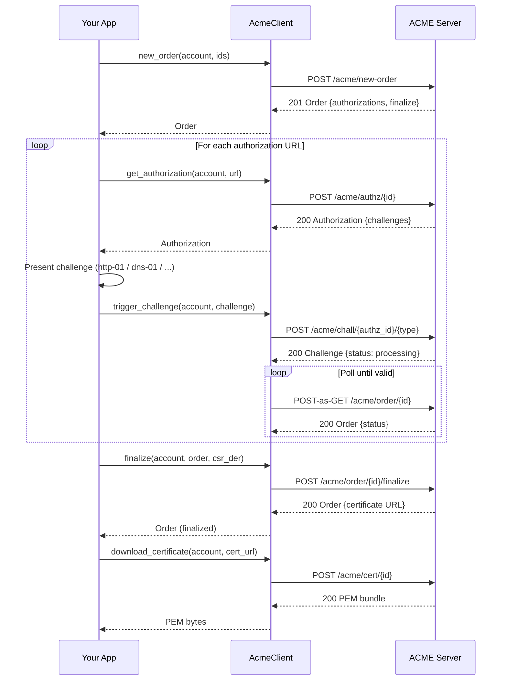

# akamu-client — ACME Client Library

`akamu-client` is an async Rust library that implements the full RFC 8555 ACME client lifecycle. It targets applications that need to obtain and renew certificates programmatically without shelling out to certbot or acme.sh.

## Overview

The library covers:

- ACME directory discovery and nonce management (automatic, with nonce recycling)
- Account registration with optional External Account Binding (EAB)
- Account lookup (`find_account`), state retrieval (`get_account`), contact updates (`update_account`)
- Account key rollover (`key_change`, RFC 8555 §7.3.5)
- Account deactivation
- Order creation, authorization retrieval, challenge triggering, and status polling
- CSR construction (`build_csr`)
- Order finalization and certificate download
- Certificate revocation via account key or certificate's own key (RFC 8555 §7.6)
- ARI renewal window query (`get_renewal_info`, RFC 9773)
- Built-in http-01 challenge solver (`Http01Solver`)
- Built-in tls-alpn-01 challenge solver (`TlsAlpn01Solver`, RFC 8737)
- DNS challenge helpers (`Dns01Helper`, `DnsPersist01Helper`)
- onion-csr-01 CSR builder (`build_onion_csr`, RFC 9799)
- A `ChallengeSolver` trait for custom solvers

Dependencies: `tokio`, `hyper-rustls` (TLS enabled by default), `akamu-jose`. No database or server dependencies.

## End-to-end example: P-256 key, http-01 challenge

```rust
use akamu_client::{
    AccountKey, AccountOptions, AcmeClient,
    Http01Solver, Identifier, build_csr, ChallengeSolver as _,
};
use std::sync::Arc;

#[tokio::main]
async fn main() -> Result<(), Box<dyn std::error::Error>> {
    // 1. Account key
    let key = Arc::new(AccountKey::generate("ec:P-256")?);

    // 2. Connect to the ACME server (HTTPS by default)
    let client = AcmeClient::new("https://acme.example.com/acme/directory").await?;

    // 3. Register an account
    let opts = AccountOptions {
        contacts: &["mailto:ops@example.com"],
        agree_tos: true,
        eab: None,
    };
    let account = client.new_account(Arc::clone(&key), &opts).await?;

    // 4. Place an order
    let ids = vec![Identifier::dns("example.com")];
    let order = client.new_order(&account, &ids).await?;

    // 5. Solve each authorization
    let solver = Http01Solver::new(80);
    solver.start().await?;

    for authz_url in &order.authorizations {
        let authz = client.get_authorization(&account, authz_url).await?;
        if authz.status == "valid" { continue; }

        let challenge = authz.find_challenge("http-01")
            .expect("http-01 challenge not offered");

        let token = challenge.token.as_deref().expect("challenge has no token");
        let key_auth = account.key_authorization(token);
        solver.present(token, &key_auth).await?;

        client.trigger_challenge(&account, challenge).await?;
        let _order = client.poll_order(&account, &order.url).await?;

        solver.cleanup(token).await?;
    }

    // 6. Finalize
    let cert_key = AccountKey::generate("ec:P-256")?;
    let csr_der = build_csr(&["example.com"], cert_key.private_key())?;
    let finalized = client.finalize(&account, &order, &csr_der).await?;

    // 7. Download
    let cert_url = finalized.certificate.expect("order has no certificate URL");
    let pem = client.download_certificate(&account, &cert_url).await?;
    std::fs::write("cert.pem", &pem)?;
    println!("Certificate written to cert.pem");
    Ok(())
}
```

## AccountKey

`AccountKey` holds the ACME account private key. It wraps a `BackendPrivateKey` from `synta-certificate`.

### Generating a key

```rust
let key = AccountKey::generate("ec:P-256")?;   // or "rsa:2048", "ed25519", "ml-dsa-65", ...
```

Supported key types: `ec:P-256`, `ec:P-384`, `ec:P-521`, `rsa:2048`, `rsa:3072`, `rsa:4096`, `ed25519`, `ed448`, `ml-dsa-44`, `ml-dsa-65`, `ml-dsa-87`.

### Saving and loading

```rust
let pem = key.to_pem()?;
std::fs::write("account.key", &pem)?;

let loaded = AccountKey::from_pem(&pem)?;
```

### Thumbprint and key authorization

```rust
let thumb = key.thumbprint();                        // base64url SHA-256 of JWK (no fallible call needed)
let key_auth = key.key_authorization("some-token");  // "<token>.<thumb>"
```

### JWS algorithm

```rust
let alg = key.alg();   // "ES256", "EdDSA", "ML-DSA-65", etc.
```

## AcmeClient

### Directory discovery

`AcmeClient::new` fetches the ACME directory over HTTPS and caches the endpoint URLs. Nonces are recycled from `Replay-Nonce` response headers; `HEAD /new-nonce` is only called on a cache miss.

```rust
let client = AcmeClient::new("https://acme.example.com/acme/directory").await?;
```

The client also transparently retries any request that receives a `badNonce` error exactly once.

### Account registration

```rust
use std::sync::Arc;

let key = Arc::new(AccountKey::generate("ec:P-256")?);
let opts = AccountOptions {
    contacts: &["mailto:admin@example.com"],
    agree_tos: true,
    eab: None,
};
let account = client.new_account(Arc::clone(&key), &opts).await?;
```

The returned `Account` contains:

- `account.url` — the account URL (a.k.a. kid), used in subsequent requests
- `account.status` — `"valid"`, `"deactivated"`, or `"revoked"`
- `account.contacts` — the contact URIs registered

### Finding an existing account

POST to `/new-account` with `onlyReturnExisting: true` (RFC 8555 §7.3.1). Fails with `accountDoesNotExist` if no account is registered for the key.

```rust
let account = client.find_account(Arc::clone(&key)).await?;
```

### Fetching current account state

POST-as-GET to the account URL (RFC 8555 §7.3.2). Returns a fresh `Account` reflecting the server's current view.

```rust
let account = client.get_account(&account).await?;
println!("{} {:?}", account.status, account.contacts);
```

### Updating account contacts

```rust
let updated = client.update_account(
    &account,
    &["mailto:new@example.com", "mailto:ops@example.com"],
).await?;
```

Pass an empty slice to clear all contacts.

### Account key rollover (RFC 8555 §7.3.5)

Replaces the account key on the server with a new key. After this call the old `account` is no longer valid; use the returned `Account`, which holds the new key.

```rust
let new_key = Arc::new(AccountKey::generate("ec:P-384")?);
let updated = client.key_change(&account, Arc::clone(&new_key)).await?;
// updated.key is now new_key; old account key is rejected by the server
```

### Account deactivation

```rust
client.deactivate_account(&account).await?;
```

After deactivation the account status becomes `"deactivated"`. The server will reject all future requests signed with that account key.

## External Account Binding (EAB)

Some ACME servers require EAB before accepting new accounts. EAB proves that the account request is authorized by an out-of-band credential.

Pass an `EabOptions` inside `AccountOptions`:

```rust
use akamu_client::{AccountOptions, EabOptions};

let eab_key_bytes: Vec<u8> = /* base64url-decode your HMAC key here */ vec![];

let opts = AccountOptions {
    contacts: &["mailto:admin@example.com"],
    agree_tos: true,
    eab: Some(EabOptions {
        kid: "eab-key-id-from-your-ca",
        hmac_key: &eab_key_bytes,  // raw bytes, NOT base64
        alg: "HS256",              // "HS256", "HS384", or "HS512"
    }),
};
let account = client.new_account(Arc::clone(&key), &opts).await?;
```

The library builds the EAB JWS internally, signs it with the HMAC key, and embeds it in the new-account request as `externalAccountBinding`.

## Order lifecycle



### new_order

```rust
let ids = vec![
    Identifier::dns("example.com"),
    Identifier::dns("www.example.com"),
    Identifier::ip("192.0.2.1"),          // RFC 8555 ip-type identifier
    Identifier::onion("foo.onion"),        // RFC 9799 onion identifier
];
let order = client.new_order(&account, &ids).await?;
// order.authorizations — Vec<String> of authz URLs
// order.finalize       — finalize URL
// order.status         — "pending"
```

### get_authorization

```rust
let authz = client.get_authorization(&account, &authz_url).await?;
// authz.identifier   — Identifier { type, value }
// authz.status       — "pending", "valid", "invalid", ...
// authz.challenges   — Vec<Challenge>

// Convenience method to find a challenge by type:
let chall = authz.find_challenge("http-01").expect("no http-01 challenge offered");
```

### trigger_challenge

```rust
client.trigger_challenge(&account, &challenge).await?;
```

Sends an empty-body POST (`{}`) to the challenge URL, signaling that the client is ready. The server begins validation asynchronously.

### trigger_challenge_onion (RFC 9799)

For onion-csr-01 challenges, use this instead of `trigger_challenge`. It posts a `{"csr": "<base64url>"}` payload:

```rust
let csr_der = akamu_client::build_onion_csr(&domain, &key_auth, &hs_key_pem)?;
client.trigger_challenge_onion(&account, &challenge.url, &csr_der).await?;
```

### poll_order

```rust
let order = client.poll_order(&account, &order.url).await?;
```

Polls with exponential backoff until `order.status` is `"ready"` or `"valid"`. Respects the `Retry-After` header from the server. The internal deadline is 30 seconds; wrap with `tokio::time::timeout` for longer limits.

### finalize

```rust
let csr_der = build_csr(&["example.com", "www.example.com"], cert_key.private_key())?;
let finalized = client.finalize(&account, &order, &csr_der).await?;
```

Submits the CSR. Returns the updated order which, when the server is done, contains a `certificate` URL.

### download_certificate

```rust
let pem = client.download_certificate(&account, &cert_url).await?;
// pem is a Vec<u8> containing a PEM bundle (leaf + intermediates)
```

## Certificate revocation (RFC 8555 §7.6)

### Via account key

```rust
use akamu_client::pem_to_der;

let cert_pem = std::fs::read("cert.pem")?;
let cert_der = pem_to_der(&cert_pem).into_iter().next()
    .expect("no certificate in PEM");

// reason: None = unspecified; Some(0..=10, not 7) = CRL reason code
client.revoke_certificate(&account, &cert_der, None).await?;
```

### Via certificate's own private key (self-revocation)

Use this when the account key is unavailable but the certificate's private key is known.

```rust
let cert_key = Arc::new(AccountKey::from_pem(&std::fs::read("cert.key.pem")?)?);
client.revoke_certificate_with_cert_key(&cert_key, &cert_der, Some(1)).await?;
```

## ARI renewal information (RFC 9773)

```rust
let cert_pem = std::fs::read("cert.pem")?;
let info = client.get_renewal_info(&cert_pem).await?;
// info.window_start  — RFC 3339 string (start of suggested renewal window)
// info.window_end    — RFC 3339 string
// info.retry_after_secs — Option<u64> from Retry-After header
println!("Renew between {} and {}", info.window_start, info.window_end);
```

Returns `Err` if the server does not advertise a `renewalInfo` endpoint.

## STAR order API (RFC 8739)

ACME STAR (Short-Term, Automatically Renewed) orders let a client place a single order and receive a continuous stream of short-lived certificates without repeating domain validation. Use `StarOrderParams` to describe the order and `AcmeClient::new_star_order()` to place it.

### Placing a STAR order

```rust
use akamu_client::{StarOrderParams, Identifier};

let params = StarOrderParams {
    identifiers: &[Identifier::dns("example.com")],
    end_date: "2026-12-31T00:00:00Z",   // RFC 3339
    lifetime_secs: 86400,               // each cert is valid for 1 day
    start_date: None,                   // start when order becomes ready
    lifetime_adjust_secs: 0,            // no clock-skew pre-dating
    allow_certificate_get: true,        // allow unauthenticated rolling GET
};

let star_order = client.new_star_order(&account, &params).await?;
// star_order.status         — "pending"
// star_order.authorizations — authz URLs to solve, same as a regular order
// star_order.finalize       — finalize URL
```

After placing the order, solve the authorizations and finalize using the standard `get_authorization`, `trigger_challenge`, and `finalize` calls. The server then automatically reissues a new certificate before each one expires.

### `StarOrderParams` fields

| Field | Required | Description |
|-------|----------|-------------|
| `identifiers` | Yes | Identifiers to certify. |
| `end_date` | Yes | RFC 3339 timestamp; the last certificate's `notBefore` must not exceed this. |
| `lifetime_secs` | Yes | Validity period of each automatically issued certificate, in seconds. |
| `start_date` | No | RFC 3339 timestamp for the earliest `notBefore` of the first certificate. Defaults to when the order becomes ready. |
| `lifetime_adjust_secs` | No | Pre-dates each certificate's `notBefore` by this many seconds to create an overlap window (RFC 8739 §3.1.1). Default: `0`. |
| `allow_certificate_get` | No | When `true`, the rolling certificate URL can be fetched without authentication. |

### Downloading the rolling certificate

After finalization `star_order.star_certificate` contains the rolling URL. Download it either with an authenticated POST-as-GET or (when `allow_certificate_get` was requested) an unauthenticated GET:

```rust
// Authenticated download (always works):
let pem = client.download_star_certificate(&account, &star_cert_url).await?;

// Unauthenticated GET (only when allow_certificate_get was true):
let pem = client.get_star_certificate(&star_cert_url).await?;
```

Both methods return the current PEM certificate chain.

### Canceling a STAR order

```rust
client.cancel_star_order(&account, &star_order.url).await?;
```

After cancellation the rolling certificate URL returns HTTP 403 (`autoRenewalCanceled`). The currently active short-lived certificate remains usable until it expires.

## Identifier constructors

```rust
Identifier::dns("example.com")       // {"type":"dns","value":"example.com"}
Identifier::dns("*.example.com")     // wildcard (dns-01 only)
Identifier::ip("192.0.2.1")          // RFC 8555 §7.1.4 ip-type
Identifier::ip("2001:db8::1")        // IPv6
Identifier::onion("foo.onion")       // RFC 9799 Tor hidden service
```

## ChallengeSolver trait

Implement this trait to provide a custom challenge solver (for example, a DNS-01 solver that calls your registrar's API):

```rust
pub trait ChallengeSolver: Send + Sync {
    fn present(
        &self,
        token: &str,
        key_auth: &str,
    ) -> std::pin::Pin<Box<dyn std::future::Future<Output = Result<(), ClientError>> + Send + '_>>;

    fn cleanup(
        &self,
        token: &str,
    ) -> std::pin::Pin<Box<dyn std::future::Future<Output = Result<(), ClientError>> + Send + '_>>;
}
```

`present` is called before `trigger_challenge`. `cleanup` is called after the authorization reaches a terminal state.

## Http01Solver

The built-in http-01 solver starts a small HTTP server that serves key authorization values at `/.well-known/acme-challenge/<token>`.

```rust
let solver = Http01Solver::new(80);  // listen port
solver.start().await?;               // spawns a background task
```

Port 80 requires elevated privileges on most Linux systems. Either run as root, use `CAP_NET_BIND_SERVICE`, or configure an iptables redirect from port 80 to a high port.

`Http01Solver` implements `ChallengeSolver`. Call `present` before triggering and `cleanup` after validation completes.

## TlsAlpn01Solver (RFC 8737)

Serves ephemeral ACME challenge certificates over TLS for tls-alpn-01. The solver binds port 443 (or another port), responds to SNI lookups from the ACME server, and completes the TLS handshake with ALPN `acme-tls/1`.

```rust
use akamu_client::TlsAlpn01Solver;

let mut solver = TlsAlpn01Solver::new(443);
solver.start().await?;

// For each authorization:
let key_auth = account.key_authorization(token);
solver.present(
    &authz.identifier.value,  // domain or IP string
    &authz.identifier.r#type, // "dns" or "ip"
    &key_auth,
).await?;

client.trigger_challenge(&account, &challenge).await?;
client.poll_order(&account, &order.url).await?;

// When done with all authorizations:
solver.cleanup();  // note: not async, takes &mut self
```

- `new(port)` — creates the solver; does not bind yet.
- `start()` — binds the port and spawns the TLS accept loop.
- `present(domain, id_type, key_auth)` — generates an ephemeral P-256 certificate with the `id-pe-acmeIdentifier` extension and registers it for SNI lookup.
- `cleanup()` — aborts the background listener.

tls-alpn-01 cannot validate wildcard identifiers (RFC 8737 §3).

## DNS helpers

### Dns01Helper

Computes the TXT record value for dns-01. Does not modify DNS — you must add and remove the record yourself.

```rust
use akamu_client::Dns01Helper;

let txt = Dns01Helper::txt_value(&key_auth)?;
// Add TXT record: _acme-challenge.example.com  TXT  <txt>
// After validation completes, remove the record.
```

### DnsPersist01Helper

Same computation for the dns-persist-01 challenge variant. The record name is `_validation-persist.<domain>` and it is long-lived (set once per account key):

```rust
use akamu_client::DnsPersist01Helper;

let txt = DnsPersist01Helper::txt_value(&key_auth)?;
// Add TXT record: _validation-persist.example.com  TXT  <txt>
```

## build_onion_csr (RFC 9799)

Builds a DER-encoded CSR for an onion-csr-01 challenge. The CSR carries the `cabf-onion-csr-nonce` extension (OID 2.23.140.41) containing the key authorization as a DER UTF8String, and is signed by the hidden-service Ed25519 private key.

```rust
use akamu_client::build_onion_csr;

let hs_key_pem = std::fs::read("hs_ed25519_secret_key.pem")?;
let csr_der = build_onion_csr(
    "example.onion",   // .onion domain
    &key_auth,         // token.thumbprint
    &hs_key_pem,       // Ed25519 hidden-service private key (PEM)
)?;
client.trigger_challenge_onion(&account, &challenge.url, &csr_der).await?;
```

## build_csr

Generates a PKCS#10 CSR in DER format. The first element of the domains slice becomes the CN; all elements become Subject Alternative Names.

```rust
let cert_key = AccountKey::generate("ec:P-256")?;
let csr_der = build_csr(&["example.com", "www.example.com"], cert_key.private_key())?;
```

Wildcard domains are supported: pass `"*.example.com"`. The CSR key type is independent of the account key type.

## pem_to_der

Re-exported from `synta_certificate` for convenience. Decodes all PEM blocks in a byte slice to DER:

```rust
use akamu_client::pem_to_der;

let cert_pem = std::fs::read("cert.pem")?;
let ders: Vec<Vec<u8>> = pem_to_der(&cert_pem);
let cert_der = ders.into_iter().next().expect("no certificate");
```

## ClientError

```rust
pub enum ClientError {
    Jose(JoseError),          // JWK/JWS error from akamu-jose
    Http(String),             // HTTP transport error (hyper)
    Acme { acme_type: String, detail: String },  // server returned problem+json
    Crypto(String),           // key generation or CSR error
    Io(String),               // I/O error
}
```

Handle `Acme` errors by inspecting `acme_type`:

```rust
match err {
    ClientError::Acme { acme_type, detail } => {
        eprintln!("ACME error {acme_type}: {detail}");
        // acme_type examples:
        //   "urn:ietf:params:acme:error:badNonce"
        //   "urn:ietf:params:acme:error:unauthorized"
        //   "urn:ietf:params:acme:error:incorrectResponse"
        //   "urn:ietf:params:acme:error:accountDoesNotExist"
    }
    _ => eprintln!("Other error: {err}"),
}
```

`badNonce` errors are retried automatically once by the library; if they appear in user code it means the retry also failed.
