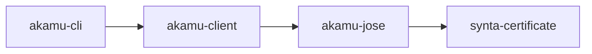

# Client Libraries Overview

The Akāmu repository ships three standalone crates in addition to the server binary. They were extracted from the server so that external Rust applications can speak ACME without pulling in the full server stack.

| Crate | What it provides |
|---|---|
| `akamu-jose` | RFC 7517/7515 JWK/JWS primitives, key thumbprints, ML-DSA signatures |
| `akamu-client` | Full RFC 8555 ACME client lifecycle (async, tokio + hyper) |
| `akamu-cli` | End-user CLI wrapping `akamu-client` |

## Crate dependency graph



The server binary (`akamu`) also depends on `akamu-jose` directly; its `src/jose/` module is a thin re-export layer.

## When to use which crate

**Use `akamu-jose` when** you need only cryptographic primitives: JWK parsing, JWS signing/verification, thumbprint computation, or algorithm support. It has no HTTP or database dependencies and compiles quickly.

**Use `akamu-client` when** you want to drive the full ACME protocol from Rust code — account registration, ordering, challenge solving, finalization, and certificate download. It brings in `tokio` and `hyper` but nothing database-related.

**Use `akamu-cli` when** you want a command-line tool and do not want to write Rust. It wraps `akamu-client` and exposes register, issue, and deregister subcommands.

## The PQC OpenSSL patch requirement

> **Important:** `akamu-jose` (and therefore all crates that depend on it) require a patched OpenSSL fork that adds post-quantum ML-DSA support. Any workspace that uses these crates as dependencies must add the following `[patch.crates-io]` block to its **root** `Cargo.toml`. The patch cannot live in a sub-crate's manifest.

```toml
[patch.crates-io]
openssl-sys = { git = "https://github.com/abbra/rust-openssl.git", branch = "pqc-prs" }
openssl     = { git = "https://github.com/abbra/rust-openssl.git", branch = "pqc-prs" }
```

Without this block, `cargo build` will either fail to resolve `openssl-sys` or will resolve the upstream crates.io version, which lacks ML-DSA support.

## Getting started

### Add crates to your Cargo.toml

```toml
[dependencies]
# ACME client + JWK/JWS:
akamu-client = { path = "/path/to/akamu/crates/akamu-client" }

# Or just the crypto primitives:
akamu-jose = { path = "/path/to/akamu/crates/akamu-jose" }
```

### Add the patch block

In your workspace root `Cargo.toml` (not in a member manifest):

```toml
[patch.crates-io]
openssl-sys = { git = "https://github.com/abbra/rust-openssl.git", branch = "pqc-prs" }
openssl     = { git = "https://github.com/abbra/rust-openssl.git", branch = "pqc-prs" }
```

### Verify the build

```bash
cargo build -p akamu-jose
cargo build -p akamu-client
```

Both crates should compile without errors. The first build downloads and compiles the patched OpenSSL fork, which can take a few minutes.

## Further reading

- [akamu-jose — JWK/JWS Primitives](jose.md)
- [akamu-client — ACME Client Library](client-library.md)
- [akamu-cli — Command Reference](cli.md)
