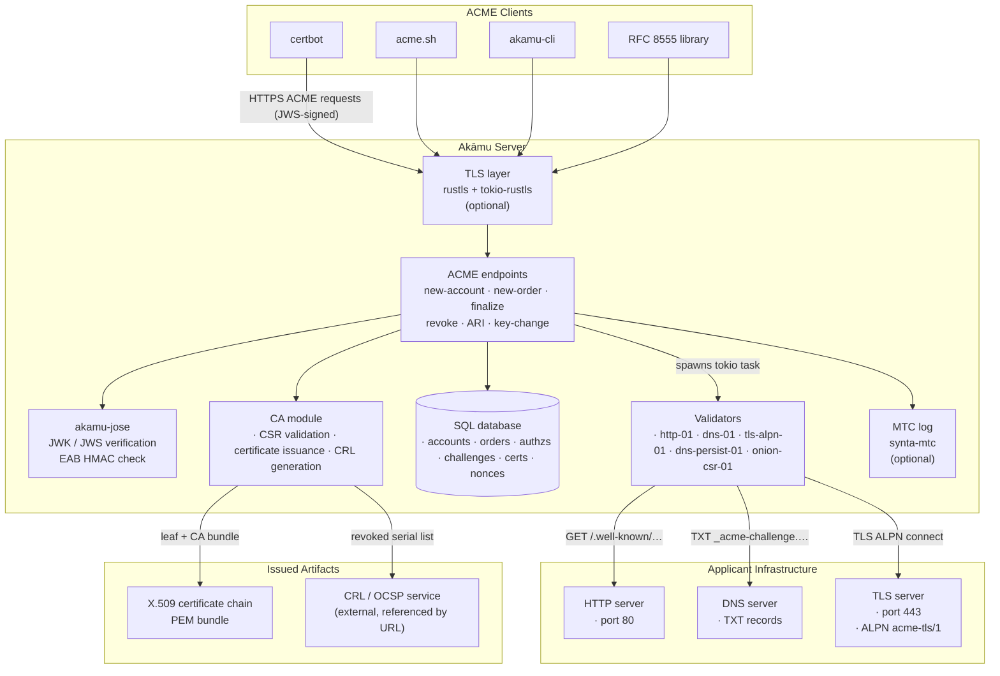
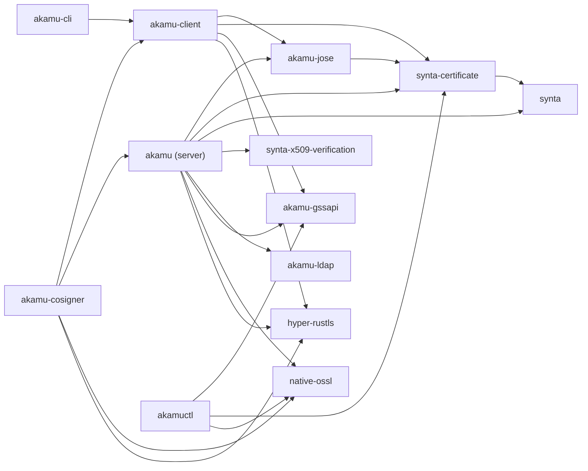

# Architecture

> **Implementation Guide** — This section is for contributors working on the Akāmu source code. It covers architecture, internal module design, database schema, CA internals, and testing. If you are deploying or operating the server, see the [Operator Guide](../user/operator-roles.md). If you are building an ACME client or integrating with the API, see the [API Reference](../client/protocol.md).

This chapter describes the overall structure of `Akāmu`, the key modules, and the full request lifecycle from a TCP connection to an HTTP response.

## System architecture



## Crate layout

The repository is organized as a **Cargo workspace** with eight members:

```
Cargo.toml          <- workspace root (members: ., crates/*)
src/                <- akamu server binary
crates/
  akamu-jose/       <- JWK/JWS primitives (no HTTP/DB deps)
  akamu-client/     <- async ACME client library (tokio, hyper)
  akamu-cli/        <- CLI binary wrapping akamu-client
  akamu-cosigner/   <- standalone MTC cosigner daemon
  akamu-ldap/       <- safe Rust wrapper around the OpenLDAP C library (libldap);
                       provides LdapConnection (sync) and AsyncLdapConnection
                       (tokio::task::spawn_blocking) with simple-bind and
                       SASL GSSAPI/Kerberos authentication
  akamu-gssapi/     <- safe Rust GSSAPI/SPNEGO bindings (FFI to libgssapi_krb5);
                       provides GssServerCred and GssClientCred for keytab- and
                       ccache-based credential acquisition, plus accept_token /
                       init_token convenience wrappers; MIT Kerberos thread-safety
                       guarantees allow an Arc<GssServerCred> to be shared across
                       all handler threads without a mutex
  akamuctl/         <- server administration CLI binary; talks to /admin/* endpoints
                       over mTLS or GSSAPI/Kerberos (ccache-based) authentication
```

### Crate dependencies



The server and `akamu-client` both depend directly on `akamu-jose` and `synta-certificate`. The server additionally depends on:

- `akamu-ldap` for reading Dogtag and IPA certificate profiles from LDAP.
- `akamu-gssapi` for standalone SPNEGO authentication (`gss_cred`, `admin_gss_cred` in `AppState`).
- `native-ossl` directly for digest operations (SHA-256 fingerprinting, channel-binding hashes), HKDF key derivation (`eab_derivation.rs`), and asymmetric-key signature verification in the mTLS verifier. `rustls-native-ossl` (a thin rustls crypto-provider shim over `native-ossl`) supplies the OpenSSL backend to rustls.
- `synta` (the base ASN.1 codec crate) for `Decoder`/`Encoder` and the `Integer` type used in certificate serial number and OID handling; `synta-certificate` is built on top of it.
- `synta-x509-verification` for X.509 certification-path validation (trust anchor resolution, name constraints, key usage checking) used in mTLS client-certificate verification and OCSP response validation.
- `hyper-rustls` as the HTTPS connector for outbound MTC cosigner requests; paired with `rustls-native-certs` to load the OS root CA store for verifying cosigner TLS certificates.

`akamu-client` uses `akamu-gssapi` for GSSAPI-authenticated ACME requests and `hyper-rustls` for all outbound HTTPS. `akamu-cli` depends only on `akamu-client`. `akamu-cosigner` depends on both `akamu-client` (for ACME EAB bootstrap) and `akamu` itself (to reuse TLS loader helpers and key generation utilities), and uses `native-ossl` directly for crypto operations. `akamuctl` is a standalone admin CLI that depends on `akamu-gssapi` for ccache-based Kerberos login to the `/admin/*` endpoints, on `synta-certificate` for certificate handling, and on `native-ossl` directly; it does not depend on `akamu-client` or `akamu-jose`.

### Key external dependencies

The following external crates are direct server dependencies whose role is not otherwise obvious from the module descriptions above.

| Crate | Purpose |
|-------|---------|
| `uuid` | Generates UUIDv4 identifiers for every ACME resource (orders, authorizations, challenges, certificates, nonces). |
| `getrandom` | Cryptographically random byte source for anti-replay nonce generation (`NonceBucket`). |
| `subtle` | Constant-time byte comparison (`subtle::ConstantTimeEq`) used in admin session-token lookup to prevent timing-based token recovery. |
| `zeroize` | `Zeroizing<T>` wrapper that zeroes memory on drop; applied to the EAB master secret in `AppState` to satisfy FDP_RIP.1 (residual information protection). |
| `ipnet` | CIDR range type (`IpNet`) used to match incoming request source addresses against the `[server].trusted_proxies` allow-list. |
| `regex` | Compiled regular expressions for profile identifier authorization (`auth.rs` `check_profile_auth` — identifier pattern matching against the `allowed_identifiers` field). |
| `libc` | `flock(2)` call that takes an exclusive advisory lock on the MTC log file, preventing two server processes from writing the same log concurrently. |
| `rustls-native-certs` | Loads the operating-system root certificate store into rustls for verifying cosigner HTTPS connections. |
| `indexmap` | `IndexMap` preserves config-file insertion order for the multi-CA registry (`AppState::cas`), ensuring deterministic directory listing and default-CA fallback. |

See [Client Libraries](../client/overview.md) for the standalone client API.

### The server's jose/ module

`src/jose/jwk.rs` and `src/jose/jws.rs` are thin re-exports:

```rust
// src/jose/jwk.rs
pub use akamu_jose::JwkPublic;

// src/jose/jws.rs
pub use akamu_jose::{JwsFlattened, JwsKeyRef, JwsProtectedHeader};
```

All JWK/JWS logic lives in `crates/akamu-jose`. The `src/jose/` shim exists so the rest of the server can use short import paths without knowing about the crate boundary.

### Server source layout

The `src/` directory is organized as follows:

```
src/
  main.rs          Entry point; parses config, initializes subsystems, starts axum
  lib.rs           Re-exports public modules for integration tests
  config.rs        TOML configuration structs (Config, CaConfig, MtcConfig, ServerConfig,
                   ProfilesConfig, ProviderConfig, BuiltinProviderConfig, AdminConfig, …)
  state.rs         Shared application state (AppState, CaState, MtcState, NonceBucket,
                   CrlCache, TlsState, CachedAccount, OperatorRole, AdminSession, …)
  error.rs         AcmeError enum with HTTP mapping and problem+json serialization
  audit.rs         Structured audit trail (FAU family): AuditEvent, AuditState,
                   AuditPolicy, record_or_log, overflow handling (FAU_STG.4)
  dns.rs           Thin DNS query helper (hickory-resolver; optional DNS-over-TLS)
  eab_derivation.rs HKDF-SHA-256 (RFC 5869) credential derivation for /acme/eab
  extract.rs       Axum extractors: RemoteUser (proxy header or standalone GSSAPI)
  star.rs          RFC 8739 ACME STAR background reissuance task
  delegation_upstream.rs  RFC 9115 upstream CA polling task (see delegation/ module)
  util.rs          Shared utilities: unix_now, unix_to_rfc3339, certificate helpers

  admin/
    mod.rs         Re-exports admin submodules
    auth.rs        Operator authentication (mTLS cert or GSSAPI/Kerberos session token),
                   OperatorContext extractor, session management (POST/DELETE /admin/session)
    init.rs        Admin operator bootstrap — seeds the first operator from config on startup

  db/
    mod.rs         Database initialization (open, migrations, WAL mode)
    schema.rs      Row types mirroring database columns
    accounts.rs    CRUD for accounts table
    audit.rs       Append-only CRUD for audit_events table (insert, count, query, delete_oldest)
    authz.rs       CRUD for authorizations table
    certs.rs       CRUD for certificates table (includes mtc_standalone_der column)
    challenges.rs  CRUD for challenges table
    checkpoints.rs CRUD for mtc_checkpoints table (upsert, get_latest, prune_oldest)
    cosignatures.rs CRUD for mtc_cosignatures table
    cross_certs.rs CRUD for cross_certs table (insert, get_by_id, list by issuer/subject CA)
    eab.rs         CRUD for eab_keys table
    landmarks.rs   CRUD for mtc_landmarks table (insert, get_by_seq, list, prune_oldest)
    nonces.rs      Anti-replay nonce management
    operators.rs   CRUD for operators table (insert, get_by_fingerprint/principal, update,
                   failed-attempt tracking and account locking — FIA_AFL.1)
    orders.rs      CRUD for orders table
    delegations.rs CRUD for delegations table (insert, get_by_id, update, delete, list, list_by_account)
    stats.rs       Aggregate statistics queries for GET /admin/stats

  routes/
    mod.rs         Router assembly (build_router, build_admin_router), CaId extractor,
                   shared helpers (parse_jws, acme_headers, json_response, acme_prefix)
    directory.rs   GET /acme/directory
    nonce.rs       HEAD/GET /acme/new-nonce
    account.rs     POST /acme/new-account, POST /acme/account/{id}
    order.rs       POST /acme/new-order, POST /acme/order/{id}
    authz.rs       POST /acme/new-authz, POST /acme/authz/{id}
    challenge.rs   POST /acme/chall/{authz_id}/{type}
    finalize.rs    POST /acme/order/{id}/finalize
    certificate.rs GET /acme/cert/{id}, POST /acme/cert/{id}
                   (auto-detects MTC vs X.509 by PEM marker)
    star_cert.rs   GET/POST /acme/cert/star/{order_id} (RFC 8739 §3.3 STAR rolling cert URL)
    revoke.rs      POST /acme/revoke-cert
    key_change.rs  POST /acme/key-change
    renewal_info.rs GET /acme/renewal-info/{cert_id}
    mtc.rs         GET /acme/mtc/tree-size, /root, /inclusion-proof/{id},
                   /cert/{id}/standalone, /landmarks, /landmarks/{seq}/cert;
                   C2SP tlog-tiles: /acme/mtc/tlog/checkpoint, /tlog/cosignature,
                   /tlog/tile/{*path}
    crl.rs         GET /ca/crl, GET /ca/{ca_id}/crl — serve DER-encoded CRLs (cached);
                   GET /ca/cross-certs, GET /ca/{ca_id}/cross-certs — PEM cross-cert bundles
    ocsp.rs        POST /ca/ocsp, GET /ca/ocsp/{request},
                   POST /ca/{ca_id}/ocsp, GET /ca/{ca_id}/ocsp/{request} (RFC 6960)
    eab_identity.rs GET /acme/eab — derive and return EAB credentials for
                    the authenticated principal (proxy or standalone GSSAPI)
    delegation.rs   POST /acme/delegations/{account_id} (list; POST-as-GET),
                    POST /acme/delegation/{id} (fetch one; POST-as-GET) —
                    RFC 9115 NDC-facing delegation endpoints; active when
                    server.delegation_enabled = true
    admin.rs       All /admin/* endpoints served on the dedicated admin listener;
                   POST/DELETE /admin/session (auth);
                   GET/POST /admin/operators, GET/PUT/PATCH /admin/operators/{id},
                   POST /admin/operators/{id}/unlock;
                   GET/POST/PUT/DELETE /admin/account/{id}/profile-grants,
                   POST /admin/account/{id}/deactivate;
                   GET /admin/accounts, GET /admin/account/{id};
                   POST/GET/DELETE /admin/eab, GET/DELETE /admin/eab/{kid};
                   GET /admin/audit;
                   GET /admin/certs, GET /admin/certs/{id},
                   GET /admin/certs/{id}/download;
                   GET/POST /admin/profiles, PUT/DELETE /admin/profiles/{id};
                   GET /admin/orders, GET /admin/orders/{id};
                   GET /admin/config;
                   POST /admin/crl/force, POST /admin/revoke;
                   GET /admin/stats;
                   GET /admin/cas, GET /admin/cas/{id}, GET /admin/cas/{id}/cert;
                   POST /admin/ca/{id}/crl/force, POST /admin/ca/{id}/cross-sign;
                   GET /admin/cross-certs, GET /admin/cross-certs/{id};
                   GET/POST /admin/delegations, GET/PUT/DELETE /admin/delegations/{id}
                   (role-based access control; admin listener not started when [admin] absent)

  ca/
    mod.rs         Re-exports ca submodules
    init.rs        CA key and certificate load-or-generate
    key_loader.rs  CaKeyLoader — routes key loading to PEM file or PKCS#11 token URI
    csr.rs         PKCS#10 CSR parsing and validation
    issue.rs       End-entity and CA certificate issuance (issue_certificate,
                   issue_with_params, issue_ca_cert, check_is_ca_cert)
    revoke.rs      CRL generation

  profiles/
    mod.rs           ProfileRegistry — in-memory cache, background refresh, resolve()
    builtin.rs       Builtin provider: inline TOML profile declarations;
                     handles issue_as, allowed_identifiers, auth_hook, require_account_grant
    auth.rs          check_profile_auth — identifier pattern, external hook, account grant checks
    cfg.rs           Dogtag Java-properties .cfg parser and translator
    dogtag.rs        Dogtag PKI provider (filesystem or LDAP — simple bind and GSSAPI/Kerberos)
    ipa.rs           FreeIPA/IPAThinCA provider (filesystem or LDAP — simple bind and GSSAPI/Kerberos)
    ldap_resolve.rs  resolve_ldap_uris() — merges uri/uris/srv_domain into a space-separated
                     URI string for ldap_initialize; SRV records sorted per RFC 2782
    ldap_session.rs  Shared LDAP connect→bind→search→parse helper used by dogtag and ipa providers

  tls/
    mod.rs           Re-exports tls submodules; module-level doc for standalone TLS support
    channel_binding.rs TLS channel binding helpers (tls-unique / tls-exporter)
    init.rs          load_or_generate — loads or auto-generates the server TLS certificate
    loader.rs        Async TLS config reloader (hot-reload of cert/key without restart)
    schemes.rs       Custom rustls SignatureScheme negotiation for hybrid post-quantum keys
    verifier.rs      SyntaClientCertVerifier — mTLS client certificate verification
                     (CAB Forum or RFC 5280 profile; hybrid ML-DSA+classical chains)

  validation/
    mod.rs             Challenge dispatch and DB state transitions (validate_challenge)
    http01.rs          http-01 validation (hyper HTTP client)
    dns01.rs           dns-01 validation (hickory-resolver)
    tls_alpn01.rs      tls-alpn-01 validation (rustls TLS client)
    dns_persist_01.rs  dns-persist-01 validation (hickory-resolver; persistent TXT records)
    onion_csr_01.rs    onion-csr-01 validation (CSR-based; .onion identifiers)
    caa.rs             CAA record validation (RFC 8659 + RFC 8657)

  mtc/
    mod.rs         Re-exports mtc submodules
    log.rs         SharedLog type alias; tree_size, proof_and_tree_size async wrappers
    checkpoint.rs  Checkpoint production background task; signs and stores Merkle roots
    cosign.rs      CosignerClient; parallel cosignature gathering from external cosigners
    landmark.rs    Landmark background task; allocates and builds LandmarkCertificate DERs
    standalone.rs  StandaloneCertificate construction after each checkpoint
    tlog.rs        C2SP tlog-tiles and signed-note support: checkpoint format, key-ID
                   computation, cosignature production, hash tile computation for all
                   C2SP signature types (Ed25519, ECDSA, ML-DSA-44 cosignatures)

  delegation/
    mod.rs         Re-exports delegation submodules
    upstream.rs    DelegationUpstreamTask — background tokio task that polls
                   processing delegation orders and drives the upstream ACME
                   flow (account registration, new-order, dns-01 deploy/poll,
                   finalize, cert retrieval) using [delegation_upstream] config;
                   not started when [delegation_upstream] is absent

  jose/            Thin re-exports and helpers for crates/akamu-jose
    mod.rs         Module re-exports
    jwk.rs         Re-exports JwkPublic from akamu-jose
    jws.rs         Re-exports JwsFlattened, JwsKeyRef, JwsProtectedHeader from akamu-jose
    eab.rs         EAB (External Account Binding) HMAC verification helpers
    kid.rs         account_id_from_kid — extracts and validates the account ID from a JWS kid URL
```

## Key types

### `AppState`

Defined in `src/state.rs`. Every axum handler receives an `Arc<AppState>` via axum's `State` extractor. It contains:

- `config: Arc<Config>` — immutable configuration parsed at startup.
- `db: crate::db::Db` — write connection pool. All write transactions and most read queries use this pool.
- `db_ro: crate::db::Db` — read-only connection pool for SQLite file-backed databases (opened with `?mode=ro` URI parameter). Pure-read handlers (`get_order`, `get_authz`, `download_cert`) route through this pool so WAL concurrent reads do not contend on the write lock. For `:memory:` databases and non-SQLite backends this is a clone of `db`.
- `db_kind: DbKind` — discriminant indicating the underlying database backend (SQLite, Postgres, MariaDB); used by a small number of queries that need backend-specific SQL.
- `cas: Arc<IndexMap<String, Arc<CaState>>>` — all configured CAs keyed by their ID, in config-file insertion order. Replaces the old single `ca` field.
- `default_ca_id: Arc<String>` — the CA ID that serves the backward-compatible `/acme/directory` and `/ca/crl` routes. Set to the entry with `is_default = true` in `[[ca]]` config.
- `crl_caches: Arc<HashMap<String, CrlCache>>` — per-CA CRL cache keyed by CA ID. Each entry is `None` until the first CRL request for that CA. Replaces the old single `crl_cache` field.
- `link_headers: Arc<HashMap<String, Arc<HeaderValue>>>` — per-CA precomputed `Link: …; rel="index"` header values keyed by CA ID. `acme_headers(state, ca_id, nonce)` looks up the header for the request's CA, falling back to the default CA's header. Replaces the old single `link_header` field.
- `mtc: Arc<MtcState>` — MTC log handle, signing key, and pre-built cosigner HTTPS clients.
- `profiles: Arc<ProfileRegistry>` — in-memory certificate profile cache; empty when no providers are configured, in which case every order falls back to CA defaults.
- `tls: Option<Arc<TlsState>>` — present when `[tls]` is enabled and client auth is configured; holds the client-auth config for introspection by handlers.
- `nonces: Arc<NonceBucket>` — in-memory anti-replay nonce store.
- `spki_cache: Arc<RwLock<HashMap<String, CachedAccount>>>` — per-account SPKI/thumbprint cache to avoid a DB round-trip per authenticated request after the first.
- `validation_client: ValidationClient` — shared hyper HTTP client for http-01 challenge validation; connection-pooled so TCP connections are reused across validations.
- `gss_cred: Option<Arc<GssServerCred>>` — server-side GSSAPI credential for standalone SPNEGO authentication. `None` when `[server.gssapi]` is absent.
- `admin_gss_cred: Option<Arc<GssServerCred>>` — admin-specific GSSAPI credential from `[admin.gssapi]`; takes precedence over `gss_cred` for admin SPNEGO. `None` when `[admin.gssapi]` is absent.
- `eab_master_secret: Option<Arc<Zeroizing<Vec<u8>>>>` — decoded master secret for HKDF-based EAB key derivation. `None` when `[server].eab_master_secret` is absent.
- `audit: Arc<AuditState>` — shared in-memory audit state (overflow flag, FAU_ARP.1 alarm counter). Always present.
- `audit_policy: Arc<AuditPolicy>` — audit policy extracted from `[admin]` at startup.
- `admin_sessions: Option<Arc<tokio::sync::Mutex<HashMap<String, AdminSession>>>>` — opaque session token store for admin operator sessions. `None` when `[admin]` is absent.
- `admin_auth_limiter: Option<AdminAuthLimiter>` — per-source-IP credential-attempt timestamps for admin auth rate-limiting. `None` when `[admin]` is absent.
- `startup_time: Instant` — time the server process started; used for uptime reporting in `GET /admin/stats`.

`AppState` is `Clone` because `Arc<T>` is `Clone` and `sqlx::AnyPool` is `Clone`. Cloning is cheap (reference count bump). All mutable state (the database and MTC log) is protected at a lower level by sqlx's internal pool management and a `tokio::sync::Mutex<DiskBackedLog>`, respectively.

### `CaState`

Holds the key material and issuance policy for a single CA. Key fields:

- `id: String` — the CA's unique identifier, matching `CaConfig.id` from the config file.
- `key_type: String` — the key algorithm string (e.g. `"ec:P-256"`, `"rsa:2048"`).
- `key: BackendPrivateKey` — CA private key used for certificate and CRL signing.
- `cert_der: Vec<u8>` — DER-encoded CA certificate.
- `hash_alg: String` — hash algorithm string for certificate and CRL signatures (e.g. `"sha256"`).
- `validity_days: u32` — default validity period for issued end-entity certificates.
- `crl_url: Option<String>` — optional CRL distribution point URL embedded in issued certificates.
- `ocsp_url: Option<String>` — optional OCSP responder URL embedded in issued certificates.
- `aki_bytes: Vec<u8>` — RFC 7093 §2 Method 1 key identifier bytes (leftmost 20 bytes of the SHA-256 of the CA public key BIT STRING). Used to validate the AKI component of ARI cert-ids (RFC 9773 §4.1).
- `enforce_validity_cap: bool` — when `true`, `issue_with_params` rejects issuance when the computed validity exceeds 200 days (CA/B Forum BR §6.3.2).
- `crl_next_update_secs: u64` — validity window for signed CRLs (determines cache TTL).
- `caa_identities: Vec<String>` — CAA domain identities specific to this CA; falls back to `[server].caa_identities` when empty.

`CaState` is shared across all concurrent handler tasks via `Arc<CaState>`. The underlying `BackendPrivateKey` delegates to the OpenSSL backend, which serializes concurrent signing operations internally.

Two helpers on `AppState` provide access to CA instances:

- `AppState::get_ca(id: &str) -> Option<&Arc<CaState>>` — look up a CA by ID; returns `None` for unknown IDs.
- `AppState::default_ca() -> &Arc<CaState>` — return the default CA (the one designated by `is_default = true`). Panics only if the server was constructed incorrectly.

### `AcmeError`

Defined in `src/error.rs`. Implements `IntoResponse` so it can be returned directly from axum handlers. Maps each variant to:

- An ACME problem type string (`urn:ietf:params:acme:error:*`).
- An HTTP status code.
- A human-readable `detail` string.

The response body is `application/problem+json` (RFC 7807).

## Request lifecycle

### 1. TCP accept

The tokio runtime accepts a TCP connection on the configured `listen_addr`. axum's `serve` function passes it to the hyper HTTP/1.1 or HTTP/2 codec.

### 2. HTTP parsing

hyper parses the HTTP request (method, URL, headers, body). Tower middleware is applied in order; currently only `TraceLayer` is configured, which emits a tracing span for each request.

### 3. Route dispatch

axum matches the request method and path against the router built in `routes::build_router`. Two route sets are registered:

- **Legacy routes** (`/acme/directory`, `/acme/new-account`, etc.) — served by the same handlers, using `default_ca_id` as the implicit CA context.
- **Per-CA routes** (`/acme/{ca_id}/directory`, `/acme/{ca_id}/new-account`, etc.) — the same handlers, but the `{ca_id}` path parameter selects the CA. Axum resolves static path segments before dynamic ones, so the legacy `/acme/directory` route is always matched before `/acme/{ca_id}/directory`; config validation ensures no CA ID collides with reserved ACME path segments (`"directory"`, `"new-nonce"`, etc.).

The `CaId` extractor (`src/routes/mod.rs`) resolves the active CA for each request. When the `{ca_id}` path parameter is present it validates the value against `state.cas` and returns `404 Not Found` for unknown IDs. On legacy routes without `{ca_id}`, it returns the `default_ca_id`. Every handler that is CA-aware accepts a `CaId` argument.

Each route maps to a handler function in the corresponding `routes/` module. The handler receives the following extractors:

- `State(state): State<Arc<AppState>>` — shared application state.
- `CaId(ca_id): CaId` — resolved CA identifier for this request.
- `Path(...)` — URL path parameters (e.g., order ID, authz ID).
- `body: Bytes` — raw request body for JWS verification.

The `account_scope` setting in `[server]` affects account creation and JWS validation. When set to `"server"` (the default), one account registration is valid for all CAs. When set to `"ca"`, accounts are isolated per CA and each CA directory advertises its own `/acme/{ca_id}/new-account` endpoint; JWS `kid` validation additionally checks that the account's `ca_id` matches the request's CA.

### 4. JWS verification (POST endpoints)

Almost every POST endpoint calls `routes::parse_jws` before processing the payload:

1. **Parse**: deserialize the `Bytes` body as a JWS flattened JSON serialization.
2. **Decode header**: base64url-decode the `protected` header and parse the JSON.
3. **URL check**: compare `header.url` with the expected full URL for this endpoint. A mismatch returns `unauthorized`.
4. **Nonce check**: look up `header.nonce` in the in-memory `NonceBucket` and atomically replace it with a fresh nonce. A missing or already-used nonce returns `badNonce`. The nonce store is in-memory (a `Mutex<HashMap>` inside `AppState::nonces`); nonces issued before a server restart are silently dropped, and clients detect the resulting `badNonce` and retry per RFC 8555 §6.5.
5. **Key resolution**: if the header uses `jwk`, extract the SPKI DER from the JWK directly. If it uses `kid`, look up the account in the database and fetch its stored SPKI DER.
6. **Signature verification**: verify the JWS signature over `protected || "." || payload` using the resolved public key via `synta-certificate`. Classical algorithms (RS256, RS384,
   RS512, PS256, PS384, PS512, ES256, ES384, ES512, EdDSA) use `verify_signature`. ML-DSA algorithms (`ML-DSA-44`, `ML-DSA-65`, `ML-DSA-87`) are dispatched first — their raw-byte signatures (not DER) are verified with `verify_ml_dsa_with_context` using an empty context string, as required by RFC 9964 §4.
7. **Payload decode**: base64url-decode the `payload` field.

The result is a `JwsContext` struct containing the decoded header, payload bytes, SPKI DER, and optional account ID.

### 5. Business logic

Each handler implements the ACME protocol semantics for its endpoint: reading from and writing to the database, dispatching validation, invoking the CA, etc.

For write operations that span multiple tables (e.g., creating an order with its authorizations and challenges), the handler uses a single database transaction to ensure atomicity. On PostgreSQL, state-transition transactions (new-order, new-authz, challenge) additionally issue `SET LOCAL synchronous_commit = off` via `db::pg_local_async_commit` to eliminate per-commit WAL flush overhead; the certificate issuance transaction retains full durability.

### 6. Response construction

Handlers return `Result<Response, AcmeError>`. On success, they call `routes::json_response`, which:

1. Generates a new anti-replay nonce.
2. Stores it in the in-memory `NonceBucket`.
3. Adds the `Replay-Nonce` and `Link: <directory>; rel="index"` headers, selecting the correct `Link` value from `state.link_headers` for the active CA.
4. Serializes the JSON body and sets `Content-Type: application/json`.

On error, `AcmeError::into_response` builds a `application/problem+json` body.

### 7. Background tasks

Challenge validation does not block the HTTP response. When a challenge is triggered, the handler:

1. Marks the challenge `processing` in the database.
2. Spawns a `tokio::spawn` task running `validation::validate_challenge`.
3. Spawns a second observer task watching for panics via `JoinHandle::await`.
4. Returns immediately with the `processing` status.

Similarly, MTC log appends are spawned as background tasks after certificate issuance.

A third background task (`ProfileRegistry::spawn_refresh_task`) wakes every `refresh_interval_secs` seconds, re-loads all configured profile providers, and atomically replaces the in-memory `ProfileCache` under a write lock. It holds a weak `Arc` reference to the registry so that dropping the server's strong reference causes the task to exit cleanly on shutdown.

A fourth background task (`DelegationUpstreamTask`) is started at server startup when `[delegation_upstream]` is configured. It wakes every `poll_interval_secs` seconds (default 10), queries the database for delegation orders in `processing` status, and drives each one through the upstream ACME flow: it contacts the upstream CA's directory, registers an account (if not already registered), submits a new-order, triggers the dns-01 challenge by invoking `challenge_deploy_script`, polls until the upstream authorization is valid, calls `challenge_cleanup_script` (if configured), finalizes the order, and stores the resulting certificate URL back into the order row. On success the order transitions to `valid`; on any unrecoverable upstream failure it transitions to `invalid`.

## Database access model

All database access goes through `sqlx::AnyPool`. Queries are async and run directly on the tokio runtime. This means:

- `sqlx::query!(...)` / `sqlx::query_as!(...)` are the primary way to issue queries.
- For multi-statement atomicity, acquire a transaction with `pool.begin().await?` and commit with `tx.commit().await?`.

Foreign key enforcement is enabled at database open time (`PRAGMA foreign_keys=ON`). WAL journal mode is also enabled after migrations (`PRAGMA journal_mode=WAL`).

## Async design

The server is fully async on the tokio runtime. All I/O — TCP, HTTP, DNS, TLS — is async. CPU-bound work (DER encoding for MTC) is offloaded to `tokio::task::spawn_blocking`.

The only shared mutable state in the async domain is the `Mutex<DiskBackedLog>` for the MTC log. All other state is either immutable after startup (`AppState`, `Config`, `CaState`) or encapsulated in the database background thread.
