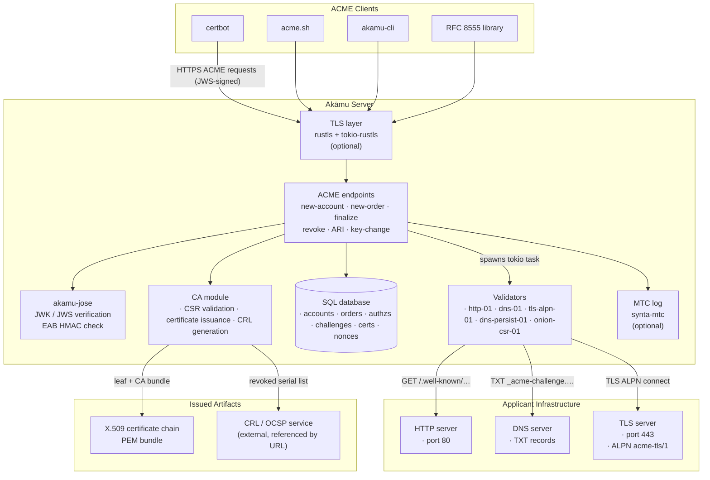
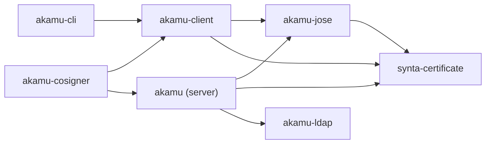

# Architecture

This chapter describes the overall structure of `Akāmu`, the key modules, and the full request lifecycle from a TCP connection to an HTTP response.

## System architecture



## Crate layout

The repository is organized as a **Cargo workspace** with six members:

```
Cargo.toml          <- workspace root (members: ., crates/*)
src/                <- akamu server binary
crates/
  akamu-jose/       <- JWK/JWS primitives (no HTTP/DB deps)
  akamu-client/     <- async ACME client library (tokio, hyper)
  akamu-cli/        <- CLI binary wrapping akamu-client
  akamu-cosigner/   <- standalone MTC cosigner daemon
  akamu-ldap/       <- safe Rust wrapper around the OpenLDAP C library (libldap);
                       provides LdapConnection (sync) and AsyncLdapConnection
                       (tokio::task::spawn_blocking) with simple-bind and
                       SASL GSSAPI/Kerberos authentication
```

### Crate dependencies



The server and `akamu-client` both depend directly on `akamu-jose` and `synta-certificate`. The server additionally depends on `akamu-ldap` for reading Dogtag and IPA certificate profiles from LDAP. `akamu-cli` depends only on `akamu-client`. `akamu-cosigner` depends on both `akamu-client` (for ACME EAB bootstrap) and `akamu` itself (to reuse TLS loader helpers and key generation utilities).

See [Client Libraries](../client/overview.md) for the standalone client API.

### The server's jose/ module

`src/jose/jwk.rs` and `src/jose/jws.rs` are thin re-exports:

```rust
// src/jose/jwk.rs
pub use akamu_jose::JwkPublic;

// src/jose/jws.rs
pub use akamu_jose::{JwsFlattened, JwsKeyRef, JwsProtectedHeader};
```

All JWK/JWS logic lives in `crates/akamu-jose`. The `src/jose/` shim exists so the rest of the server can use short import paths without knowing about the crate boundary.

### Server source layout

The `src/` directory is organized as follows:

```
src/
  main.rs          Entry point; parses config, initializes subsystems, starts axum
  lib.rs           Re-exports public modules for integration tests
  config.rs        TOML configuration structs (Config, CaConfig, MtcConfig, ServerConfig,
                   ProfilesConfig, ProviderConfig, BuiltinProviderConfig, AdminConfig, …)
  state.rs         Shared application state (AppState, CaState, MtcState)
  error.rs         AcmeError enum with HTTP mapping and problem+json serialization

  db/
    mod.rs         Database initialization (open, migrations, WAL mode)
    schema.rs      Row types mirroring database columns
    accounts.rs    CRUD for accounts table
    authz.rs       CRUD for authorizations table
    certs.rs       CRUD for certificates table (includes mtc_standalone_der column)
    challenges.rs  CRUD for challenges table
    checkpoints.rs CRUD for mtc_checkpoints table (upsert, get_latest, prune_oldest)
    cosignatures.rs CRUD for mtc_cosignatures table
    eab.rs         CRUD for eab_keys table
    landmarks.rs   CRUD for mtc_landmarks table (insert, get_by_seq, list, prune_oldest)
    nonces.rs      Anti-replay nonce management
    orders.rs      CRUD for orders table

  routes/
    mod.rs         Router assembly, shared helpers (parse_jws, acme_headers, json_response)
    directory.rs   GET /acme/directory
    nonce.rs       HEAD/GET /acme/new-nonce
    account.rs     POST /acme/new-account, POST /acme/account/{id}
    order.rs       POST /acme/new-order, POST /acme/order/{id}
    authz.rs       POST /acme/authz/{id}
    challenge.rs   POST /acme/chall/{authz_id}/{type}
    finalize.rs    POST /acme/order/{id}/finalize
    certificate.rs GET /acme/cert/{id} (auto-detects MTC vs X.509 by PEM marker)
    revoke.rs      POST /acme/revoke-cert
    key_change.rs  POST /acme/key-change
    renewal_info.rs GET /acme/renewal-info/{cert_id}
    mtc.rs         GET /acme/mtc/tree-size, /root, /inclusion-proof/{id},
                   /cert/{id}/standalone, /landmarks, /landmarks/{seq}/cert
    admin.rs       GET/PUT/DELETE /admin/account/{id}/profile-grants,
                   POST/GET/DELETE /admin/eab, GET /admin/audit,
                   GET /admin/certs, POST /admin/crl/force, POST /admin/revoke,
                   GET /admin/stats, GET/POST/PATCH /admin/operators
                   (role-based access control; admin listener not started when [admin] absent)

  ca/
    mod.rs         Re-exports ca submodules
    init.rs        CA key and certificate load-or-generate
    csr.rs         PKCS#10 CSR parsing and validation
    issue.rs       End-entity certificate issuance (issue_certificate + issue_with_params)
    revoke.rs      CRL generation

  profiles/
    mod.rs           ProfileRegistry — in-memory cache, background refresh, resolve()
    builtin.rs       Builtin provider: inline TOML profile declarations;
                     handles issue_as, allowed_identifiers, auth_hook, require_account_grant
    auth.rs          check_profile_auth — identifier pattern, external hook, account grant checks
    cfg.rs           Dogtag Java-properties .cfg parser and translator
    dogtag.rs        Dogtag PKI provider (filesystem or LDAP — simple bind and GSSAPI/Kerberos)
    ipa.rs           FreeIPA/IPAThinCA provider (filesystem or LDAP — simple bind and GSSAPI/Kerberos)
    ldap_resolve.rs  resolve_ldap_uris() — merges uri/uris/srv_domain into a space-separated
                     URI string for ldap_initialize; SRV records sorted per RFC 2782

  validation/
    mod.rs             Challenge dispatch and DB state transitions (validate_challenge)
    http01.rs          http-01 validation (hyper HTTP client)
    dns01.rs           dns-01 validation (hickory-resolver)
    tls_alpn01.rs      tls-alpn-01 validation (rustls TLS client)
    dns_persist_01.rs  dns-persist-01 validation (hickory-resolver; persistent TXT records)
    onion_csr_01.rs    onion-csr-01 validation (CSR-based; .onion identifiers)
    caa.rs             CAA record validation (RFC 8659 + RFC 8657)

  mtc/
    mod.rs         Re-exports mtc submodules
    log.rs         SharedLog type alias; tree_size, proof_and_tree_size async wrappers
    checkpoint.rs  Checkpoint production background task; signs and stores Merkle roots
    cosign.rs      CosignerClient; parallel cosignature gathering from external cosigners
    landmark.rs    Landmark background task; allocates and builds LandmarkCertificate DERs
    standalone.rs  StandaloneCertificate construction after each checkpoint

  jose/            Thin re-exports from crates/akamu-jose
                   (JwkPublic, JwsFlattened, JwsKeyRef, JwsProtectedHeader)
```

## Key types

### `AppState`

Defined in `src/state.rs`. Every axum handler receives an `Arc<AppState>` via axum's `State` extractor. It contains:

- `config: Arc<Config>` — immutable configuration parsed at startup.
- `db: sqlx::AnyPool` — shared connection pool. All database access goes through this.
- `ca: Arc<CaState>` — CA private key, certificate, and signing policy.
- `mtc: Arc<MtcState>` — MTC log handle, signing key, and pre-built cosigner HTTPS clients.
- `profiles: Arc<ProfileRegistry>` — in-memory certificate profile cache; empty when no providers are configured, in which case every order falls back to CA defaults.
- `nonces: Arc<NonceBucket>` — in-memory anti-replay nonce store.
- `spki_cache: Arc<RwLock<HashMap<…>>>` — per-account SPKI/thumbprint cache to avoid a DB round-trip per authenticated request after the first.
- `validation_client: ValidationClient` — shared hyper HTTP client for http-01 challenge validation; connection-pooled so TCP connections are reused across validations.
- `link_header: Arc<HeaderValue>` — precomputed `Link: <base_url>/acme/directory>; rel="index"` header.

`AppState` is `Clone` because `Arc<T>` is `Clone` and `sqlx::AnyPool` is `Clone`. Cloning is cheap (reference count bump). All mutable state (the database and MTC log) is protected at a lower level by sqlx's internal pool management and a `tokio::sync::Mutex<DiskBackedLog>`, respectively.

### `CaState`

Holds the CA private key (`BackendPrivateKey` from `synta-certificate`) and the DER-encoded CA certificate. The key is used for both certificate signing and CRL signing. `CaState` is shared across all concurrent handler tasks via `Arc<CaState>`. The underlying `BackendPrivateKey` delegates to the OpenSSL backend, which serializes concurrent signing operations internally.

### `AcmeError`

Defined in `src/error.rs`. Implements `IntoResponse` so it can be returned directly from axum handlers. Maps each variant to:

- An ACME problem type string (`urn:ietf:params:acme:error:*`).
- An HTTP status code.
- A human-readable `detail` string.

The response body is `application/problem+json` (RFC 7807).

## Request lifecycle

### 1. TCP accept

The tokio runtime accepts a TCP connection on the configured `listen_addr`. axum's `serve` function passes it to the hyper HTTP/1.1 or HTTP/2 codec.

### 2. HTTP parsing

hyper parses the HTTP request (method, URL, headers, body). Tower middleware is applied in order; currently only `TraceLayer` is configured, which emits a tracing span for each request.

### 3. Route dispatch

axum matches the request method and path against the router built in `routes::build_router`. Each route maps to a handler function in the corresponding `routes/` module. The handler receives the following extractors:

- `State(state): State<Arc<AppState>>` — shared application state.
- `Path(...)` — URL path parameters (e.g., order ID, authz ID).
- `body: Bytes` — raw request body for JWS verification.

### 4. JWS verification (POST endpoints)

Almost every POST endpoint calls `routes::parse_jws` before processing the payload:

1. **Parse**: deserialize the `Bytes` body as a JWS flattened JSON serialization.
2. **Decode header**: base64url-decode the `protected` header and parse the JSON.
3. **URL check**: compare `header.url` with the expected full URL for this endpoint. A mismatch returns `unauthorized`.
4. **Nonce check**: look up `header.nonce` in the `nonces` database table and mark it consumed. A missing or already-used nonce returns `badNonce`. Anti-replay protection is thus database-backed, surviving server restarts.
5. **Key resolution**: if the header uses `jwk`, extract the SPKI DER from the JWK directly. If it uses `kid`, look up the account in the database and fetch its stored SPKI DER.
6. **Signature verification**: verify the JWS signature over `protected || "." || payload` using the resolved public key via `synta-certificate`. Classical algorithms (RS256, RS384,
   RS512, PS256, PS384, PS512, ES256, ES384, ES512, EdDSA) use `verify_signature`. ML-DSA algorithms (`ML-DSA-44`, `ML-DSA-65`, `ML-DSA-87`) are dispatched first — their raw-byte signatures (not DER) are verified with `verify_ml_dsa_with_context` using an empty context string, as required by draft-ietf-cose-dilithium-11 §4.
7. **Payload decode**: base64url-decode the `payload` field.

The result is a `JwsContext` struct containing the decoded header, payload bytes, SPKI DER, and optional account ID.

### 5. Business logic

Each handler implements the ACME protocol semantics for its endpoint: reading from and writing to the database, dispatching validation, invoking the CA, etc.

For write operations that span multiple tables (e.g., creating an order with its authorizations and challenges), the handler uses a single SQLite transaction to ensure atomicity.

### 6. Response construction

Handlers return `Result<Response, AcmeError>`. On success, they call `routes::json_response`, which:

1. Generates a new anti-replay nonce.
2. Inserts it into the `nonces` table.
3. Adds the `Replay-Nonce` and `Link: <directory>; rel="index"` headers.
4. Serializes the JSON body and sets `Content-Type: application/json`.

On error, `AcmeError::into_response` builds a `application/problem+json` body.

### 7. Background tasks

Challenge validation does not block the HTTP response. When a challenge is triggered, the handler:

1. Marks the challenge `processing` in the database.
2. Spawns a `tokio::spawn` task running `validation::validate_challenge`.
3. Spawns a second observer task watching for panics via `JoinHandle::await`.
4. Returns immediately with the `processing` status.

Similarly, MTC log appends are spawned as background tasks after certificate issuance.

A third background task (`ProfileRegistry::spawn_refresh_task`) wakes every `refresh_interval_secs` seconds, re-loads all configured profile providers, and atomically replaces the in-memory `ProfileCache` under a write lock. It holds a weak `Arc` reference to the registry so that dropping the server's strong reference causes the task to exit cleanly on shutdown.

## Database access model

All database access goes through `sqlx::AnyPool`. Queries are async and run directly on the tokio runtime. This means:

- `sqlx::query!(...)` / `sqlx::query_as!(...)` are the primary way to issue queries.
- For multi-statement atomicity, acquire a transaction with `pool.begin().await?` and commit with `tx.commit().await?`.

Foreign key enforcement is enabled at database open time (`PRAGMA foreign_keys=ON`). WAL journal mode is also enabled after migrations (`PRAGMA journal_mode=WAL`).

## Async design

The server is fully async on the tokio runtime. All I/O — TCP, HTTP, DNS, TLS — is async. CPU-bound work (DER encoding for MTC) is offloaded to `tokio::task::spawn_blocking`.

The only shared mutable state in the async domain is the `Mutex<DiskBackedLog>` for the MTC log. All other state is either immutable after startup (`AppState`, `Config`, `CaState`) or encapsulated in the database background thread.
