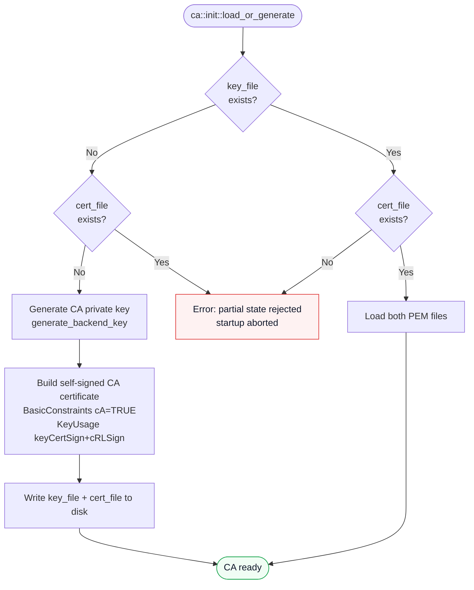
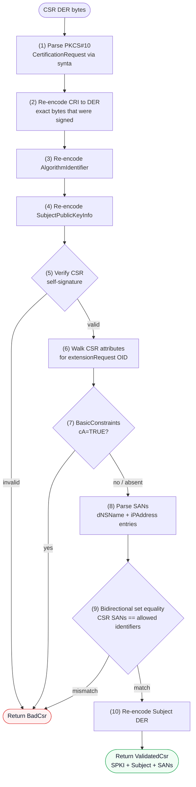

# Certificate Authority

The CA module (`src/ca/`) handles key generation, certificate issuance, CSR validation, and CRL generation. All CA operations are synchronous (no async); they are called from async handlers but do not perform I/O themselves (except during initialization).

## Initialization (`src/ca/init.rs`)

`ca::init::load_or_generate(config: &CaConfig)` is called once at startup. It follows this logic:

| `key_file` exists | `cert_file` exists | Action |
|---|---|---|
| No | No | Generate a new CA key and self-signed certificate; write both to disk. |
| Yes | Yes | Load both PEM files from disk. |
| Yes | No (or No/Yes) | Return an error — partial state is rejected. |



### Key generation

`generate_backend_key(key_type: &str)` dispatches to `synta_certificate::BackendPrivateKey`:

| `key_type` string | Algorithm |
|---|---|
| `"ec:P-256"` or `"P-256"` | ECDSA P-256 |
| `"ec:P-384"` or `"P-384"` | ECDSA P-384 |
| `"ec:P-521"` or `"P-521"` | ECDSA P-521 |
| `"rsa:2048"` or `"rsa2048"` | RSA 2048 (e=65537) |
| `"rsa:3072"` or `"rsa3072"` | RSA 3072 (e=65537) |
| `"rsa:4096"` or `"rsa4096"` | RSA 4096 (e=65537) |
| `"ed25519"` | Ed25519 |
| `"ed448"` | Ed448 |

Any other string returns `AcmeError::Internal`.

### CA certificate profile

The auto-generated CA certificate contains:

| Field | Value |
|---|---|
| Serial | `INTEGER { 1 }` |
| Subject | `CN=<common_name>, O=<organization>` |
| Issuer | Same as subject (self-signed) |
| NotBefore | Current time |
| NotAfter | `ca_validity_years * 365.25 * 86400` seconds in the future |
| BasicConstraints | Critical; `cA=TRUE` |
| KeyUsage | Critical; `keyCertSign + cRLSign` |
| SubjectKeyIdentifier | Leftmost 20 bytes of SHA-256 hash of the public key bit string (RFC 7093 §2 Method 1) |
| AuthorityKeyIdentifier | Same key ID (self-signed) |

### Time encoding

Internal timestamps are represented as Unix epoch seconds. The helper function `unix_to_generalized_time(secs: i64) -> String` converts them to the `YYYYMMDDHHmmssZ` format used by ASN.1 `GeneralizedTime`, using `synta::GeneralizedTime::from_unix` for the Gregorian calendar decomposition (Howard Hinnant's algorithm, no external dependencies).

## CSR validation (`src/ca/csr.rs`)

`ca::csr::validate_csr(csr_der: &[u8], allowed_identifiers: &[(&str, &str)]) -> Result<ValidatedCsr, AcmeError>` performs the following checks in order:



1. **Parse**: decode the `csr_der` as a DER PKCS#10 `CertificationRequest` using `synta`.
2. **Re-encode CRI**: encode the `CertificationRequestInfo` back to DER to obtain the exact bytes that were signed.
3. **Re-encode AlgorithmIdentifier**: same for the signature algorithm.
4. **Re-encode SPKI**: extract and re-encode the SubjectPublicKeyInfo.
5. **Verify signature**: `BackendPublicKey::verify_signature(cri_der, alg_der, signature)`. Returns `BadCsr` if invalid.
6. **Extract extensions**: walk the CSR attributes for the `extensionRequest` attribute (OID `1.2.840.113549.1.9.14`) and decode the extension list.
7. **Check BasicConstraints**: if present, reject `cA=TRUE`.
8. **Parse SANs**: walk the SubjectAlternativeName extension for `dNSName` (tag `[2]`) and `iPAddress` (tag `[7]`) entries. Other SAN types are silently ignored.
9. **Bidirectional set equality**: every CSR SAN must appear in `allowed_identifiers`, and every entry in `allowed_identifiers` must appear in the CSR SANs. A mismatch returns `BadCsr`.
10. **Re-encode Subject**: extract the subject Name DER.

The returned `ValidatedCsr` contains the SPKI DER, subject DER, and parsed SAN list. These are passed directly to `issue_certificate`.

The DER walking in step 6 is done manually (not using synta's high-level decoder) because the extension attribute is nested inside a `SET OF ANY`, which requires raw byte manipulation to extract.

## Certificate issuance (`src/ca/issue.rs`)

There are two issuance entry points:

| Function | Used when |
|---|---|
| `issue_certificate(…)` | Internal default path (tests, legacy callers) |
| `issue_with_params(ca, csr, params, not_before, not_after)` | All order finalizations — receives `CertificateParameters` resolved from the profile registry |

Both return an `IssuedCert` with the same structure. `issue_certificate` is kept for backward compatibility with existing unit tests.

### `issue_with_params`

`ca::issue::issue_with_params(ca, csr, params, not_before_override, not_after_override)` builds and signs an X.509 v3 end-entity certificate using the resolved `CertificateParameters`. It is the primary issuance path called by `routes::finalize`.

`CertificateParameters` is resolved at finalize time from `ProfileRegistry::resolve(profile_name)` when a profile is requested, or from `CertificateParameters::from_ca(ca)` when no profile is given. The latter reproduces the pre-profile default: `digitalSignature` KeyUsage, `serverAuth` EKU, and the `[ca]` validity/URL settings.

### Serial number

A random 16-byte serial is generated by `getrandom`. The high bit is cleared to ensure the value is non-negative in two's complement (required by RFC 5280 §4.1.2.2).

### Extensions added

| Extension | Critical | Condition |
|---|---|---|
| BasicConstraints | No | Always; `cA=FALSE` |
| KeyUsage | Yes | Only when `key_usage_bits ≠ 0` |
| ExtendedKeyUsage | No | Only when `extended_key_usages` is non-empty |
| SubjectKeyIdentifier | No | Always; RFC 7093 §2 Method 1 (SHA-256) of SPKI from CSR |
| AuthorityKeyIdentifier | No | Always; RFC 7093 §2 Method 1 (SHA-256) of CA's SPKI |
| SubjectAlternativeName | No | Always; rebuilt from validated SANs |
| AuthorityInfoAccess (OCSP) | No | Only when `ocsp_url` is `Some(_)` |
| CRLDistributionPoints | No | Only when `crl_url` is `Some(_)` |
| CertificatePolicies | No | Only when `certificate_policies` is non-empty |

The default `CertificateParameters::from_ca` sets `key_usage_bits = digitalSignature` and `extended_key_usages = ["server_auth"]`, so the KeyUsage and EKU extensions are always present in the default case.

### Validity clamping

If `not_before_override` or `not_after_override` is given (from the `newOrder` payload), the validity window is set accordingly. The `notBefore` is granted a 5-minute clock-skew grace (it may be up to 5 minutes in the past). The total window cannot exceed `params.validity_days` from the moment of signing.

### PEM bundle

The returned `IssuedCert` contains:
- `cert_der` — the leaf certificate DER (stored in `certificates.der`).
- `cert_pem` — a PEM bundle with the leaf certificate followed by the CA certificate (stored in `certificates.pem` and served by the download endpoint).

## CRL generation (`src/ca/revoke.rs`)

`ca::revoke::build_crl(ca_key, ca_cert_der, hash_alg, revoked_entries, next_update_secs)` generates a v2 CRL.

The CRL:
- Uses the CA's subject Name as the issuer.
- Contains one entry per `RevokedEntry` with serial bytes, revocation time, and optional reason code.
- Includes a `CRLNumber` extension (required for v2 by RFC 5280 §5.2.3) with the current Unix timestamp as a monotonically increasing integer.
- Is returned as both DER and PEM.

The CRL Number is encoded as a positive DER INTEGER. `encode_integer_der` handles the two's complement padding (adding a `0x00` prefix when the high bit of the first content byte is set).

`build_crl` is called by the CRL handler in `src/routes/crl.rs`, which serves both `GET /ca/crl` (legacy, defaults to the default CA) and `GET /ca/{ca_id}/crl` (per-CA). The handler uses a per-CA in-memory cache (`AppState::crl_caches`) keyed by CA ID:

1. **Fast path**: if the cached DER is still within its TTL, it is returned immediately without a DB query or signing operation.
2. **Slow path**: if the cache is empty or expired, `db::certs::list_revoked(ca_id)` fetches all revoked certificates for that CA (bounded to `MAX_CRL_ENTRIES = 500,000`), `build_crl` signs a fresh CRL, and the result is stored in the cache with a TTL of `crl_next_update_secs / 2` (minimum 30 seconds).

The `POST /admin/ca/{id}/crl/force` endpoint invalidates the per-CA cache so operators can force an immediate rebuild after a revocation.

## Multi-CA support

When more than one `[[ca]]` entry is present in `config.toml`, `main.rs` runs the `ca::init::load_or_generate` loop for each entry and builds an `IndexMap<String, Arc<CaState>>` stored in `AppState::cas`.

### `CaState` structure

Each `CaState` instance carries all information needed to issue and revoke certificates for one CA. The fields added for multi-CA deployments are:

| Field | Type | Description |
|---|---|---|
| `id` | `String` | Unique CA identifier; matches `CaConfig.id` and appears as the `{ca_id}` URL segment. |
| `key_type` | `String` | Key algorithm string from config (e.g. `"ec:P-256"`, `"rsa:2048"`). Stored for logging and API responses. |
| `crl_next_update_secs` | `u64` | Validity window for signed CRLs in seconds; determines the CRL cache TTL. |
| `caa_identities` | `Vec<String>` | CAA domain identities specific to this CA. When empty, falls back to `[server].caa_identities`. |

All other `CaState` fields (`key`, `cert_der`, `hash_alg`, `validity_days`, `crl_url`, `ocsp_url`, `aki_bytes`, `enforce_validity_cap`) exist in single-CA deployments as well.

### CA lookup helpers

Two methods on `AppState` are the canonical way to obtain a `CaState` reference inside handlers:

```rust
// Look up a CA by its string ID; returns None for unknown IDs.
let ca: Option<&Arc<CaState>> = state.get_ca("rsa");

// Return the default CA (the one with is_default = true in config).
// Panics only if the server was constructed incorrectly.
let ca: &Arc<CaState> = state.default_ca();
```

The `CaId` extractor in `src/routes/mod.rs` resolves the per-request CA ID from the `{ca_id}` URL path parameter or falls back to `state.default_ca_id`. Handlers pass this string to `state.get_ca(ca_id)` when they need the full `CaState`.

### Per-CA initialization loop

`main.rs` builds the multi-CA state with a loop:

```rust
for ca_cfg in &config.cas {
    let (key, cert_der) = ca::init::load_or_generate(ca_cfg)?;
    let ca_state = Arc::new(CaState {
        id: ca_cfg.id.clone(),
        key_type: ca_cfg.key_type.clone(),
        // … other fields …
    });
    crl_caches_map.insert(ca_cfg.id.clone(), Default::default());
    link_headers_map.insert(ca_cfg.id.clone(), build_link_header(&config, &ca_cfg.id));
    cas_map.insert(ca_cfg.id.clone(), ca_state);
}
let default_ca_id = config.default_ca().id.clone();
```

`Config::default_ca()` returns the `CaConfig` entry with `is_default = true`. `Config::validate()` enforces that exactly one entry is default, all IDs are unique and lowercase, and no ID matches a reserved ACME path segment.

### Profile filtering per CA

`ProfileRegistry::profiles_for_ca(ca_id)` returns only the profiles whose `ca_ids` list is empty (unrestricted) or explicitly contains `ca_id`. `ProfileRegistry::resolve_for_ca(name, ca_id)` applies the same filter to a single profile lookup. Handlers call these instead of the unfiltered `all_profiles()` / `resolve()` methods when operating on a specific CA.

## Cross-signing

The admin API allows an operator to issue a cross-certificate: a CA certificate signed by one Akāmu CA for the public key of another CA (same-server or external). Cross-certificates are stored in the `cross_certs` table and served at `/ca/{ca_id}/cross-certs`.

### Request body (`CrossSignSubject`)

`POST /admin/ca/{id}/cross-sign` accepts a JSON body with two variants (mutually exclusive; serde uses `untagged` dispatch):

```json
// Variant 1 — same-server CA:
{ "subject_ca_id": "rsa", "validity_years": 5 }

// Variant 2 — external CA supplied as PEM:
{ "subject_cert_pem": "-----BEGIN CERTIFICATE-----\n…", "validity_years": 5 }
```

`validity_years` defaults to 5 when omitted. The `{id}` path parameter identifies the issuing CA; the `subject_ca_id` or `subject_cert_pem` identifies the subject whose public key is signed.

### `issue_ca_cert`

```rust
pub fn issue_ca_cert(
    issuer_ca: &CaState,
    subject_cert_der: &[u8],
    validity_years: u32,
) -> Result<IssuedCaCert, AcmeError>
```

Issues a CA certificate signed by `issuer_ca` for the public key extracted from `subject_cert_der`. The issued certificate carries:

| Extension | Value |
|---|---|
| BasicConstraints | Critical; `cA=TRUE`, `pathLen=0` |
| KeyUsage | Critical; `keyCertSign + cRLSign` |
| SubjectKeyIdentifier | RFC 7093 §2 Method 1 hash of the subject CA's SPKI |
| AuthorityKeyIdentifier | RFC 7093 §2 Method 1 hash of the issuer CA's SPKI |

`pathLen=0` limits the cross-certificate to a one-hop chain: the subject CA may sign end-entity certificates but may not sign further intermediate CAs. This is the narrowest `cA=TRUE` constraint that still allows the subject CA to fulfil its role while preventing the creation of unlimited additional CA layers beneath it.

Validity is computed as `validity_years` Julian years (365.25 days each) from `now`, with no 5-minute backdate clamp applied (cross-certificate issuance is operator-initiated, not time-sensitive).

The return value is an `IssuedCaCert` struct containing `cert_der`, `cert_pem`, the hex `serial_number`, Unix timestamps `not_before` / `not_after`, the `subject_spki_der`, and a `subject_dn` RFC 4514 string.

### `check_is_ca_cert`

```rust
pub(crate) fn check_is_ca_cert(cert_der: &[u8], now: i64) -> Result<(), AcmeError>
```

Validates that a DER certificate has `BasicConstraints cA=TRUE` before it is accepted as a cross-signing subject. Uses `ValidationProfile::Rfc5280` with `ee_extension_policy = new_default_webpki_ca()` so that CABF WebPKI end-entity restrictions are bypassed and `cA=TRUE` is required. The certificate is used as its own trust anchor (self-signed root CA scenario). Returns `AcmeError::BadRequest` when the check fails.

The admin cross-cert endpoint (`POST /admin/ca/{id}/cross-sign`) calls `check_is_ca_cert` before calling `issue_ca_cert` to reject requests that supply an end-entity certificate as the subject.
