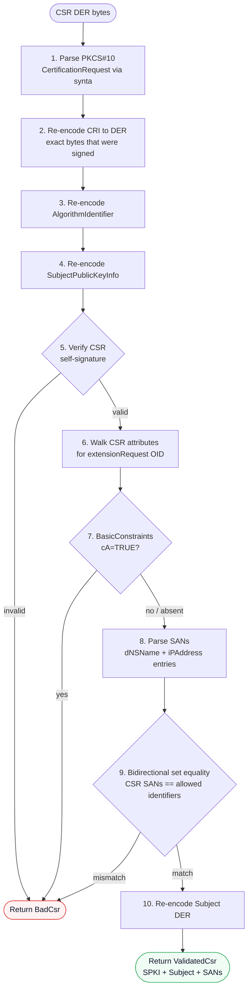

# Certificate Authority

The CA module (`src/ca/`) handles key generation, certificate issuance, CSR validation, and CRL generation. All CA operations are synchronous (no async); they are called from async handlers but do not perform I/O themselves (except during initialization).

## Initialization (`src/ca/init.rs`)

`ca::init::load_or_generate(config: &CaConfig)` is called once at startup. It follows this logic:

| `key_file` exists | `cert_file` exists | Action |
|---|---|---|
| No | No | Generate a new CA key and self-signed certificate; write both to disk. |
| Yes | Yes | Load both PEM files from disk. |
| Yes | No (or No/Yes) | Return an error — partial state is rejected. |

### Key generation

`generate_backend_key(key_type: &str)` dispatches to `synta_certificate::BackendPrivateKey`:

| `key_type` string | Algorithm |
|---|---|
| `"ec:P-256"` or `"P-256"` | ECDSA P-256 |
| `"ec:P-384"` or `"P-384"` | ECDSA P-384 |
| `"ec:P-521"` or `"P-521"` | ECDSA P-521 |
| `"rsa:2048"` or `"rsa2048"` | RSA 2048 (e=65537) |
| `"rsa:3072"` or `"rsa3072"` | RSA 3072 (e=65537) |
| `"rsa:4096"` or `"rsa4096"` | RSA 4096 (e=65537) |
| `"ed25519"` | Ed25519 |
| `"ed448"` | Ed448 |

Any other string returns `AcmeError::Internal`.

### CA certificate profile

The auto-generated CA certificate contains:

| Field | Value |
|---|---|
| Serial | `INTEGER { 1 }` |
| Subject | `CN=<common_name>, O=<organization>` |
| Issuer | Same as subject (self-signed) |
| NotBefore | Current time |
| NotAfter | `ca_validity_years * 365.25 * 86400` seconds in the future |
| BasicConstraints | Critical; `cA=TRUE` |
| KeyUsage | Critical; `keyCertSign + cRLSign` |
| SubjectKeyIdentifier | SHA-1 of the public key (RFC 5280 method 1) |
| AuthorityKeyIdentifier | Same key ID (self-signed) |

### Time encoding

Internal timestamps are represented as Unix epoch seconds. The helper function `unix_to_generalized_time(secs: i64) -> String` converts them to the `YYYYMMDDHHmmssZ` format used by ASN.1 `GeneralizedTime`, using `synta::GeneralizedTime::from_unix` for the Gregorian calendar decomposition (Howard Hinnant's algorithm, no external dependencies).

## CSR validation (`src/ca/csr.rs`)

`ca::csr::validate_csr(csr_der: &[u8], allowed_identifiers: &[(&str, &str)]) -> Result<ValidatedCsr, AcmeError>` performs the following checks in order:

1. **Parse**: decode the `csr_der` as a DER PKCS#10 `CertificationRequest` using `synta`.
2. **Re-encode CRI**: encode the `CertificationRequestInfo` back to DER to obtain the exact bytes that were signed.
3. **Re-encode AlgorithmIdentifier**: same for the signature algorithm.
4. **Re-encode SPKI**: extract and re-encode the SubjectPublicKeyInfo.
5. **Verify signature**: `BackendPublicKey::verify_signature(cri_der, alg_der, signature)`. Returns `BadCsr` if invalid.
6. **Extract extensions**: walk the CSR attributes for the `extensionRequest` attribute (OID `1.2.840.113549.1.9.14`) and decode the extension list.
7. **Check BasicConstraints**: if present, reject `cA=TRUE`.
8. **Parse SANs**: walk the SubjectAlternativeName extension for `dNSName` (tag `[2]`) and `iPAddress` (tag `[7]`) entries. Other SAN types are silently ignored.
9. **Bidirectional set equality**: every CSR SAN must appear in `allowed_identifiers`, and every entry in `allowed_identifiers` must appear in the CSR SANs. A mismatch returns `BadCsr`.
10. **Re-encode Subject**: extract the subject Name DER.

The returned `ValidatedCsr` contains the SPKI DER, subject DER, and parsed SAN list. These are passed directly to `issue_certificate`.

The DER walking in step 6 is done manually (not using synta's high-level decoder) because the extension attribute is nested inside a `SET OF ANY`, which requires raw byte manipulation to extract.

## Certificate issuance (`src/ca/issue.rs`)

`ca::issue::issue_certificate(ca_key, ca_cert_der, hash_alg, validity_days, crl_url, ocsp_url, csr)` builds and signs an X.509 v3 end-entity certificate.

### Serial number

A random 16-byte serial is generated by `getrandom`. The high bit is cleared to ensure the value is non-negative in two's complement (required by RFC 5280 §4.1.2.2).

### Extensions added

| Extension | Critical | Notes |
|---|---|---|
| BasicConstraints | No | `cA=FALSE` |
| KeyUsage | Yes | `digitalSignature` only |
| ExtendedKeyUsage | No | `serverAuth` |
| SubjectKeyIdentifier | No | SHA-1 of SPKI from CSR |
| AuthorityKeyIdentifier | No | SHA-1 of CA's SPKI |
| SubjectAlternativeName | No | Rebuilt from validated SANs |
| AuthorityInfoAccess | No | Present only if `ocsp_url` is set |
| CRLDistributionPoints | No | Present only if `crl_url` is set |

### PEM bundle

The returned `IssuedCert` contains:
- `cert_der` — the leaf certificate DER (stored in `certificates.der`).
- `cert_pem` — a PEM bundle with the leaf certificate followed by the CA certificate (stored in `certificates.pem` and served by the download endpoint).

## CRL generation (`src/ca/revoke.rs`)

`ca::revoke::build_crl(ca_key, ca_cert_der, hash_alg, revoked_entries, next_update_secs)` generates a v2 CRL.

The CRL:
- Uses the CA's subject Name as the issuer.
- Contains one entry per `RevokedEntry` with serial bytes, revocation time, and optional reason code.
- Includes a `CRLNumber` extension (required for v2 by RFC 5280 §5.2.3) with the current Unix timestamp as a monotonically increasing integer.
- Is returned as both DER and PEM.

The CRL Number is encoded as a positive DER INTEGER. `encode_integer_der` handles the two's complement padding (adding a `0x00` prefix when the high bit of the first content byte is set).

The server does not call `build_crl` automatically. It must be called by external tooling or a future CRL-serving endpoint.
