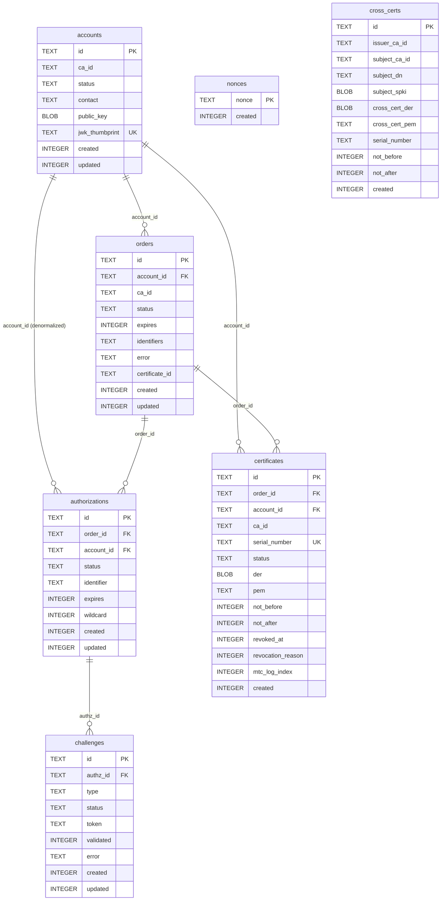

# Database

`Akāmu` uses `sqlx` 0.8 as its database layer, with a runtime-dispatch `AnyPool` that supports SQLite, PostgreSQL, and MariaDB. The active backend is selected by a compile-time feature flag (`backend-sqlite`, `backend-postgres`, or `backend-mariadb`). Schema migrations are managed by sqlx's built-in `migrate!` macro.

## Connection model

The server holds a single `sqlx::AnyPool` shared across all handler tasks (stored in `AppState`). sqlx manages an async connection pool internally; callers simply use `pool.acquire()` or pass `&pool` directly to query macros.

All queries use the sqlx macro pattern:

```rust
sqlx::query_as!(Row, "SELECT … FROM …", param)
    .fetch_one(&db)
    .await?
```

### Initialization

`db::open(url, max_connections, migrations_dir)` in `src/db/mod.rs` performs the following in order:

1. Registers all compiled-in sqlx drivers via `sqlx::any::install_default_drivers()`.
2. Opens the pool (creates the SQLite file if needed; for `:memory:` a fresh in-memory database is used).
3. Runs all pending migrations from `migrations_dir` via `sqlx::migrate::Migrator`.
4. Enables WAL mode for SQLite: `PRAGMA journal_mode=WAL`.

WAL (Write-Ahead Logging) mode is enabled after migrations rather than before, because changing the journal mode during a migration can cause transaction issues.

At server startup, nonces older than 24 hours are swept: `db::nonces::sweep_expired(&db, 86400)`.

## Schema

The core schema begins with six tables applied through three migration files. Later migrations add additional columns and tables as described below.

### Migration 001 — Initial schema

**`nonces`** — Anti-replay nonces consumed on first use.

```sql
CREATE TABLE nonces (
    nonce   TEXT    PRIMARY KEY,
    created INTEGER NOT NULL  -- Unix epoch seconds
);
```

**`accounts`** — ACME accounts.

```sql
CREATE TABLE accounts (
    id             TEXT    PRIMARY KEY,
    status         TEXT    NOT NULL DEFAULT 'valid',
    contact        TEXT,                        -- JSON array of mailto: URIs
    public_key     BLOB    NOT NULL,            -- DER-encoded SubjectPublicKeyInfo
    jwk_thumbprint TEXT    NOT NULL UNIQUE,     -- base64url SHA-256 JWK thumbprint
    created        INTEGER NOT NULL,
    updated        INTEGER NOT NULL
);
```

`jwk_thumbprint` has a unique constraint so the database enforces that no two accounts share a key.

**`orders`** — ACME orders.

```sql
CREATE TABLE orders (
    id             TEXT    PRIMARY KEY,
    account_id     TEXT    NOT NULL REFERENCES accounts(id),
    status         TEXT    NOT NULL DEFAULT 'pending',
    expires        INTEGER,
    identifiers    TEXT    NOT NULL,            -- JSON [{type,value}]
    not_before     INTEGER,
    not_after      INTEGER,
    error          TEXT,                        -- problem+json string if invalid
    certificate_id TEXT,
    created        INTEGER NOT NULL,
    updated        INTEGER NOT NULL
);
```

`identifiers` is stored as a JSON string, e.g. `[{"type":"dns","value":"example.com"}]`.

**`authorizations`** — One per identifier per order.

```sql
CREATE TABLE authorizations (
    id         TEXT    PRIMARY KEY,
    order_id   TEXT    NOT NULL REFERENCES orders(id),
    account_id TEXT    NOT NULL REFERENCES accounts(id),
    status     TEXT    NOT NULL DEFAULT 'pending',
    identifier TEXT    NOT NULL,                -- JSON {"type":..,"value":..}
    expires    INTEGER,
    wildcard   INTEGER NOT NULL DEFAULT 0,      -- 0=false, 1=true
    created    INTEGER NOT NULL,
    updated    INTEGER NOT NULL
);
```

`account_id` is denormalized from the parent order to allow efficient per-account queries without joins.

**`challenges`** — One or more per authorization.

```sql
CREATE TABLE challenges (
    id        TEXT    PRIMARY KEY,
    authz_id  TEXT    NOT NULL REFERENCES authorizations(id),
    type      TEXT    NOT NULL,                -- http-01|dns-01|tls-alpn-01
    status    TEXT    NOT NULL DEFAULT 'pending',
    token     TEXT    NOT NULL,
    validated INTEGER,
    error     TEXT,
    created   INTEGER NOT NULL,
    updated   INTEGER NOT NULL
);
```

All challenges for a given authorization share the same `token` (generated once per authorization at order creation).

**`certificates`** — Issued X.509 certificates.

```sql
CREATE TABLE certificates (
    id                TEXT    PRIMARY KEY,
    order_id          TEXT    NOT NULL REFERENCES orders(id),
    account_id        TEXT    NOT NULL REFERENCES accounts(id),
    serial_number     TEXT    NOT NULL UNIQUE,  -- hex-encoded
    status            TEXT    NOT NULL DEFAULT 'valid',
    der               BLOB    NOT NULL,
    pem               TEXT    NOT NULL,
    not_before        INTEGER NOT NULL,
    not_after         INTEGER NOT NULL,
    revoked_at        INTEGER,
    revocation_reason INTEGER,
    mtc_log_index     INTEGER,
    created           INTEGER NOT NULL
);
```

`der` stores only the leaf certificate DER. `pem` stores the full PEM chain (leaf + CA). Both `der` and `pem` are stored because some operations (CRL generation, MTC logging) need the DER, while the download endpoint serves the PEM.

### Migration 002 — Renewal info

Adds ARI (ACME Renewal Information) columns to `certificates`:

```sql
ALTER TABLE certificates ADD COLUMN suggested_window_start INTEGER;
ALTER TABLE certificates ADD COLUMN suggested_window_end   INTEGER;
```

These are `NULL` by default. The ARI endpoint computes a default window if they are not set.

### Migration 003 — Performance indexes

```sql
CREATE INDEX IF NOT EXISTS idx_certs_status
    ON certificates(status);

CREATE INDEX IF NOT EXISTS idx_certs_account_status_not_after
    ON certificates(account_id, status, not_after);

CREATE INDEX IF NOT EXISTS idx_nonces_created
    ON nonces(created);
```

`idx_certs_status` speeds up CRL generation (which selects all revoked certificates). `idx_certs_account_status_not_after` speeds up per-account certificate listing. `idx_nonces_created` speeds up the expiry sweep.

## Row types

`src/db/schema.rs` defines Rust structs mirroring each table row. These are plain data structs used to move data between the database layer and the application logic:

- `AccountRow` — mirrors `accounts`. Includes `ca_id: String` (empty = server-wide scope; non-empty only when `server.account_scope = "ca"`).
- `OrderRow` — mirrors `orders`. Includes `ca_id: String` (the CA that issued/will issue the certificate for this order; defaults to `"default"` for rows created before migration 0012).
- `AuthorizationRow` — mirrors `authorizations`. Includes `ca_id: String` (the CA that owns this authorization; empty for pre-migration rows).
- `ChallengeRow` — mirrors `challenges`.
- `CertificateRow` — mirrors `certificates`. Includes `ca_id: String` (the issuing CA; defaults to `"default"` for rows created before migration 0012).
- `CrossCertRow` — mirrors `cross_certs`. Fields: `issuer_ca_id`, `subject_ca_id` (nullable — `None` when the subject is an external CA), `subject_dn`, `subject_spki`, `cross_cert_der`, `cross_cert_pem`, `serial_number`, `not_before`, `not_after`, `created`.

## Database module structure

Each table has its own submodule in `src/db/`:

| Module | Exposed functions |
|---|---|
| `db::accounts` | `insert`, `get_by_id`, `get_by_thumbprint`, `update_contact`, `update_status`, `update_key` |
| `db::orders` | `insert`, `get_by_id`, `update_status`, `list_authz_ids` |
| `db::authz` | `insert`, `get_by_id`, `update_status` |
| `db::challenges` | `insert`, `get_by_id`, `list_by_authz`, `set_processing`, `set_invalid` |
| `db::certs` | `get_by_id`, `get_by_serial`, `revoke`, `set_mtc_log_index` |
| `db::cross_certs` | `insert`, `list_by_issuer`, `list_by_subject`, `get_by_id` |
| `db::nonces` | `insert`, `consume`, `sweep_expired` |

## Transactions

Multi-table writes use explicit SQLite transactions to ensure atomicity:

- **Order creation**: the order row, all authorization rows, and all challenge rows are inserted in a single transaction.
- **Challenge validation success**: the challenge, authorization, and (if all authorizations are now valid) the order are updated in a single transaction.
- **Certificate issuance**: the certificate row is inserted and the order is updated to `valid` in a single transaction.

This prevents the database from being left in an inconsistent state if the process crashes between writes.

## Schema diagram

The entity-relationship diagram below shows all six tables and their foreign-key
relationships. The `account_id` column on `authorizations` is denormalized from the
parent order; both FKs exist in the database.



### Migration 009 — Operator lockout

Adds `failed_attempts INTEGER NOT NULL DEFAULT 0` and `locked_until TEXT` columns to the `operators` table for FIA_AFL.1 lockout support.

### Migration 0012 — Multi-CA support (SQLite), 0011 (PostgreSQL/MariaDB)

Adds `ca_id TEXT NOT NULL DEFAULT ''` to `accounts`, and `ca_id TEXT NOT NULL DEFAULT 'default'` to `orders` and `certificates`. Also adds supporting indexes:

```sql
ALTER TABLE accounts     ADD COLUMN ca_id TEXT NOT NULL DEFAULT '';
ALTER TABLE orders       ADD COLUMN ca_id TEXT NOT NULL DEFAULT 'default';
ALTER TABLE certificates ADD COLUMN ca_id TEXT NOT NULL DEFAULT 'default';

CREATE INDEX idx_accounts_ca_id ON accounts(ca_id);
CREATE INDEX idx_orders_ca_id   ON orders(ca_id);
CREATE INDEX idx_certs_ca_id    ON certificates(ca_id);
-- Partial index for CRL generation (WHERE status = 'revoked' AND ca_id = ?)
CREATE INDEX idx_certs_ca_id_revoked ON certificates(ca_id) WHERE status = 'revoked';
```

Sentinel conventions:

- `accounts.ca_id = ''` (empty string) — server-wide account scope; the account may use any CA. Empty string is not a valid CA ID (config validator requires at least one alphanumeric character).
- `orders.ca_id = 'default'` — backfills pre-migration rows to the canonical single-CA name. `"default"` is the auto-assigned ID for single-CA compatibility mode.
- `certificates.ca_id = 'default'` — same backfill convention.

### Migration 0013 — Cross-certificates (SQLite), 0012 (PostgreSQL/MariaDB)

Adds the `cross_certs` table:

```sql
CREATE TABLE cross_certs (
    id              TEXT    PRIMARY KEY,        -- UUID
    issuer_ca_id    TEXT    NOT NULL,           -- CA that signed the cross-cert
    subject_ca_id   TEXT,                      -- akamu CA ID if same-server; NULL if external
    subject_dn      TEXT    NOT NULL,           -- RFC 4514 subject DN string
    subject_spki    BLOB    NOT NULL,           -- DER SubjectPublicKeyInfo of subject CA key
    cross_cert_der  BLOB    NOT NULL,           -- DER of the issued cross-certificate
    cross_cert_pem  TEXT    NOT NULL,           -- PEM for download
    not_before      INTEGER NOT NULL,           -- Unix epoch
    not_after       INTEGER NOT NULL,           -- Unix epoch
    serial_number   TEXT    NOT NULL,           -- hex-encoded (same format as certificates)
    created         INTEGER NOT NULL,           -- Unix epoch
    UNIQUE (issuer_ca_id, serial_number)        -- RFC 5280: unique within issuing CA
);
```

`subject_ca_id` is `NULL` when the subject is an external CA whose certificate was uploaded via the admin API. When the subject is another same-server CA, `subject_ca_id` matches its `CaConfig.id`.

Rows are insert-only (never mutated after creation). The module `src/db/cross_certs.rs` provides `insert`, `list_by_issuer`, `list_by_subject`, and `get_by_id`.

### Migration 0014/0015 — Authorization CA scope and operator CA scope

Migration 0014 (SQLite) / 0013 (PostgreSQL/MariaDB) adds `ca_id TEXT NOT NULL DEFAULT ''` to `authorizations`, recording which CA owns each authorization.

Migration 0015 (SQLite) / 0014 (PostgreSQL/MariaDB) adds `ca_id TEXT NOT NULL DEFAULT ''` to `operators`. For `ca_ra` operators, a non-empty `ca_id` restricts the operator to that specific CA; empty means server-wide. The `db::operators::update()` function accepts `ca_id: Option<&str>`: `None` means no change, `Some("")` clears the CA scope, `Some("x")` sets it.

The `OperatorRow` struct in `src/db/operators.rs` includes:

```rust
/// CA scope for ca_ra operators.  Empty string means server-wide (no restriction).
/// Ignored for all roles other than ca_ra.
pub ca_id: String,
```

`AdminSession.ca_id` is populated from the operator row at login time and propagated to all admin request handlers.

## Foreign key enforcement

Foreign key constraints are enabled at database open time. The constraint graph is:

- `orders.account_id` → `accounts.id`
- `authorizations.order_id` → `orders.id`
- `authorizations.account_id` → `accounts.id`
- `challenges.authz_id` → `authorizations.id`
- `certificates.order_id` → `orders.id`
- `certificates.account_id` → `accounts.id`

Enabling foreign keys is done before running migrations so that any migration that would violate a constraint fails immediately rather than silently inserting orphaned rows.
