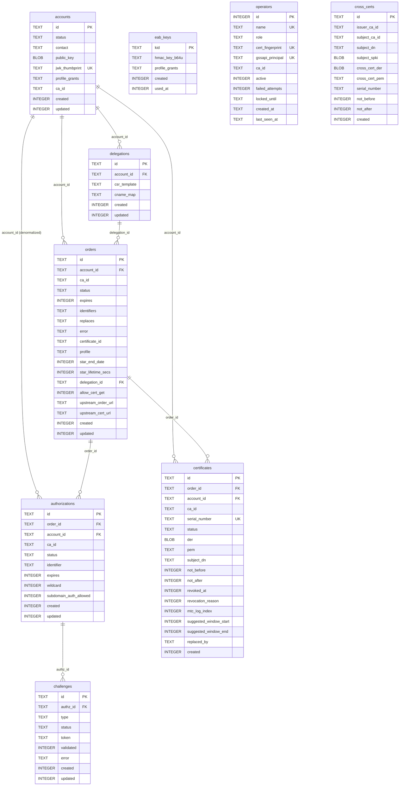

# Database

`Akāmu` uses `sqlx` 0.8 as its database layer, with a runtime-dispatch `AnyPool` that supports SQLite, PostgreSQL, and MariaDB. The active backend is selected by a compile-time feature flag (`backend-sqlite`, `backend-postgres`, or `backend-mariadb`). Schema migrations are managed by sqlx's built-in `migrate!` macro.

## Connection model

The server holds two `sqlx::AnyPool` instances stored in `AppState`:

- **`db`** (write pool) — all migrations run here; all write transactions use it; most read queries also use it.
- **`db_ro`** (read-only pool) — opened with the `?mode=ro` SQLite URI parameter. Pure-read handlers (`get_order`, `get_authz`, `download_cert`) route through this pool so concurrent reads do not contend on the WAL write lock. For `:memory:` databases and non-SQLite backends `db_ro` is a clone of `db`.

`db::open_ro(url, max_connections)` in `src/db/mod.rs` opens the read-only pool. It returns `None` for `:memory:` URLs (each connection sees an empty schema) and for non-SQLite URLs.

sqlx manages each pool's connection count internally; callers pass `&pool` to query helpers or `&mut *tx` inside transactions.

All queries use the sqlx `QueryBuilder` or typed-query pattern:

```rust
sqlx::query_as!(Row, "SELECT … FROM …", param)
    .fetch_one(&db_ro)
    .await?
```

### Initialization

`db::open(url, max_connections, require_tls)` in `src/db/mod.rs` performs the following in order:

1. Registers all compiled-in sqlx drivers via `sqlx::any::install_default_drivers()`.
2. Optionally validates the URL for SSL/TLS parameters when `require_tls` is `true` (FPT_ITT.1).
3. Opens the pool (creates the SQLite file if needed via the `?mode=rwc` URI parameter; for `:memory:` a fresh in-memory database is used).
4. Enables WAL mode and performance pragmas for SQLite: `PRAGMA journal_mode=WAL`, `PRAGMA synchronous=NORMAL`, `PRAGMA foreign_keys=ON`, `PRAGMA mmap_size=134217728`, `PRAGMA cache_size=-65536`.
5. Runs all pending migrations via the compiled-in `sqlx::migrate!` macro, selecting the backend-specific migration directory (`migrations/sqlite/`, `migrations/postgres/`, or `migrations/mariadb/`).

At server startup, nonces older than 24 hours are swept from the in-memory `NonceBucket`.

## Migration numbering

Each database backend has its own migration directory (`migrations/sqlite/`, `migrations/postgres/`, `migrations/mariadb/`). Two backend-specific migrations affect the numbering:

- **SQLite 0006** (`0006_mtc_log_index.sql`) — a WAL-mode index-tuning step that does not apply to PostgreSQL or MariaDB.  All SQLite migrations from 0007 onward are therefore one higher than the corresponding PostgreSQL/MariaDB number.
- **PostgreSQL 0015** (`0015_hot_indexes.sql`) — two partial/compound indexes on `authorizations` that are specific to PostgreSQL concurrency characteristics.  This migration has no SQLite or MariaDB counterpart.

The remainder of this document uses SQLite numbers as the canonical reference and notes the PostgreSQL/MariaDB equivalent where the numbers differ.

## Schema

All seven core tables are created in a single initial migration (`0001_initial.sql`). Later migrations add columns and additional tables.

### Migration 0001 — Initial schema

**`nonces`** — Anti-replay nonces. The in-memory `NonceBucket` is the hot path; this table exists for startup cleanup of nonces written by a previous process version.

```sql
CREATE TABLE nonces (
    nonce   TEXT    PRIMARY KEY,
    created INTEGER NOT NULL  -- Unix epoch seconds
);
CREATE INDEX idx_nonces_created ON nonces(created);
```

**`accounts`** — ACME accounts.

```sql
CREATE TABLE accounts (
    id             TEXT    PRIMARY KEY,      -- UUID
    status         TEXT    NOT NULL DEFAULT 'valid',  -- valid|deactivated|revoked
    contact        TEXT,                     -- JSON array of mailto: URIs
    public_key     BLOB    NOT NULL,         -- DER-encoded SubjectPublicKeyInfo
    jwk_thumbprint TEXT    NOT NULL UNIQUE,  -- base64url SHA-256 JWK thumbprint
    created        INTEGER NOT NULL,
    updated        INTEGER NOT NULL
);
```

`jwk_thumbprint` has a unique constraint so the database enforces that no two accounts share a key.

**`orders`** — ACME orders, including STAR (RFC 8739) auto-renewal fields.

```sql
CREATE TABLE orders (
    id                        TEXT    PRIMARY KEY,
    account_id                TEXT    NOT NULL REFERENCES accounts(id),
    status                    TEXT    NOT NULL DEFAULT 'pending',
    expires                   INTEGER,
    identifiers               TEXT    NOT NULL,   -- JSON [{type,value}]
    not_before                INTEGER,
    not_after                 INTEGER,
    error                     TEXT,               -- problem+json string if invalid
    certificate_id            TEXT,               -- FK to certificates.id when valid
    replaces                  TEXT,               -- RFC 9773 ARI: cert_id of predecessor
    created                   INTEGER NOT NULL,
    updated                   INTEGER NOT NULL,
    -- RFC 8739 STAR auto-renewal
    star_start_date           INTEGER,
    star_end_date             INTEGER,
    star_lifetime_secs        INTEGER,
    star_lifetime_adjust_secs INTEGER NOT NULL DEFAULT 0,
    star_allow_cert_get       INTEGER NOT NULL DEFAULT 0,
    star_canceled_at          INTEGER,
    star_csr_der              BLOB,               -- stored CSR DER for reissuance
    -- draft-ietf-acme-profiles-01
    profile                   TEXT
);
CREATE INDEX idx_orders_account  ON orders(account_id);
CREATE INDEX idx_orders_status   ON orders(status);
CREATE INDEX idx_orders_replaces ON orders(replaces) WHERE replaces IS NOT NULL;
CREATE INDEX idx_orders_star     ON orders(star_end_date) WHERE star_end_date IS NOT NULL;
```

**`authorizations`** — One per identifier per order. `account_id` is denormalized from the parent order to allow efficient per-account queries without joins. `subdomain_auth_allowed` records whether RFC 9444 subdomain authorization was granted.

```sql
CREATE TABLE authorizations (
    id                    TEXT    PRIMARY KEY,
    order_id              TEXT    NOT NULL REFERENCES orders(id),
    account_id            TEXT    NOT NULL REFERENCES accounts(id),
    status                TEXT    NOT NULL DEFAULT 'pending',
    identifier            TEXT    NOT NULL,   -- JSON {"type":"dns","value":"example.com"}
    expires               INTEGER,
    wildcard              INTEGER NOT NULL DEFAULT 0,
    subdomain_auth_allowed INTEGER NOT NULL DEFAULT 0,  -- RFC 9444
    created               INTEGER NOT NULL,
    updated               INTEGER NOT NULL
);
CREATE INDEX idx_authz_order   ON authorizations(order_id);
CREATE INDEX idx_authz_account ON authorizations(account_id);
```

**`challenges`** — One or more per authorization. All challenges for a given authorization share the same `token`.

```sql
CREATE TABLE challenges (
    id        TEXT    PRIMARY KEY,
    authz_id  TEXT    NOT NULL REFERENCES authorizations(id),
    type      TEXT    NOT NULL,     -- http-01|dns-01|tls-alpn-01
    status    TEXT    NOT NULL DEFAULT 'pending',
    token     TEXT    NOT NULL,
    validated INTEGER,
    error     TEXT,
    created   INTEGER NOT NULL,
    updated   INTEGER NOT NULL
);
CREATE INDEX idx_chall_authz ON challenges(authz_id);
```

**`certificates`** — Issued X.509 certificates. `der` stores only the leaf DER; `pem` stores the full chain (leaf + CA). Both are stored because CRL generation and MTC logging need DER while the download endpoint serves PEM.

```sql
CREATE TABLE certificates (
    id                    TEXT    PRIMARY KEY,   -- UUID used in the cert URL path
    order_id              TEXT    NOT NULL REFERENCES orders(id),
    account_id            TEXT    NOT NULL REFERENCES accounts(id),
    serial_number         TEXT    NOT NULL UNIQUE,
    status                TEXT    NOT NULL DEFAULT 'valid',  -- valid|revoked
    der                   BLOB    NOT NULL,
    pem                   TEXT    NOT NULL,
    not_before            INTEGER NOT NULL,
    not_after             INTEGER NOT NULL,
    revoked_at            INTEGER,
    revocation_reason     INTEGER,
    mtc_log_index         INTEGER,
    created               INTEGER NOT NULL,
    suggested_window_start INTEGER,  -- RFC 9773 ARI renewal window
    suggested_window_end   INTEGER,
    replaced_by           TEXT        -- RFC 9773: order_id that superseded this cert
);
CREATE INDEX idx_certs_account                  ON certificates(account_id);
CREATE INDEX idx_certs_serial                   ON certificates(serial_number);
CREATE INDEX idx_certs_order                    ON certificates(order_id);
CREATE INDEX idx_certs_status                   ON certificates(status);
CREATE INDEX idx_certs_account_status_not_after ON certificates(account_id, status, not_after);
CREATE INDEX idx_certs_replaced_by              ON certificates(replaced_by)
    WHERE replaced_by IS NOT NULL;
```

**`eab_keys`** — External Account Binding (RFC 8555 §7.3.4) pre-provisioned HMAC keys.

```sql
CREATE TABLE eab_keys (
    kid           TEXT    PRIMARY KEY,
    hmac_key_b64u TEXT    NOT NULL,
    created       INTEGER NOT NULL,
    used_at       INTEGER,
    profile_grants TEXT               -- JSON array of profile IDs; NULL = unrestricted
);
```

(`profile_grants` is added inline in the initial migration. The old `0007_profile_grants` migration added it as `ALTER TABLE` in the original schema; it is now baked into the `0001` baseline for new installations.)

### Migration 0002 — MTC checkpoints

Adds the Merkle Tree Certificate issuance-log checkpoint table:

```sql
CREATE TABLE mtc_checkpoints (
    id        INTEGER PRIMARY KEY AUTOINCREMENT,
    tree_size INTEGER NOT NULL UNIQUE,
    root_hex  TEXT    NOT NULL,
    signature BLOB    NOT NULL,
    created   INTEGER NOT NULL
);
```

### Migration 0003 — MTC standalone DER

```sql
ALTER TABLE certificates ADD COLUMN mtc_standalone_der BLOB;
```

Stores the standalone (non-chained) DER encoding of an MTC-logged certificate, used when serving MTC certificate downloads.

### Migration 0004 — MTC cosignatures

```sql
CREATE TABLE mtc_cosignatures (
    id            INTEGER PRIMARY KEY AUTOINCREMENT,
    checkpoint_id INTEGER NOT NULL REFERENCES mtc_checkpoints(id) ON DELETE CASCADE,
    cosigner_url  TEXT    NOT NULL,
    signature_der BLOB    NOT NULL,
    created       INTEGER NOT NULL,
    UNIQUE(checkpoint_id, cosigner_url)
);
CREATE INDEX idx_mtc_cosignatures_checkpoint ON mtc_cosignatures(checkpoint_id);
```

### Migration 0005 — MTC landmarks

```sql
CREATE TABLE mtc_landmarks (
    id          INTEGER PRIMARY KEY AUTOINCREMENT,
    sequence_no INTEGER NOT NULL UNIQUE,
    tree_size   INTEGER NOT NULL UNIQUE,
    cert_der    BLOB,     -- DER-encoded LandmarkCertificate; NULL until built
    created     INTEGER NOT NULL
);
```

### Migration 0006 — MTC log index (SQLite only)

```sql
CREATE INDEX idx_certs_mtc_log_index
    ON certificates(mtc_log_index)
    WHERE mtc_log_index IS NOT NULL;
```

This index is specific to SQLite WAL mode and has no equivalent in the PostgreSQL/MariaDB migrations. All subsequent SQLite migration numbers are therefore one higher than their PostgreSQL/MariaDB counterparts.

### Migration 0007 — Profile grants (PostgreSQL/MariaDB: 0006)

```sql
ALTER TABLE accounts  ADD COLUMN profile_grants TEXT;
ALTER TABLE eab_keys  ADD COLUMN profile_grants TEXT;
```

`profile_grants` is a JSON array of profile IDs (e.g. `'["tls-server","mtc-tls"]'`). `NULL` means no restriction. When an EAB key has grants set, they are copied to the account at registration time.

### Migration 0008 — Audit events (PostgreSQL/MariaDB: 0007) — DROPPED

This migration originally created the `audit_events` database table for the PP CA v2.1 FAU structured audit trail. The table has been **dropped** by migration 0031 (SQLite) / 0032 (MariaDB) / 0033 (PostgreSQL). Audit events are now written to a dedicated systemd journal namespace (`journalctl --namespace=akamu`) via `src/journal.rs`. See `contrib/systemd/journald@akamu.conf` for retention settings.

### Migration 0009 — Operators (PostgreSQL/MariaDB: 0008)

PP CA v2.1 FMT role-based access control. Operators authenticate via mTLS client certificate, Kerberos/GSSAPI, or both:

```sql
CREATE TABLE operators (
    id               INTEGER PRIMARY KEY AUTOINCREMENT,
    name             TEXT    NOT NULL UNIQUE,
    role             TEXT    NOT NULL
                             CHECK(role IN ('administrator','ca_operations','ca_ra','auditor')),
    cert_fingerprint TEXT    UNIQUE,   -- SHA-256 hex of DER leaf cert
    gssapi_principal TEXT    UNIQUE,   -- Kerberos principal e.g. alice@REALM
    created_at       TEXT    NOT NULL, -- RFC 3339
    last_seen_at     TEXT,             -- RFC 3339
    active           INTEGER NOT NULL DEFAULT 1 CHECK(active IN (0, 1)),
    CHECK(cert_fingerprint IS NOT NULL OR gssapi_principal IS NOT NULL)
);
```

### Migration 0010 — Certificate subject DN (PostgreSQL/MariaDB: 0009)

Adds a searchable subject DN column for FAU_SCR_EXT.1 audit queries:

```sql
ALTER TABLE certificates ADD COLUMN subject_dn TEXT;
CREATE INDEX idx_certs_subject_dn ON certificates(subject_dn);
```

### Migration 0011 — Operator lockout (PostgreSQL/MariaDB: 0010)

FIA_AFL.1 per-operator authentication lockout after repeated failures:

```sql
ALTER TABLE operators ADD COLUMN failed_attempts INTEGER NOT NULL DEFAULT 0;
ALTER TABLE operators ADD COLUMN locked_until TEXT;
```

### Migration 0012 — Multi-CA support (PostgreSQL/MariaDB: 0011)

Adds `ca_id` to `accounts`, `orders`, and `certificates`. Sentinel conventions:

- `accounts.ca_id = ''` — server-wide account scope; the account may use any CA. The empty string is not a valid CA ID (config validator requires `^[a-z0-9]`).
- `orders.ca_id = 'default'` — backfills pre-migration rows to the canonical single-CA name.
- `certificates.ca_id = 'default'` — same.

```sql
ALTER TABLE accounts     ADD COLUMN ca_id TEXT NOT NULL DEFAULT '';
ALTER TABLE orders       ADD COLUMN ca_id TEXT NOT NULL DEFAULT 'default';
ALTER TABLE certificates ADD COLUMN ca_id TEXT NOT NULL DEFAULT 'default';

CREATE INDEX idx_accounts_ca_id      ON accounts(ca_id);
CREATE INDEX idx_orders_ca_id        ON orders(ca_id);
CREATE INDEX idx_certs_ca_id         ON certificates(ca_id);
CREATE INDEX idx_certs_ca_id_revoked ON certificates(ca_id) WHERE status = 'revoked';
```

### Migration 0013 — Cross-certificates (PostgreSQL/MariaDB: 0012)

Stores CA certificates issued by one akāmu CA for another CA's public key. Rows are insert-only.

```sql
CREATE TABLE cross_certs (
    id             TEXT    PRIMARY KEY,   -- UUID
    issuer_ca_id   TEXT    NOT NULL,
    subject_ca_id  TEXT,                  -- akāmu CA ID if same-server; NULL if external
    subject_dn     TEXT    NOT NULL,      -- RFC 4514 subject DN
    subject_spki   BLOB    NOT NULL,      -- DER SubjectPublicKeyInfo of subject CA key
    cross_cert_der BLOB    NOT NULL,
    cross_cert_pem TEXT    NOT NULL,
    not_before     INTEGER NOT NULL,
    not_after      INTEGER NOT NULL,
    serial_number  TEXT    NOT NULL,
    created        INTEGER NOT NULL,
    UNIQUE (issuer_ca_id, serial_number)
);
CREATE INDEX idx_cross_certs_issuer  ON cross_certs(issuer_ca_id);
CREATE INDEX idx_cross_certs_subject ON cross_certs(subject_ca_id)
    WHERE subject_ca_id IS NOT NULL;
```

### Migration 0014 — Authorization CA scope (PostgreSQL/MariaDB: 0013)

Records which CA owns each authorization, enabling per-CA namespace isolation. Pre-migration rows are backfilled from the parent order's `ca_id`:

```sql
ALTER TABLE authorizations ADD COLUMN ca_id TEXT NOT NULL DEFAULT 'default';

UPDATE authorizations
   SET ca_id = COALESCE((SELECT ca_id FROM orders WHERE id = authorizations.order_id), 'default')
 WHERE order_id IS NOT NULL AND order_id != '';

CREATE INDEX idx_orders_ca_account ON orders(ca_id, account_id);
CREATE INDEX idx_authzs_ca_id      ON authorizations(ca_id);
```

### Migration 0015 — Operator CA scope (PostgreSQL/MariaDB: 0014)

Scopes `ca_ra` operators to a single CA. Empty string = server-wide (the operator can act on any CA):

```sql
ALTER TABLE operators ADD COLUMN ca_id TEXT NOT NULL DEFAULT '';
```

### Migration 0015 (PostgreSQL only) — Hot-path indexes

Two partial and compound indexes on `authorizations` that speed up the hot paths hit during every successful challenge validation. This migration has no SQLite or MariaDB equivalent because both databases perform adequately without it at typical concurrency levels; SQLite uses a single write connection that serialises concurrent writers, and MariaDB's query planner handles these patterns differently.

```sql
-- Speeds up the NOT EXISTS subquery in on_valid: filters to non-valid rows only.
CREATE INDEX IF NOT EXISTS idx_authz_order_nonvalid
    ON authorizations(order_id)
    WHERE status != 'valid';

-- Speeds up find_valid_by_account_and_identifier: covers both filter columns.
CREATE INDEX IF NOT EXISTS idx_authz_acct_ident
    ON authorizations(account_id, identifier);
```

SQLite migration numbers remain one higher than the PostgreSQL/MariaDB equivalents from migration 0007 onward (due to the SQLite-only MTC log index at SQLite 0006). The PostgreSQL migration directory now contains 17 migrations (0001–0016, plus the PostgreSQL-only hot-indexes file); the SQLite directory contains 17 migrations (0001–0017). The SQLite offset means its 0017 corresponds to the RFC 9115 delegation changes, which is PostgreSQL/MariaDB 0016.

### Migration 0016 — Email challenge state (SQLite) / Migration 0015 (PostgreSQL/MariaDB)

Adds two columns to the `challenges` table to support the two-channel token required by the RFC 8823 `email-reply-00` challenge:

```sql
ALTER TABLE challenges ADD COLUMN email_token_part1 TEXT;
ALTER TABLE challenges ADD COLUMN email_message_id  TEXT;

CREATE UNIQUE INDEX IF NOT EXISTS idx_chall_email_message_id
    ON challenges(email_message_id)
    WHERE email_message_id IS NOT NULL;
```

`email_token_part1` holds the server-generated first half of the RFC 8823 two-part token, delivered to the applicant in the challenge email subject. `email_message_id` is the `Message-ID` of the outbound challenge email, used to correlate the inbound webhook reply.

### Migration 0017 — RFC 9115 delegation (SQLite) / Migration 0016 (PostgreSQL/MariaDB)

Adds the `delegations` table and four new columns to `orders` to support RFC 9115 ACME delegated certificates:

```sql
CREATE TABLE IF NOT EXISTS delegations (
    id           TEXT    PRIMARY KEY,
    account_id   TEXT    NOT NULL REFERENCES accounts(id),
    csr_template TEXT    NOT NULL,  -- JSON per RFC 9115 §4
    cname_map    TEXT,              -- JSON {fqdn: fqdn} or NULL
    created      INTEGER NOT NULL,
    updated      INTEGER NOT NULL
);
CREATE INDEX IF NOT EXISTS idx_delegations_account ON delegations(account_id);

ALTER TABLE orders ADD COLUMN delegation_id       TEXT REFERENCES delegations(id);
ALTER TABLE orders ADD COLUMN allow_cert_get      INTEGER NOT NULL DEFAULT 0;
ALTER TABLE orders ADD COLUMN upstream_order_url  TEXT;
ALTER TABLE orders ADD COLUMN upstream_cert_url   TEXT;

CREATE INDEX IF NOT EXISTS idx_orders_delegation ON orders(delegation_id)
    WHERE delegation_id IS NOT NULL;
CREATE INDEX IF NOT EXISTS idx_orders_delegation_status
    ON orders(delegation_id, status)
    WHERE delegation_id IS NOT NULL AND status = 'processing';
```

`delegation_id` is a nullable FK to `delegations(id)`. Orders with a non-null `delegation_id` skip the authorization flow and start in `ready` status. `allow_cert_get` mirrors the `"allow-certificate-get"` field from the `new-order` payload — when set to `1`, the certificate endpoint for that order accepts unauthenticated `GET`. `upstream_order_url` and `upstream_cert_url` are set by the background delegation task as it progresses through the upstream ACME flow.

The PostgreSQL version uses `ALTER TABLE ... ADD COLUMN IF NOT EXISTS` and `CREATE INDEX CONCURRENTLY` to allow the migration to run without an exclusive table lock.

## Row types

`src/db/schema.rs` defines Rust structs mirroring each table row:

- `AccountRow` — mirrors `accounts`. Includes `ca_id: String` (empty = server-wide; non-empty only when `server.account_scope = "ca"`), `profile_grants: Option<String>`.
- `OrderRow` — mirrors `orders`. Includes `ca_id: String` (defaults to `"default"` for pre-migration rows), `profile: Option<String>`, all `star_*` fields, and the RFC 9115 delegation fields: `delegation_id: Option<String>`, `allow_cert_get: bool`, `upstream_order_url: Option<String>`, `upstream_cert_url: Option<String>`.
- `DelegationRow` — mirrors `delegations`. Fields: `id: String`, `account_id: String`, `csr_template: String` (JSON), `cname_map: Option<String>` (JSON), `created: i64`, `updated: i64`.
- `AuthorizationRow` — mirrors `authorizations`. Includes `ca_id: String` and `subdomain_auth_allowed: bool`.
- `ChallengeRow` — mirrors `challenges`.
- `CertificateRow` — mirrors `certificates`. Includes `ca_id: String`, `subject_dn: Option<String>`, `suggested_window_start/end: Option<i64>`, `replaced_by: Option<String>`.
- `CrossCertRow` — mirrors `cross_certs`. `subject_ca_id: Option<String>` is `None` when the subject is an external CA.
- `OperatorRow` — mirrors `operators`. Includes `ca_id: String` (CA scope for `ca_ra` operators; empty = server-wide), `failed_attempts: i64`, `locked_until: Option<String>`.

## Database module structure

Each table has its own submodule in `src/db/`:

| Module | Exposed functions |
|---|---|
| `db::accounts` | `insert`, `get_by_id`, `get_by_thumbprint`, `update_contact`, `update_status`, `update_key`, `set_profile_grants`, `get_profile_grants`, `list` |
| `db::orders` | `insert`, `get_by_id`, `update_status`, `list_authz_ids`, `list_pending_delegation_orders` |
| `db::delegations` | `insert`, `get_by_id`, `update`, `delete`, `list`, `list_by_account` |
| `db::authz` | `insert`, `get_by_id`, `update_status` |
| `db::challenges` | `insert`, `get_by_id`, `list_by_authz`, `set_processing`, `set_invalid` |
| `db::certs` | `insert`, `get_by_id`, `get_by_serial`, `get_by_cert_id`, `mark_replaced`, `revoke`, `set_mtc_log_index`, `set_renewal_window`, `list_revoked`, `list_valid_for_account`, `get_latest_for_order`, `search` |
| `db::cross_certs` | `insert`, `get_by_id`, `list` |
| `db::eab` | `insert`, `get_by_kid`, `mark_used`, `list`, `delete` |
| `db::nonces` | `insert`, `consume`, `sweep_expired` |
| `db::operators` | `insert`, `insert_if_absent`, `is_empty`, `get_by_id`, `get_by_fingerprint`, `get_by_principal`, `list`, `update`, `set_active`, `update_last_seen`, `increment_failed`, `reset_failed`, `unlock`, `is_locked` |
| ~~`db::audit`~~ | Removed — audit events are now written to the configured audit backend (systemd journal namespace, JSONL file, or in-process store) via `src/journal.rs` and `src/audit.rs` |

### `CertSearchParams`

`db::certs::search` accepts a `CertSearchParams<'_>` struct to satisfy `clippy::too_many_arguments`. All filter fields are optional; only `Some` values are emitted as `WHERE` clauses via `QueryBuilder`:

```rust
pub struct CertSearchParams<'a> {
    pub serial: Option<&'a str>,
    pub account_id: Option<&'a str>,
    pub status: Option<&'a str>,
    pub subject_dn: Option<&'a str>,  // LIKE-escaped substring match
    pub ca_id: Option<&'a str>,
    pub limit: i64,
    pub offset: i64,
}
```

The `subject_dn` filter uses `LIKE` with `!` as the escape character; `%` and `_` in the input are automatically escaped to prevent injection.

### `OperatorUpdateParams`

`db::operators::update` accepts an `OperatorUpdateParams<'_>` struct. Only `Some` fields are included in the generated `UPDATE` statement:

```rust
pub struct OperatorUpdateParams<'a> {
    pub name: Option<&'a str>,
    pub role: Option<&'a str>,
    pub cert_fingerprint: Option<&'a str>,
    pub gssapi_principal: Option<&'a str>,
    pub ca_id: Option<&'a str>,  // Some("") clears CA scope; None leaves it unchanged
}
```

`update` is called by the `PUT /admin/operators/{id}` handler, which evicts any active session for that operator from `AppState::admin_sessions` on every successful update. This ensures that role and CA-scope changes take effect immediately rather than at the next session expiry.

## Query helpers

`src/db/mod.rs` exports several helpers that make raw sqlx queries portable across backends.

### `pg_sql` / `query` / `query_as`

PostgreSQL uses `$N` positional placeholders while SQLite and MariaDB use `?`.  sqlx's
`AnyPool` does not automatically rewrite `?` for PostgreSQL because `?` is also the
JSONB existence operator there.  The helpers below handle the rewrite transparently:

| Helper | Usage |
|--------|-------|
| `pg_sql(sql)` | Rewrites `?` → `$1`, `$2`, … for PostgreSQL; returns the string unchanged for all other backends. The rewritten string is cached by static pointer identity, so each unique SQL literal is rewritten at most once. |
| `query(sql)` | Calls `pg_sql`, then `sqlx::query`. Use everywhere a raw `?`-parameterised query string is needed. |
| `query_as::<O>(sql)` | Calls `pg_sql`, then `sqlx::query_as`. Use for typed row mapping. |

### `DynQueryBuilder`

For dynamically constructed queries (variable number of `WHERE` clauses, multi-row
`VALUES` inserts), `DynQueryBuilder` emits `$N` for PostgreSQL and `?` for all other
backends, and tracks the bind count internally:

```rust
let mut q = DynQueryBuilder::new("SELECT id FROM certificates WHERE 1=1");
if let Some(serial) = params.serial {
    q.push(" AND serial_number = ").push_bind(serial);
}
let rows = q.fetch_all(&db).await?;
```

### `pg_local_async_commit`

```rust
pub(crate) async fn pg_local_async_commit(
    tx: &mut sqlx::Transaction<'_, sqlx::Any>,
    kind: DbKind,
) -> Result<(), sqlx::Error>
```

Issues `SET LOCAL synchronous_commit = off` inside the current PostgreSQL transaction,
eliminating the per-commit WAL flush (~1–4 ms on SSD) for writes on state-transition
paths that are eventually consistent by ACME protocol design.

Called at the start of the following write transactions:

- `new-order` — inserts the order, authorization, and challenge rows.
- `new-authz` — inserts a standalone authorization row.
- Challenge processing — updates challenge, authorization, and order status on `on_valid`
  and `on_invalid`.

The certificate issuance transaction (`finalize`) does **not** call this function; cert
rows require full durability guarantees.

No-op on SQLite and MariaDB.

## Transactions

Multi-table writes use explicit transactions to ensure atomicity:

- **Order creation**: the order row, all authorization rows, and all challenge rows are inserted in a single transaction. For PostgreSQL, `pg_local_async_commit` is called at transaction start to defer WAL flush.
- **Challenge validation success**: the challenge, authorization, and (if all authorizations are now valid) the order are updated in a single transaction. For PostgreSQL, `pg_local_async_commit` is called at transaction start.
- **Certificate issuance**: the certificate row is inserted and the order is updated to `valid` in a single transaction. STAR re-issuance also stores the new CSR DER in the same transaction. Full WAL durability is retained for this transaction on all backends.

## Schema diagram

The entity-relationship diagram below shows the ACME core tables and their foreign-key relationships. MTC tables (`mtc_checkpoints`, `mtc_cosignatures`, `mtc_landmarks`) and the standalone `nonces` table are omitted for readability. The `audit_events` table has been dropped; audit events are now written to the configured audit backend (systemd journal namespace, JSONL file, or in-process store).



## Foreign key enforcement

Foreign key constraints are enabled at database open time. The constraint graph is:

- `orders.account_id` → `accounts.id`
- `authorizations.order_id` → `orders.id`
- `authorizations.account_id` → `accounts.id`
- `challenges.authz_id` → `authorizations.id`
- `certificates.order_id` → `orders.id`
- `certificates.account_id` → `accounts.id`
- `mtc_cosignatures.checkpoint_id` → `mtc_checkpoints.id` (with `ON DELETE CASCADE`)
- `delegations.account_id` → `accounts.id`
- `orders.delegation_id` → `delegations.id` (nullable)

Enabling foreign keys is done before running migrations so that any migration that would violate a constraint fails immediately rather than silently inserting orphaned rows.
