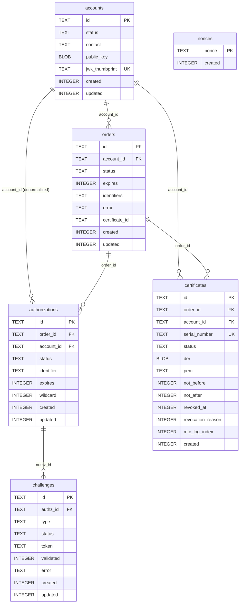

# Database

`Akāmu` uses SQLite as its persistence layer, accessed via `rusqlite` (with bundled SQLite) and `tokio-rusqlite` for async access. Schema migrations are managed by `rusqlite_migration`.

## Connection model

The server maintains a single `tokio_rusqlite::Connection` shared across all handler tasks via `Arc<Connection>`. `tokio_rusqlite` runs `rusqlite` operations on a dedicated background OS thread, communicating via an internal channel. This avoids blocking the tokio thread pool with synchronous I/O while keeping the SQLite API simple.

All queries use the pattern:

```rust
db.call(|conn| {
    // synchronous rusqlite operations here
    conn.execute(...)?;
    Ok(result)
}).await?
```

### Initialization

`db::open(path)` in `src/db/mod.rs` performs the following in order:

1. Opens or creates the SQLite database file (or opens an in-memory database for `:memory:`).
2. Enables foreign key enforcement: `PRAGMA foreign_keys=ON`.
3. Runs all pending migrations via `rusqlite_migration`.
4. Enables WAL mode: `PRAGMA journal_mode=WAL`.

WAL (Write-Ahead Logging) mode is enabled after migrations rather than before, because changing the journal mode during a migration can cause transaction issues.

At server startup, nonces older than 24 hours are swept: `db::nonces::sweep_expired(&db, 86400)`.

## Schema

The database has six tables, applied through three migration files.

### Migration 001 — Initial schema

**`nonces`** — Anti-replay nonces consumed on first use.

```sql
CREATE TABLE nonces (
    nonce   TEXT    PRIMARY KEY,
    created INTEGER NOT NULL  -- Unix epoch seconds
);
```

**`accounts`** — ACME accounts.

```sql
CREATE TABLE accounts (
    id             TEXT    PRIMARY KEY,
    status         TEXT    NOT NULL DEFAULT 'valid',
    contact        TEXT,                        -- JSON array of mailto: URIs
    public_key     BLOB    NOT NULL,            -- DER-encoded SubjectPublicKeyInfo
    jwk_thumbprint TEXT    NOT NULL UNIQUE,     -- base64url SHA-256 JWK thumbprint
    created        INTEGER NOT NULL,
    updated        INTEGER NOT NULL
);
```

`jwk_thumbprint` has a unique constraint so the database enforces that no two accounts share a key.

**`orders`** — ACME orders.

```sql
CREATE TABLE orders (
    id             TEXT    PRIMARY KEY,
    account_id     TEXT    NOT NULL REFERENCES accounts(id),
    status         TEXT    NOT NULL DEFAULT 'pending',
    expires        INTEGER,
    identifiers    TEXT    NOT NULL,            -- JSON [{type,value}]
    not_before     INTEGER,
    not_after      INTEGER,
    error          TEXT,                        -- problem+json string if invalid
    certificate_id TEXT,
    created        INTEGER NOT NULL,
    updated        INTEGER NOT NULL
);
```

`identifiers` is stored as a JSON string, e.g. `[{"type":"dns","value":"example.com"}]`.

**`authorizations`** — One per identifier per order.

```sql
CREATE TABLE authorizations (
    id         TEXT    PRIMARY KEY,
    order_id   TEXT    NOT NULL REFERENCES orders(id),
    account_id TEXT    NOT NULL REFERENCES accounts(id),
    status     TEXT    NOT NULL DEFAULT 'pending',
    identifier TEXT    NOT NULL,                -- JSON {"type":..,"value":..}
    expires    INTEGER,
    wildcard   INTEGER NOT NULL DEFAULT 0,      -- 0=false, 1=true
    created    INTEGER NOT NULL,
    updated    INTEGER NOT NULL
);
```

`account_id` is denormalized from the parent order to allow efficient per-account queries without joins.

**`challenges`** — One or more per authorization.

```sql
CREATE TABLE challenges (
    id        TEXT    PRIMARY KEY,
    authz_id  TEXT    NOT NULL REFERENCES authorizations(id),
    type      TEXT    NOT NULL,                -- http-01|dns-01|tls-alpn-01
    status    TEXT    NOT NULL DEFAULT 'pending',
    token     TEXT    NOT NULL,
    validated INTEGER,
    error     TEXT,
    created   INTEGER NOT NULL,
    updated   INTEGER NOT NULL
);
```

All challenges for a given authorization share the same `token` (generated once per authorization at order creation).

**`certificates`** — Issued X.509 certificates.

```sql
CREATE TABLE certificates (
    id                TEXT    PRIMARY KEY,
    order_id          TEXT    NOT NULL REFERENCES orders(id),
    account_id        TEXT    NOT NULL REFERENCES accounts(id),
    serial_number     TEXT    NOT NULL UNIQUE,  -- hex-encoded
    status            TEXT    NOT NULL DEFAULT 'valid',
    der               BLOB    NOT NULL,
    pem               TEXT    NOT NULL,
    not_before        INTEGER NOT NULL,
    not_after         INTEGER NOT NULL,
    revoked_at        INTEGER,
    revocation_reason INTEGER,
    mtc_log_index     INTEGER,
    created           INTEGER NOT NULL
);
```

`der` stores only the leaf certificate DER. `pem` stores the full PEM chain (leaf + CA). Both `der` and `pem` are stored because some operations (CRL generation, MTC logging) need the DER, while the download endpoint serves the PEM.

### Migration 002 — Renewal info

Adds ARI (ACME Renewal Information) columns to `certificates`:

```sql
ALTER TABLE certificates ADD COLUMN suggested_window_start INTEGER;
ALTER TABLE certificates ADD COLUMN suggested_window_end   INTEGER;
```

These are `NULL` by default. The ARI endpoint computes a default window if they are not set.

### Migration 003 — Performance indexes

```sql
CREATE INDEX IF NOT EXISTS idx_certs_status
    ON certificates(status);

CREATE INDEX IF NOT EXISTS idx_certs_account_status_not_after
    ON certificates(account_id, status, not_after);

CREATE INDEX IF NOT EXISTS idx_nonces_created
    ON nonces(created);
```

`idx_certs_status` speeds up CRL generation (which selects all revoked certificates). `idx_certs_account_status_not_after` speeds up per-account certificate listing. `idx_nonces_created` speeds up the expiry sweep.

## Row types

`src/db/schema.rs` defines Rust structs mirroring each table row. These are plain data structs used to move data between the database layer and the application logic:

- `AccountRow` — mirrors `accounts`.
- `OrderRow` — mirrors `orders`.
- `AuthorizationRow` — mirrors `authorizations`.
- `ChallengeRow` — mirrors `challenges`.
- `CertificateRow` — mirrors `certificates`.

## Database module structure

Each table has its own submodule in `src/db/`:

| Module | Exposed functions |
|---|---|
| `db::accounts` | `insert`, `get_by_id`, `get_by_thumbprint`, `update_contact`, `update_status`, `update_key` |
| `db::orders` | `insert`, `get_by_id`, `update_status`, `list_authz_ids` |
| `db::authz` | `insert`, `get_by_id`, `update_status` |
| `db::challenges` | `insert`, `get_by_id`, `list_by_authz`, `set_processing`, `set_invalid` |
| `db::certs` | `get_by_id`, `get_by_serial`, `revoke`, `set_mtc_log_index` |
| `db::nonces` | `insert`, `consume`, `sweep_expired` |

## Transactions

Multi-table writes use explicit SQLite transactions to ensure atomicity:

- **Order creation**: the order row, all authorization rows, and all challenge rows are inserted in a single transaction.
- **Challenge validation success**: the challenge, authorization, and (if all authorizations are now valid) the order are updated in a single transaction.
- **Certificate issuance**: the certificate row is inserted and the order is updated to `valid` in a single transaction.

This prevents the database from being left in an inconsistent state if the process crashes between writes.

## Schema diagram

The entity-relationship diagram below shows all six tables and their foreign-key
relationships. The `account_id` column on `authorizations` is denormalized from the
parent order; both FKs exist in the database.



## Foreign key enforcement

Foreign key constraints are enabled at database open time. The constraint graph is:

- `orders.account_id` → `accounts.id`
- `authorizations.order_id` → `orders.id`
- `authorizations.account_id` → `accounts.id`
- `challenges.authz_id` → `authorizations.id`
- `certificates.order_id` → `orders.id`
- `certificates.account_id` → `accounts.id`

Enabling foreign keys is done before running migrations so that any migration that would violate a constraint fails immediately rather than silently inserting orphaned rows.
