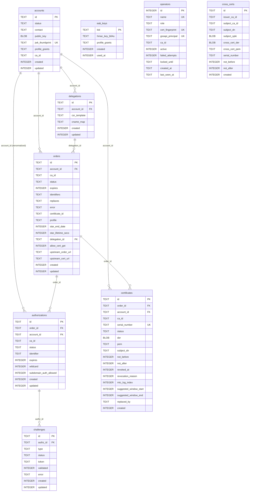

# Database

`Akāmu` uses `sqlx` 0.8 as its database layer, with a runtime-dispatch `AnyPool` that supports SQLite, PostgreSQL, and MariaDB. The active backend is selected by a compile-time feature flag (`backend-sqlite`, `backend-postgres`, or `backend-mariadb`). Schema migrations are managed by sqlx's built-in `migrate!` macro.

## Connection model

The server holds two `sqlx::AnyPool` instances stored in `AppState`:

- **`db`** (write pool) — all migrations run here; all write transactions use it; most read queries also use it.
- **`db_ro`** (read-only pool) — opened with the `?mode=ro` SQLite URI parameter. Pure-read handlers (`get_order`, `get_authz`, `download_cert`) route through this pool so concurrent reads do not contend on the WAL write lock. For `:memory:` databases and non-SQLite backends `db_ro` is a clone of `db`.

`db::open_ro(url, max_connections)` in `src/db/mod.rs` opens the read-only pool. It returns `None` for `:memory:` URLs (each connection sees an empty schema) and for non-SQLite URLs.

sqlx manages each pool's connection count internally; callers pass `&pool` to query helpers or `&mut *tx` inside transactions.

All queries use the sqlx `QueryBuilder` or typed-query pattern:

```rust
sqlx::query_as!(Row, "SELECT … FROM …", param)
    .fetch_one(&db_ro)
    .await?
```

### Initialization

`open_databases` (`src/main.rs`) calls `db::install_drivers()` once, before opening
any pool, to register all compiled-in sqlx drivers via
`sqlx::any::install_default_drivers()`.

`db::open(url, max_connections, require_tls)` in `src/db/mod.rs` then performs
the following, in order:

1. Optionally validates the URL for SSL/TLS parameters when `require_tls` is `true` (FPT_ITT.1).
2. Opens the pool (creates the SQLite file if needed via the `?mode=rwc` URI parameter; for `:memory:` a fresh in-memory database is used).
3. Runs all pending migrations via the compiled-in `sqlx::migrate!` macro, selecting the backend-specific migration directory (`migrations/sqlite/`, `migrations/postgres/`, or `migrations/mariadb/`).
4. Enables WAL mode and performance pragmas for SQLite, in this order: `PRAGMA journal_mode=WAL`, `PRAGMA synchronous=NORMAL`, `PRAGMA foreign_keys=ON`, `PRAGMA mmap_size=134217728`, `PRAGMA cache_size=-65536`, `PRAGMA temp_store=MEMORY`, `PRAGMA wal_autocheckpoint=10000`.

Migrations run **before** the pragmas — in particular before `PRAGMA
foreign_keys=ON` — not after. sqlx unconditionally wraps each SQLite
migration file in its own transaction (unlike the PostgreSQL driver, which
honors a `-- no-transaction` marker), and `PRAGMA foreign_keys` is a
documented no-op once a transaction is already open. A migration that
rebuilds a table with live rows in a referencing child table (SQLite has no
`ALTER TABLE ADD CONSTRAINT`, so drop-and-recreate is the only way to change
such a table) would fail with "FOREIGN KEY constraint failed" if enforcement
were already active when the migration ran. A fresh SQLite connection
defaults `foreign_keys` to off, so running migrations first is safe;
enforcement is turned on immediately afterward, before the pool is handed to
any caller.

At server startup, nonces older than 24 hours are swept from the in-memory `NonceBucket`.

## Migrations

Each database backend has its own migration directory (`migrations/sqlite/`,
`migrations/postgres/`, `migrations/mariadb/`), and each directory currently
contains a single file: `0001_initial.sql`. The full schema history was
squashed into that one file per backend (no production deployment existed
yet, so migration-replay compatibility did not need to be preserved) — see
`migrations/NUMBERING.md` for the rationale and the numbering rule for future
migrations (`0002_...` onward, kept in sync file-for-file across the three
backends whenever a change affects all of them).

The three `0001_initial.sql` files define an identical schema: same tables,
columns, indexes, and `CHECK` constraints. They differ only in backend SQL
syntax — e.g. SQLite `BLOB`/`INTEGER`/`AUTOINCREMENT` versus PostgreSQL
`BYTEA`/`BIGINT`/`SMALLINT`/`BIGSERIAL` versus MariaDB
`MEDIUMBLOB`/`BIGINT`/`TINYINT`/`AUTO_INCREMENT` — plus a handful of
PostgreSQL-specific touches such as deferring the `orders.delegation_id`
foreign key until after `delegations` is created.

## Schema

The CREATE TABLE statements below are reproduced (in SQLite syntax, trimmed
of some comments) from `migrations/sqlite/0001_initial.sql` for quick
reference; the migration file itself is the authoritative source. Every
CRDT-tracked table (`accounts`,
`orders`, `authorizations`, `challenges`, `certificates`, `eab_keys`,
`operators`, `delegations`, `mtc_checkpoints`, `mtc_cosignatures`,
`policy_rules`) also carries a `local_gen INTEGER NOT NULL DEFAULT 0` column
— see [`local_gen` column](#local_gen-column-on-main-database-tables) below.

### Core ACME tables

**`accounts`** — ACME accounts.

```sql
CREATE TABLE accounts (
    id                  TEXT    PRIMARY KEY,      -- UUID
    status              TEXT    NOT NULL DEFAULT 'valid'
                                 CHECK(status IN ('valid','deactivated','revoked')),
    contact             TEXT,                     -- JSON array of mailto: URIs
    public_key          BLOB    NOT NULL,         -- DER-encoded SubjectPublicKeyInfo
    jwk_thumbprint      TEXT    NOT NULL UNIQUE,  -- base64url SHA-256 JWK thumbprint
    created             INTEGER NOT NULL,
    updated             INTEGER NOT NULL,
    profile_grants      TEXT,                     -- JSON array of allowed profile IDs; NULL = no restriction
    ca_id               TEXT    NOT NULL DEFAULT '', -- '' = server-wide scope
    local_gen           INTEGER NOT NULL DEFAULT 0,
    kerberos_principal  TEXT                      -- set when created via GSSAPI-authenticated EAB
);
CREATE INDEX idx_accounts_ca_id ON accounts(ca_id);
```

`jwk_thumbprint` has a unique constraint so the database enforces that no two
accounts share a key. `ca_id = ''` means server-wide account scope (the
account may use any CA); the empty string is not a valid CA ID (config
validation requires CA IDs to match `^[a-z0-9]`), so it can never collide
with a real CA.

**`orders`** — ACME orders, including STAR (RFC 8739) auto-renewal fields and RFC 9115 delegation fields.

```sql
CREATE TABLE orders (
    id                         TEXT    PRIMARY KEY,
    account_id                 TEXT    NOT NULL REFERENCES accounts(id),
    status                     TEXT    NOT NULL DEFAULT 'pending'
                                       CHECK(status IN ('pending','ready','processing','valid','invalid','canceled')),
    expires                    INTEGER,
    identifiers                TEXT    NOT NULL,         -- JSON [{type,value}]
    not_before                 INTEGER,
    not_after                  INTEGER,
    error                      TEXT,                     -- problem+json string if invalid
    certificate_id             TEXT,                     -- FK to certificates.id when valid
    replaces                   TEXT,                     -- RFC 9773 ARI: cert_id of predecessor
    created                    INTEGER NOT NULL,
    updated                    INTEGER NOT NULL,
    -- RFC 8739 STAR auto-renewal fields
    star_start_date            INTEGER,
    star_end_date              INTEGER,
    star_lifetime_secs         INTEGER,
    star_lifetime_adjust_secs  INTEGER NOT NULL DEFAULT 0,
    star_allow_cert_get        INTEGER NOT NULL DEFAULT 0,
    star_canceled_at           INTEGER,
    star_csr_der               BLOB,                     -- stored CSR DER for reissuance
    -- draft-ietf-acme-profiles-01
    profile                    TEXT,
    -- Multi-CA and RFC 9115 delegation fields
    ca_id                      TEXT    NOT NULL DEFAULT 'default',
    delegation_id              TEXT    REFERENCES delegations(id),
    allow_cert_get             INTEGER NOT NULL DEFAULT 0, -- RFC 9115 §2.3.5 top-level flag
    upstream_order_url         TEXT,
    upstream_cert_url          TEXT,
    local_gen                  INTEGER NOT NULL DEFAULT 0
);
CREATE INDEX idx_orders_account  ON orders(account_id);
CREATE INDEX idx_orders_status   ON orders(status);
CREATE INDEX idx_orders_replaces ON orders(replaces) WHERE replaces IS NOT NULL;
CREATE INDEX idx_orders_star     ON orders(star_end_date) WHERE star_end_date IS NOT NULL;
CREATE INDEX idx_orders_ca_id    ON orders(ca_id);
CREATE INDEX idx_orders_ca_account ON orders(ca_id, account_id);
CREATE INDEX idx_orders_delegation ON orders(delegation_id) WHERE delegation_id IS NOT NULL;
CREATE INDEX idx_orders_delegation_status
    ON orders(delegation_id, status)
    WHERE delegation_id IS NOT NULL AND status = 'processing';
```

`ca_id = 'default'` is the canonical single-CA name used by deployments that
never configured `[[ca]]` arrays. `delegation_id` is a nullable FK to
`delegations(id)`: orders with a non-null `delegation_id` skip the
authorization flow and start in `ready` status. `allow_cert_get` mirrors the
`"allow-certificate-get"` field from the `new-order` payload. `upstream_order_url`
and `upstream_cert_url` are set by the background delegation task as it
progresses through the upstream ACME flow (see [RFC 9115](rfc-compliance.md)).

**`authorizations`** — One per identifier per order (or standalone for RFC 8555 §7.4.1 pre-authorizations, where `order_id` is `NULL`). `account_id` is denormalized from the parent order to allow efficient per-account queries without joins. `subdomain_auth_allowed` records whether RFC 9444 subdomain authorization was granted.

```sql
CREATE TABLE authorizations (
    id                     TEXT    PRIMARY KEY,
    order_id               TEXT    REFERENCES orders(id), -- NULL for standalone pre-authorizations
    account_id             TEXT    NOT NULL REFERENCES accounts(id),
    status                 TEXT    NOT NULL DEFAULT 'pending'
                                   CHECK(status IN ('pending','valid','invalid','deactivated','expired','revoked')),
    identifier             TEXT    NOT NULL,   -- JSON {"type":"dns","value":"example.com"}
    expires                INTEGER,
    wildcard               INTEGER NOT NULL DEFAULT 0,
    subdomain_auth_allowed INTEGER NOT NULL DEFAULT 0,  -- RFC 9444
    created                INTEGER NOT NULL,
    updated                INTEGER NOT NULL,
    ca_id                  TEXT    NOT NULL DEFAULT 'default',
    local_gen              INTEGER NOT NULL DEFAULT 0
);
CREATE INDEX idx_authz_order   ON authorizations(order_id);
CREATE INDEX idx_authz_account ON authorizations(account_id);
CREATE INDEX idx_authzs_ca_id  ON authorizations(ca_id);
```

**`challenges`** — One or more per authorization. All challenges for a given authorization share the same `token`. `email_token_part1` and `email_message_id` support the two-channel token required by the RFC 8823 `email-reply-00` challenge; `tkauth_type` and `token_authority` support RFC 9447 `tkauth-01`.

```sql
CREATE TABLE challenges (
    id                TEXT    PRIMARY KEY,
    authz_id          TEXT    NOT NULL REFERENCES authorizations(id),
    type              TEXT    NOT NULL,     -- http-01|dns-01|tls-alpn-01|...
    status            TEXT    NOT NULL DEFAULT 'pending'
                               CHECK(status IN ('pending','processing','valid','invalid')),
    token             TEXT    NOT NULL,
    validated         INTEGER,
    error             TEXT,
    created           INTEGER NOT NULL,
    updated           INTEGER NOT NULL,
    email_token_part1 TEXT,
    email_message_id  TEXT,
    local_gen         INTEGER NOT NULL DEFAULT 0,
    tkauth_type       TEXT,
    token_authority   TEXT
);
CREATE INDEX idx_chall_authz ON challenges(authz_id);
CREATE UNIQUE INDEX idx_chall_email_message_id
    ON challenges(email_message_id)
    WHERE email_message_id IS NOT NULL;
```

**`certificates`** — Issued X.509 certificates. `der`/`pem` store the full chain (leaf + CA); `mtc_standalone_der` stores the standalone (non-chained) MTC form used when serving MTC certificate downloads.

```sql
CREATE TABLE certificates (
    id                     TEXT    PRIMARY KEY,   -- UUID used in the cert URL path
    order_id               TEXT    NOT NULL REFERENCES orders(id),
    account_id             TEXT    NOT NULL REFERENCES accounts(id),
    serial_number          TEXT    NOT NULL UNIQUE,
    status                 TEXT    NOT NULL DEFAULT 'valid'
                                   CHECK(status IN ('valid','revoked')),
    der                    BLOB    NOT NULL,
    pem                    TEXT    NOT NULL,
    not_before             INTEGER NOT NULL,
    not_after              INTEGER NOT NULL,
    revoked_at             INTEGER,
    revocation_reason      INTEGER,
    mtc_log_index          INTEGER,
    created                INTEGER NOT NULL,
    suggested_window_start INTEGER,  -- RFC 9773 ARI renewal window
    suggested_window_end   INTEGER,
    replaced_by            TEXT,     -- RFC 9773: order_id that replaced this cert
    mtc_standalone_der     BLOB,
    subject_dn             TEXT,     -- FAU_SCR_EXT.1 searchable subject DN
    ca_id                  TEXT    NOT NULL DEFAULT 'default',
    local_gen              INTEGER NOT NULL DEFAULT 0
);
CREATE INDEX idx_certs_account                  ON certificates(account_id);
CREATE INDEX idx_certs_serial                   ON certificates(serial_number);
CREATE INDEX idx_certs_order                    ON certificates(order_id);
CREATE INDEX idx_certs_status                   ON certificates(status);
CREATE INDEX idx_certs_account_status_not_after ON certificates(account_id, status, not_after);
CREATE INDEX idx_certs_replaced_by              ON certificates(replaced_by)
    WHERE replaced_by IS NOT NULL;
CREATE INDEX idx_certs_mtc_log_index
    ON certificates(mtc_log_index)
    WHERE mtc_log_index IS NOT NULL;
CREATE INDEX idx_certs_subject_dn ON certificates(subject_dn);
CREATE INDEX idx_certs_ca_id      ON certificates(ca_id);
CREATE INDEX idx_certs_ca_id_revoked ON certificates(ca_id) WHERE status = 'revoked';
```

**`nonces`** — Anti-replay nonces. The in-memory `NonceBucket` is the hot path; this table exists for startup cleanup of nonces written by a previous process version.

```sql
CREATE TABLE nonces (
    nonce   TEXT    PRIMARY KEY,
    created INTEGER NOT NULL
);
CREATE INDEX idx_nonces_created ON nonces(created);
```

### Accounts, operators, and multi-CA

**`eab_keys`** — External Account Binding (RFC 8555 §7.3.4) HMAC keys, whether pre-provisioned via `[server.eab_keys]` or derived on demand via `GET /acme/eab`.

```sql
CREATE TABLE eab_keys (
    kid                    TEXT    PRIMARY KEY,
    hmac_key_b64u          TEXT    NOT NULL,
    created                INTEGER NOT NULL,
    used_at                INTEGER,
    profile_grants         TEXT,     -- JSON array of profile IDs copied to the account at creation
    created_by_operator_id INTEGER,  -- provisioning operator; NULL = config file / derived
    bound_principal        TEXT,     -- Kerberos principal that derived this key via /acme/eab
    alg                    TEXT    NOT NULL DEFAULT 'sha256', -- sha256|sha384|sha512
    local_gen              INTEGER NOT NULL DEFAULT 0
);
```

**`operators`** — PP CA v2.1 FMT role-based access control. Each operator is identified by a client certificate fingerprint, a Kerberos principal, or both (at least one must be non-NULL, enforced by a `CHECK` constraint); `failed_attempts`/`locked_until` implement FIA_AFL.1 lockout, and `ca_id` implements per-CA operator scoping.

```sql
CREATE TABLE operators (
    id               INTEGER PRIMARY KEY AUTOINCREMENT,
    name             TEXT    NOT NULL UNIQUE,
    role             TEXT    NOT NULL
                             CHECK(role IN ('administrator','ca_operations','ca_ra','auditor')),
    cert_fingerprint TEXT    UNIQUE,   -- SHA-256 hex of DER leaf cert; NULL = no cert auth
    gssapi_principal TEXT    UNIQUE,   -- Kerberos principal e.g. alice@REALM; NULL = no GSSAPI auth
    created_at       TEXT    NOT NULL, -- RFC 3339
    last_seen_at     TEXT,             -- RFC 3339
    active           INTEGER NOT NULL DEFAULT 1 CHECK(active IN (0, 1)),
    failed_attempts  INTEGER NOT NULL DEFAULT 0,
    locked_until     TEXT,
    ca_id            TEXT    NOT NULL DEFAULT '', -- '' = server-wide; else scoped to one CA
    local_gen        INTEGER NOT NULL DEFAULT 0,
    CHECK(cert_fingerprint IS NOT NULL OR gssapi_principal IS NOT NULL)
);
```

**`cross_certs`** — CA certificates issued by one akāmu CA for another CA's public key (used to build alternative trust chains across multi-CA deployments). Rows are insert-only.

```sql
CREATE TABLE cross_certs (
    id             TEXT    PRIMARY KEY,   -- UUID
    issuer_ca_id   TEXT    NOT NULL,
    subject_ca_id  TEXT,                  -- akāmu CA ID if same-server; NULL if external
    subject_dn     TEXT    NOT NULL,      -- RFC 4514 subject DN
    subject_spki   BLOB    NOT NULL,      -- DER SubjectPublicKeyInfo of subject CA key
    cross_cert_der BLOB    NOT NULL,
    cross_cert_pem TEXT    NOT NULL,
    not_before     INTEGER NOT NULL,
    not_after      INTEGER NOT NULL,
    serial_number  TEXT    NOT NULL,
    created        INTEGER NOT NULL,
    UNIQUE (issuer_ca_id, serial_number)
);
CREATE INDEX idx_cross_certs_issuer  ON cross_certs(issuer_ca_id);
CREATE INDEX idx_cross_certs_subject ON cross_certs(subject_ca_id)
    WHERE subject_ca_id IS NOT NULL;
```

### RFC 9115 delegation

**`delegations`** — A pre-configured delegation from an Identifier Owner (IdO) to a Name Delegation Consumer (NDC), carrying a CSR template the NDC must satisfy at finalize and an optional CNAME map.

```sql
CREATE TABLE delegations (
    id           TEXT    PRIMARY KEY,
    account_id   TEXT    NOT NULL REFERENCES accounts(id),
    csr_template TEXT    NOT NULL,  -- JSON per RFC 9115 §4 / Appendix A
    cname_map    TEXT,              -- JSON {fqdn: fqdn} or NULL
    created      INTEGER NOT NULL,
    updated      INTEGER NOT NULL,
    local_gen    INTEGER NOT NULL DEFAULT 0,
    ca_id        TEXT    NOT NULL DEFAULT ''
);
CREATE INDEX idx_delegations_account ON delegations(account_id);
```

### tkauth-01 replay prevention

**`tkauth_jti_cache`** — RFC 9447 `tkauth-01` JTI (JWT ID) replay-prevention cache. Pruned periodically by a background task (`[tkauth].jti_prune_interval_secs`).

```sql
CREATE TABLE tkauth_jti_cache (
    jti      TEXT    PRIMARY KEY,
    authz_id TEXT    NOT NULL,
    expires  INTEGER NOT NULL,
    created  INTEGER NOT NULL,
    tkvalue  TEXT,                       -- JWTClaimConstraints DER for encoder-backed identifiers
    ca_flag  INTEGER NOT NULL DEFAULT 0  -- atc.ca boolean from the authority token
);
CREATE INDEX tkauth_jti_expires_idx  ON tkauth_jti_cache (expires);
CREATE INDEX tkauth_jti_authzid_idx  ON tkauth_jti_cache (authz_id, expires);
```

### Merkle Tree Certificates

**`mtc_checkpoints`**, **`mtc_landmarks`**, **`mtc_cosignatures`**, **`mtc_revoked_ranges`** — support the draft-ietf-plants-merkle-tree-certs transparency log; see [MTC Implementation](mtc.md) for how they are populated.

```sql
CREATE TABLE mtc_checkpoints (
    id          INTEGER PRIMARY KEY AUTOINCREMENT,
    ca_id       TEXT    NOT NULL DEFAULT 'default',
    tree_size   INTEGER NOT NULL,       -- log leaf count when checkpoint was produced
    root_hex    TEXT    NOT NULL,       -- lowercase hex Merkle root
    signature   BLOB    NOT NULL,       -- MTC signing key signature over DER Checkpoint
    created     INTEGER NOT NULL,
    local_gen   INTEGER NOT NULL DEFAULT 0,
    UNIQUE(ca_id, tree_size)
);

CREATE TABLE mtc_landmarks (
    id          INTEGER PRIMARY KEY AUTOINCREMENT,
    ca_id       TEXT    NOT NULL DEFAULT 'default',
    sequence_no INTEGER NOT NULL,
    tree_size   INTEGER NOT NULL,
    cert_der    BLOB,           -- DER-encoded LandmarkCertificate; NULL until built
    created     INTEGER NOT NULL,
    UNIQUE(ca_id, sequence_no),
    UNIQUE(ca_id, tree_size)
);

CREATE TABLE mtc_cosignatures (
    id              INTEGER PRIMARY KEY AUTOINCREMENT,
    ca_id           TEXT    NOT NULL DEFAULT 'default',
    checkpoint_id   INTEGER NOT NULL REFERENCES mtc_checkpoints(id) ON DELETE CASCADE,
    cosigner_url    TEXT    NOT NULL,
    signature_der   BLOB    NOT NULL,
    created         INTEGER NOT NULL,
    local_gen       INTEGER NOT NULL DEFAULT 0,
    UNIQUE(checkpoint_id, cosigner_url)
);
CREATE INDEX idx_mtc_cosignatures_checkpoint ON mtc_cosignatures(checkpoint_id);

-- Ranges of revoked log entry indices (draft §5.6).
CREATE TABLE mtc_revoked_ranges (
    id          INTEGER PRIMARY KEY AUTOINCREMENT,
    ca_id       TEXT    NOT NULL,
    range_start INTEGER NOT NULL,
    range_end   INTEGER NOT NULL,
    created     INTEGER NOT NULL,
    UNIQUE(ca_id, range_start, range_end),
    CHECK(range_start <= range_end)
);
```

### Policy engine

**`policy_rules`** — ABAC issuance policy rules, soft-deletable via `tombstone` so a rule name can be re-created after deletion without breaking gossip convergence.

```sql
CREATE TABLE policy_rules (
    id           TEXT PRIMARY KEY,
    scope        TEXT NOT NULL,
    name         TEXT NOT NULL,
    rule_json    TEXT NOT NULL,
    enabled      INTEGER NOT NULL DEFAULT 1,
    created_at   TEXT NOT NULL,
    updated_at   TEXT NOT NULL,
    created_by   TEXT,
    local_gen    INTEGER NOT NULL DEFAULT 0,
    tombstone    INTEGER NOT NULL DEFAULT 0,
    tombstone_at INTEGER,
    CHECK ((tombstone = 0 AND tombstone_at IS NULL) OR (tombstone = 1 AND tombstone_at IS NOT NULL))
);
-- Partial unique index: only live (non-tombstoned) rows participate in the
-- uniqueness check, so a rule can be re-created after soft-delete.
CREATE UNIQUE INDEX uq_policy_rules_scope_name_live
    ON policy_rules (scope, name)
    WHERE tombstone = 0;
CREATE INDEX idx_policy_rules_scope
    ON policy_rules (scope)
    WHERE tombstone = 0;
```

### Cluster / CRDT tables (main database)

`node_keys`, `crdt_cluster_nodes`, `crdt_order_owners`, and `crdt_mtc_writer`
also exist in the main database, with the same shape as their counterparts in
the separate CRDT database — see [Schema](#schema-1) under [CRDT
database](#crdt-database) below for their column definitions. The
main-database copies are a historical artifact of the initial gossip
implementation; the active code path reads from and writes to the CRDT
database pool exclusively.

## Row types

`src/db/schema.rs` defines Rust structs mirroring each table row:

- `AccountRow` — mirrors `accounts`. Includes `ca_id: String` (empty = server-wide; non-empty only when `server.account_scope = "ca"`), `profile_grants: Option<String>`.
- `OrderRow` — mirrors `orders`. Includes `ca_id: String` (defaults to `"default"` for pre-migration rows), `profile: Option<String>`, all `star_*` fields, and the RFC 9115 delegation fields: `delegation_id: Option<String>`, `allow_cert_get: bool`, `upstream_order_url: Option<String>`, `upstream_cert_url: Option<String>`.
- `DelegationRow` — mirrors `delegations`. Fields: `id: String`, `account_id: String`, `csr_template: String` (JSON), `cname_map: Option<String>` (JSON), `created: i64`, `updated: i64`.
- `AuthorizationRow` — mirrors `authorizations`. Includes `ca_id: String` and `subdomain_auth_allowed: bool`.
- `ChallengeRow` — mirrors `challenges`.
- `CertificateRow` — mirrors `certificates`. Includes `ca_id: String`, `subject_dn: Option<String>`, `suggested_window_start/end: Option<i64>`, `replaced_by: Option<String>`.
- `CrossCertRow` — mirrors `cross_certs`. `subject_ca_id: Option<String>` is `None` when the subject is an external CA.
- `OperatorRow` — mirrors `operators`. Includes `ca_id: String` (CA scope for `ca_ra` operators; empty = server-wide), `failed_attempts: i64`, `locked_until: Option<String>`.

## Database module structure

Each table has its own submodule in `src/db/`:

| Module | Exposed functions |
|---|---|
| `db::accounts` | `insert`, `get_by_id`, `get_by_thumbprint`, `update_contact`, `update_status`, `update_key`, `set_profile_grants`, `get_profile_grants`, `list` |
| `db::orders` | `insert`, `get_by_id`, `update_status`, `list_authz_ids`, `list_pending_delegation_orders` |
| `db::delegations` | `insert`, `get_by_id`, `update`, `delete`, `list`, `list_by_account` |
| `db::authz` | `insert`, `get_by_id`, `update_status` |
| `db::challenges` | `insert`, `get_by_id`, `list_by_authz`, `set_processing`, `set_invalid` |
| `db::certs` | `insert`, `get_by_id`, `get_by_serial`, `get_by_cert_id`, `mark_replaced`, `revoke`, `set_mtc_log_index`, `set_renewal_window`, `list_revoked`, `list_valid_for_account`, `get_latest_for_order`, `search` |
| `db::cross_certs` | `insert`, `get_by_id`, `list` |
| `db::eab` | `insert`, `get_by_kid`, `mark_used`, `list`, `delete` |
| `db::nonces` | `insert`, `consume`, `sweep_expired` |
| `db::operators` | `insert`, `insert_if_absent`, `is_empty`, `get_by_id`, `get_by_fingerprint`, `get_by_principal`, `list`, `update`, `set_active`, `update_last_seen`, `increment_failed`, `reset_failed`, `unlock`, `is_locked` |
| ~~`db::audit`~~ | Removed — audit events are now written to the configured audit backend (systemd journal namespace, JSONL file, or in-process store) via `src/journal.rs` and `src/audit.rs` |

### `CertSearchParams`

`db::certs::search` accepts a `CertSearchParams<'_>` struct to satisfy `clippy::too_many_arguments`. All filter fields are optional; only `Some` values are emitted as `WHERE` clauses via `QueryBuilder`:

```rust
pub struct CertSearchParams<'a> {
    pub serial: Option<&'a str>,
    pub account_id: Option<&'a str>,
    pub status: Option<&'a str>,
    pub subject_dn: Option<&'a str>,  // LIKE-escaped substring match
    pub ca_id: Option<&'a str>,
    pub limit: i64,
    pub offset: i64,
}
```

The `subject_dn` filter uses `LIKE` with `!` as the escape character; `%` and `_` in the input are automatically escaped to prevent injection.

### `OperatorUpdateParams`

`db::operators::update` accepts an `OperatorUpdateParams<'_>` struct. Only `Some` fields are included in the generated `UPDATE` statement:

```rust
pub struct OperatorUpdateParams<'a> {
    pub name: Option<&'a str>,
    pub role: Option<&'a str>,
    pub cert_fingerprint: Option<&'a str>,
    pub gssapi_principal: Option<&'a str>,
    pub ca_id: Option<&'a str>,  // Some("") clears CA scope; None leaves it unchanged
}
```

`update` is called by the `PUT /admin/operators/{id}` handler, which evicts any active session for that operator from `AppState::admin_sessions` on every successful update. This ensures that role and CA-scope changes take effect immediately rather than at the next session expiry.

## Query helpers

`src/db/mod.rs` exports several helpers that make raw sqlx queries portable across backends.

### `pg_sql` / `query` / `query_as`

PostgreSQL uses `$N` positional placeholders while SQLite and MariaDB use `?`.  sqlx's
`AnyPool` does not automatically rewrite `?` for PostgreSQL because `?` is also the
JSONB existence operator there.  The helpers below handle the rewrite transparently:

| Helper | Usage |
|--------|-------|
| `pg_sql(sql)` | Rewrites `?` → `$1`, `$2`, … for PostgreSQL; returns the string unchanged for all other backends. The rewritten string is cached by static pointer identity, so each unique SQL literal is rewritten at most once. |
| `query(sql)` | Calls `pg_sql`, then `sqlx::query`. Use everywhere a raw `?`-parameterised query string is needed. |
| `query_as::<O>(sql)` | Calls `pg_sql`, then `sqlx::query_as`. Use for typed row mapping. |

### `DynQueryBuilder`

For dynamically constructed queries (variable number of `WHERE` clauses, multi-row
`VALUES` inserts), `DynQueryBuilder` emits `$N` for PostgreSQL and `?` for all other
backends, and tracks the bind count internally:

```rust
let mut q = DynQueryBuilder::new("SELECT id FROM certificates WHERE 1=1");
if let Some(serial) = params.serial {
    q.push(" AND serial_number = ").push_bind(serial);
}
let rows = q.fetch_all(&db).await?;
```

### `pg_local_async_commit`

```rust
pub(crate) async fn pg_local_async_commit(
    tx: &mut sqlx::Transaction<'_, sqlx::Any>,
    kind: DbKind,
) -> Result<(), sqlx::Error>
```

Issues `SET LOCAL synchronous_commit = off` inside the current PostgreSQL transaction,
eliminating the per-commit WAL flush (~1–4 ms on SSD) for writes on state-transition
paths that are eventually consistent by ACME protocol design.

Called at the start of the following write transactions:

- `new-order` — inserts the order, authorization, and challenge rows.
- `new-authz` — inserts a standalone authorization row.
- Challenge processing — updates challenge, authorization, and order status on `on_valid`
  and `on_invalid`.

The certificate issuance transaction (`finalize`) does **not** call this function; cert
rows require full durability guarantees.

No-op on SQLite and MariaDB.

## Transactions

Multi-table writes use explicit transactions to ensure atomicity:

- **Order creation**: the order row, all authorization rows, and all challenge rows are inserted in a single transaction. For PostgreSQL, `pg_local_async_commit` is called at transaction start to defer WAL flush.
- **Challenge validation success**: the challenge, authorization, and (if all authorizations are now valid) the order are updated in a single transaction. For PostgreSQL, `pg_local_async_commit` is called at transaction start.
- **Certificate issuance**: the certificate row is inserted and the order is updated to `valid` in a single transaction. STAR re-issuance also stores the new CSR DER in the same transaction. Full WAL durability is retained for this transaction on all backends.

## Schema diagram

The entity-relationship diagram below shows the ACME core tables and their foreign-key relationships. MTC tables (`mtc_checkpoints`, `mtc_cosignatures`, `mtc_landmarks`) and the standalone `nonces` table are omitted for readability. The `audit_events` table has been dropped; audit events are now written to the configured audit backend (systemd journal namespace, JSONL file, or in-process store).



## Foreign key enforcement

Foreign key constraints are enabled at database open time. The constraint graph is:

- `orders.account_id` → `accounts.id`
- `authorizations.order_id` → `orders.id`
- `authorizations.account_id` → `accounts.id`
- `challenges.authz_id` → `authorizations.id`
- `certificates.order_id` → `orders.id`
- `certificates.account_id` → `accounts.id`
- `mtc_cosignatures.checkpoint_id` → `mtc_checkpoints.id` (with `ON DELETE CASCADE`)
- `delegations.account_id` → `accounts.id`
- `orders.delegation_id` → `delegations.id` (nullable)

Foreign keys are enabled (`PRAGMA foreign_keys=ON`, SQLite only) **after**
migrations run, not before — see [Initialization](#initialization) above for
why running migrations first is required for SQLite's drop-and-recreate
schema-change pattern to keep working. Because a fresh SQLite connection
defaults `foreign_keys` to off, this ordering does not weaken enforcement:
constraints are always active before the pool is handed to any caller,
so any code path that would insert an orphaned row still fails immediately
once the server is actually serving traffic.

## CRDT database

In a multi-node cluster, Akamu maintains a second database dedicated to CRDT cluster state.  This database is separate from the main ACME database so that periodic cluster-state persists (every 30 seconds) do not contend with ACME reads and writes on the main pool.  In single-node deployments the CRDT database still exists but receives minimal traffic.

### Configuration

The CRDT database URL is set by the top-level `crdt_db_url` configuration key:

```toml
crdt_db_url = "sqlite:///var/lib/akamu/akamu_crdt.db"
```

When `crdt_db_url` is absent, the URL is derived automatically from `database.url`:

- **SQLite file paths** — `_crdt` is inserted before the `.db` extension.  `sqlite:///var/lib/akamu/akamu.db` becomes `sqlite:///var/lib/akamu/akamu_crdt.db`.
- **`:memory:` SQLite** — the CRDT database is also in-memory (`sqlite::memory:`).
- **Non-SQLite backends** — the same URL is reused with a separate pool; contention is still reduced because the CRDT pool manages its own connections independently.

`open_crdt_db` in `crates/akamu-crdt/src/db.rs` opens the pool (up to 4 connections for file-backed SQLite, 1 for in-memory), enables WAL mode and `synchronous=NORMAL` for SQLite, and creates the four CRDT-owned tables inline via `CREATE TABLE IF NOT EXISTS`.  No migration files are used for the CRDT database; the `akamu-crdt` crate owns the schema entirely.

### Pool placement in `AppState`

`AppState` stores the CRDT pool as `crdt_db: Db` alongside the main pools.  Code paths that touch cluster tables use `state.crdt_db`; code paths that touch ACME tables use `state.db` (write) or `state.db_ro` (read-only).

### Schema

The CRDT database contains four tables.  The SQL below uses the SQLite column types; PostgreSQL uses `BYTEA`/`BIGINT`/`SMALLINT` and MariaDB uses `MEDIUMBLOB`/`BIGINT`/`TINYINT`/`VARCHAR(N)` in the corresponding main-database migration counterparts.

**`node_keys`** — Local node identity keys.  Generated on first startup; never replicated via gossip.  One row per node (a given database file always contains exactly one row, keyed by the node's own `node_id`).

```sql
CREATE TABLE IF NOT EXISTS node_keys (
    node_id                  TEXT    PRIMARY KEY,
    kem_private_key_der      BLOB    NOT NULL,  -- ML-KEM-768 PKCS8 DER
    kem_public_key_der       BLOB    NOT NULL,  -- ML-KEM-768 SPKI DER
    signing_private_key_der  BLOB    NOT NULL,  -- ECDSA P-256 PKCS8 DER
    signing_public_key_der   BLOB    NOT NULL,  -- ECDSA P-256 SPKI DER
    signing_certificate_der  BLOB    NOT NULL,  -- Self-signed X.509 DER
    created_at               INTEGER NOT NULL   -- Unix epoch seconds
);
```

**`crdt_cluster_nodes`** — Cluster node registry, mirroring `AkaCrdt.cluster_nodes`.  One row per known peer (including the local node).  Entries arrive via the `POST /admin/gossip/register` endpoint and propagate through gossip.

```sql
CREATE TABLE IF NOT EXISTS crdt_cluster_nodes (
    node_id                  TEXT    PRIMARY KEY,
    gossip_url               TEXT    NOT NULL,
    kem_public_key_der       BLOB    NOT NULL,   -- Peer ML-KEM-768 SPKI DER
    signing_public_key_der   BLOB    NOT NULL,   -- Peer ECDSA P-256 SPKI DER
    signing_certificate_der  BLOB    NOT NULL,   -- Peer self-signed X.509 DER
    ca_ids                   TEXT    NOT NULL DEFAULT '[]',  -- JSON array of CA IDs
    registered_at            INTEGER NOT NULL,    -- Unix epoch seconds
    tombstone                INTEGER NOT NULL DEFAULT 0,
    tombstone_at             INTEGER,
    local_gen                INTEGER NOT NULL DEFAULT 0,
    CONSTRAINT ck_tombstone_consistency CHECK (
        (tombstone = 0 AND tombstone_at IS NULL) OR
        (tombstone = 1 AND tombstone_at IS NOT NULL)
    )
);
```

The `tombstone`/`tombstone_at` pair tracks Observed-Remove Map deletions.  The `ck_tombstone_consistency` constraint enforces that `tombstone_at` is present if and only if the entry is tombstoned.

**`crdt_order_owners`** — Gossip-consensus order processing ownership.  One row per order that has a live claim.  A claim lapses when `claimed_at + ownership_ttl_secs < now` (default TTL: 150 seconds).

```sql
CREATE TABLE IF NOT EXISTS crdt_order_owners (
    order_id    TEXT    PRIMARY KEY,
    node_id     TEXT    NOT NULL,
    claimed_at  INTEGER NOT NULL,   -- Unix epoch seconds
    local_gen   INTEGER NOT NULL DEFAULT 0
);
```

**`crdt_mtc_writer`** — MTC log writer election.  At most one row; the application always uses `id = 'singleton'`.  The node with the highest `claimed_at` wins; ties break by lexicographic `node_id`.

```sql
CREATE TABLE IF NOT EXISTS crdt_mtc_writer (
    id          TEXT    PRIMARY KEY,   -- always 'singleton'
    node_id     TEXT    NOT NULL,
    claimed_at  INTEGER NOT NULL,      -- Unix epoch seconds
    local_gen   INTEGER NOT NULL DEFAULT 0
);
```

### Main-database migration counterparts

The same three CRDT tables (`crdt_cluster_nodes`, `crdt_order_owners`, `crdt_mtc_writer`) and `node_keys` also exist in the main ACME database — see [Cluster / CRDT tables (main database)](#cluster--crdt-tables-main-database) above. All four are defined inline in each backend's single `0001_initial.sql`, alongside every other table.

The main-database copies are a historical artifact of the initial gossip implementation; the active code path reads from and writes to the CRDT database pool exclusively.  The `open_crdt_db` inline schema creation is the authoritative schema definition.

### `local_gen` column on main-database tables

Every CRDT-tracked table in the main database carries a `local_gen INTEGER NOT NULL DEFAULT 0` column, defined inline in `0001_initial.sql` for each backend:

- `accounts`, `orders`, `authorizations`, `challenges`, `certificates`
- `eab_keys`, `operators`, `delegations`
- `mtc_checkpoints`, `mtc_cosignatures`
- `policy_rules`

This column records the CRDT generation counter value at the time each row was last written by gossip replication.  It enables delta computation after a restart: the highest `local_gen` across all tables seeds the process-wide `CRDT_GENERATION` counter so that deltas computed after startup do not collide with pre-existing generations.

For ACME tables loaded from the main database, `local_gen` is set to 0 at load time (the first gossip round after restart exchanges full state regardless).  For cluster tables loaded from the CRDT database, the stored `local_gen` is preserved so delta gossip resumes from the correct generation without requiring a full push.

### Persistence and recovery model

The in-memory `AkaCrdt` is the source of truth.  The databases are persistence caches for crash recovery.

| Data | Target pool | Trigger | Semantics |
|---|---|---|---|
| Cluster state (`crdt_cluster_nodes`, `crdt_order_owners`, `crdt_mtc_writer`) | `crdt_db` | Every 30 s in the gossip loop; immediately on `gossip/register` and inbound `gossip/sync` | Full replace (DELETE + INSERT within a transaction) |
| Order ownership claims | `crdt_db` | Immediately after `claim_order` succeeds | Single-row upsert via `persist_order_owner` |
| MTC writer election | `crdt_db` | Immediately after `claim_mtc_writer` succeeds | Single-row upsert via `persist_mtc_writer` |
| ACME state (accounts, orders, authz, challenges, certs, EAB, operators, delegations, MTC checkpoints) | `db` (main) | Every 30 s in the gossip loop | Upsert (INSERT ON CONFLICT UPDATE); certificates are UPDATE-only because `CertEntry` does not carry PEM/DER bytes |

On startup, `load_from_db` rebuilds the in-memory `AkaCrdt` by reading ACME entries from the main pool and cluster entries from the CRDT pool.  `mtc_cosignatures` is intentionally not loaded; rows are repopulated via gossip on the first sync after restart.

### Relationship to `AkaCrdt` fields

Each CRDT database table maps to a field in the `AkaCrdt` struct (defined in `crates/akamu-crdt/src/crdt.rs`):

| CRDT database table | `AkaCrdt` field | CRDT type | Entry type |
|---|---|---|---|
| `crdt_cluster_nodes` | `cluster_nodes` | `OrMap<String, AkaNodeEntry>` | `AkaNodeEntry` |
| `crdt_order_owners` | `order_owners` | `LwwMap<String, OrderOwner>` | `OrderOwner` |
| `crdt_mtc_writer` | `mtc_writer` | `LwwRegister<MtcWriter>` | `MtcWriter` |

The `node_keys` table has no CRDT counterpart; it stores local-only private key material that is never replicated.

ACME tables in the main database map to the remaining `AkaCrdt` fields (`accounts`, `orders`, `authorizations`, `challenges`, `certificates`, `eab_keys`, `operators`, `delegations`, `mtc_checkpoints`).  These are persisted to the main database rather than the CRDT database because ACME handlers query them directly via sqlx; having them in the main pool avoids cross-pool joins.
