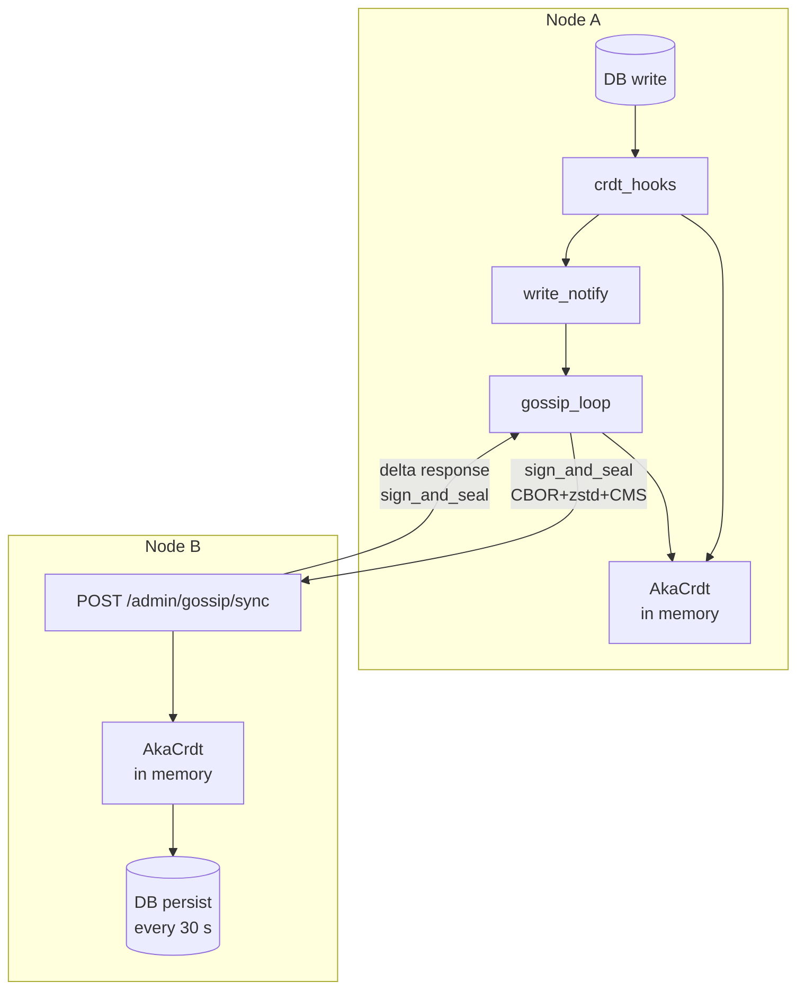

# Gossip Replication Protocol

Akamu replicates all ACME and cluster state across nodes using a CRDT-based push-pull
gossip protocol.  Each node maintains its own authoritative in-memory CRDT; the local
database is a persistence cache for crash recovery only.  Replication is eventually
consistent: a write on one node appears on all peers within one or two gossip intervals.

## Architecture Overview



## CRDT Data Model

### Top-Level: `AkaCrdt`

`AkaCrdt` (`crates/akamu-crdt/src/crdt.rs`) is the single replicated data structure
holding all cluster state.  It composes two CRDT primitive types:

| Field | Type | Semantic |
|---|---|---|
| `cluster_nodes` | `OrMap<String, AkaNodeEntry>` | Node registry (gossip keys, URLs) |
| `accounts` | `OrMap<String, AccountEntry>` | ACME accounts |
| `orders` | `OrMap<String, OrderEntry>` | ACME orders |
| `authorizations` | `OrMap<String, AuthzEntry>` | ACME authorizations |
| `challenges` | `LwwMap<String, ChallengeEntry>` | Challenge state |
| `certificates` | `OrMap<String, CertEntry>` | Issued certificates |
| `eab_keys` | `LwwMap<String, EabKeyEntry>` | EAB metadata (HMAC secret excluded) |
| `operators` | `OrMap<String, OperatorEntry>` | Admin operator accounts |
| `delegations` | `OrMap<String, DelegationEntry>` | STAR delegation records |
| `mtc_checkpoints` | `LwwMap<u64, MtcCheckpointEntry>` | MTC checkpoint metadata |
| `mtc_cosignatures` | `LwwMap<(String,String), MtcCosigEntry>` | External cosigner sigs |
| `order_owners` | `LwwMap<String, OrderOwner>` | Processing-node ownership claims |
| `mtc_writer` | `LwwRegister<MtcWriter>` | Single elected MTC log writer |

**What is NOT replicated:** nonces (single-node anti-replay), CA private keys,
admin sessions, and EAB HMAC key bytes (the `hmac_key_b64u` field has `#[serde(skip)]`
and is verified by a unit test to never appear in gossip CBOR).

### `OrMap<K, V>`: Observed-Remove Map

`or_map.rs` — used for entities that can be soft-deleted (accounts, orders, etc.).

Each entry stores `(value, added_at: i64, tombstone: bool, tombstone_at: Option<i64>)`.

Merge rules:
- **Tombstone always wins over live.** A delete from any node propagates unconditionally.
- **Live vs live:** higher `added_at` wins (Last-Write-Wins by wall-clock timestamp).
- **Tombstone before insert:** `remove()` inserts a tombstone even when the key is absent,
  so an insert arriving later via a different gossip path cannot resurrect the entry.

### `LwwMap<K, V>` + `LwwRegister<T>`: Last-Write-Wins

`lww_map.rs` / `lww_register.rs` — used for mutable state updated by a single authority
(challenge status, EAB usage, ownership claims).

`LwwRegister` stores `(value: Option<T>, timestamp: i64, node_id: String)`.

Merge rule: higher timestamp wins; on equal timestamps the **lexicographically greater
`node_id`** wins.  A `None` value with `timestamp > 0` is a deletion tombstone.

### Generation Counter

`generation.rs` exports a process-wide `AtomicU64 CRDT_GENERATION`.

`next_gen()` is called on every in-memory CRDT write (`upsert`, `remove`, `set`, `merge`
of a new entry).  The resulting `local_gen` is stored per-entry but **never serialised** to
CBOR — it resets to 0 on reload.  The counter is used exclusively for delta computation.

```
delta_since(gen) → sparse AkaCrdt with only entries where local_gen > gen
delta_range(since, until) → entries where local_gen ∈ (since, until]
```

After DB load, `AkaCrdt::max_local_gen()` seeds `CRDT_GENERATION` so deltas computed
after startup do not collide with pre-existing generations.

## Write Path

After each successful DB write, `crdt_hooks.rs` maintains the in-memory CRDT:

```
DB write succeeds
  → on_account_upsert(state, p)   [example]
      if gossip_enabled(state):
          crdt.write().await.accounts.upsert(id, entry, updated)
          state.write_notify.notify_one()
```

The guard `gossip_enabled()` is a single config check (`state.config.gossip.is_some()`).
In single-node deployments the hooks are no-ops; no CRDT overhead is incurred.

## Gossip Loop

`src/gossip/gossip_loop.rs` — spawned once from `main`, runs forever.

### Wake Triggers

The loop wakes on whichever fires first:

1. **Periodic timer** (`interval_secs`, default 15 s)
2. **Write notification** — `state.write_notify.notified()` fires after any CRDT hook write

The write-notify path has two rate controls:

| Control | Value | Purpose |
|---|---|---|
| Slide window | 20 ms | Extend wait on each additional notification within cap |
| Hard cap | 150 ms | Maximum debounce; coalesces ~8 writes per ACME issuance |
| Min interval | 500 ms | Floor between write-notify rounds (~2 Hz max) |

**Startup jitter:** Each node derives a deterministic jitter from its `node_id`
(`hash(node_id) % min_interval_ms`) and delays the first round by that amount.  Without
this, nodes started simultaneously create a gossip storm where all N nodes gossip
simultaneously to each peer, causing N-1 merge write-lock requests to queue on every
receiver.

### Four-Phase Round

```
Phase A — Build envelopes (one CRDT read lock for all peers)
  For each peer in gossip_peers:
    1. Look up peer in cluster_nodes by URL; extract KEM + signing keys
    2. If peer not in cluster_nodes or keys absent → skip (warn first 3 rounds)
    3. Decide full vs delta:
         peer_last_gen absent → clone full CRDT
         peer_last_gen present → crdt.delta_since(peer_last_gen)
    4. CBOR-encode CRDT bytes
    5. Generate 16-byte random nonce
    6. Build GossipEnvelope{crdt, issued_at, is_delta, my_gen, request_delta_since, nonce}
    7. CBOR-encode envelope
  CRDT read lock released

Phase B — Sign envelopes (no lock)
  For each prepared peer:
    sign_and_seal(envelope_bytes, peer_kem_key, own_signing_priv, own_signing_cert)

Phase C — Parallel HTTP round-trips
  Spawn one JoinHandle per peer:
    POST {peer_url}/gossip/sync
    Headers: Content-Type: application/pkcs7-mime
             X-Akamu-Node-Id: {own_node_id}
    Body: signed CMS blob

Phase D — Validate + batch-merge (one write lock for all peers)
  Pass 1 (no lock):
    For each peer response:
      verify_and_open(response, own_kem_priv, peer_signing_pub)
      decode GossipEnvelope
      validate issued_at: reject if > now+clock_skew or < now-max_age
      decode inner AkaCrdt

  Pass 2 (single write lock):
    Pre-merge all valid peer CRDTs into scratch accumulator (no lock)
    Acquire write lock once
    Merge accumulator into live CRDT
    Release write lock

  Pass 3 (no lock):
    Update peer_last_gen → post_merge_gen
    Update peer_response_gen → peer's reported my_gen
    Log first-contact entry counts if is_first_contact
```

Batch-merge (N peers → 1 write lock acquisition) keeps the lock-hold duration proportional
to one merge operation rather than N.  The pre-merge accumulator is built lock-free.

### Delta vs Full-State

| Condition | Payload |
|---|---|
| First contact (no `peer_last_gen`) | Full `AkaCrdt` clone |
| Subsequent rounds | `delta_since(peer_last_gen)` — sparse CRDT |
| Receiver response, delta requested | `delta_range(request_delta_since, pre_merge_gen)` |
| Receiver response, no delta requested | Full CRDT |

The sender's `my_gen` at send time is echoed back by the receiver as the basis for
future `request_delta_since`.  This means the requester asks for only entries the peer
received between the last exchange and the current one — not the full state history.

### Fan-Out Limiting

`fan_out = 0` (default): all peers contacted every round.

`fan_out = K > 0`: a rotating window of K peers is selected per round, indexed by
`current_gen % N`.  Every peer is reached within `⌈N/K⌉` rounds.  This bounds the
simultaneous inbound gossip handler count on receiving nodes to K × (number of sending
nodes) per round.

## Wire Protocol

### `GossipEnvelope`

`src/gossip/envelope.rs` — CBOR-serialised using compact field names.

| Field | CBOR key | Type | Description |
|---|---|---|---|
| `crdt` | `p` | bytes | CBOR-encoded `AkaCrdt` (full or delta) |
| `issued_at` | `t` | i64 | Unix timestamp (seconds); anti-replay anchor |
| `is_delta` | `d` | bool | True when `crdt` is a sparse delta |
| `my_gen` | `g` | u64 | Sender's `CRDT_GENERATION` at send time |
| `request_delta_since` | `r` | u64? | Ask receiver to respond with delta since this gen |
| `nonce` | `n` | bytes | 16 random bytes; replay deduplication |

### Cryptographic Layer

`src/gossip/crypto.rs` — CMS `SignedData(EnvelopedData)`.

**Send — `sign_and_seal(plaintext, recipients, signing_priv, signing_cert)`:**

```
plaintext
  → zstd compress (level 3)
  → AES-256-GCM encrypt with fresh 32-byte CEK + 12-byte nonce
  → for each recipient:
      ML-KEM-768 encapsulate(peer_kem_pub)
        → shared_secret, kemct
      HKDF-SHA-256(key=shared_secret, salt=kemct, info="akamu-cms-kek") → 32-byte KEK
      RFC 3394 AES-256 Key Wrap(KEK, CEK) → 40-byte encrypted CEK
      KEMRecipientInfo{kem=ML-KEM-768, kemct, kdf=HKDF-SHA-256, encrypted_key}
  → EnvelopedData DER
  → ECDSA P-256 sign(enveloped_der) → SignedData DER
```

**Receive — `verify_and_open(signed_der, kem_priv, expected_sender_spki)`:**

```
SignedData DER
  → extract embedded signer certificate
  → assert signer_cert.public_key == expected_sender_spki  (pinned — no TOFU)
  → ECDSA verify SignedData signature
  → extract EnvelopedData
  → iterate KEMRecipientInfo entries:
      ML-KEM-768 decapsulate(kem_priv, kemct) → shared_secret
      HKDF-SHA-256(shared_secret, kemct, "akamu-cms-kek") → KEK
      AES-256 Key Unwrap(KEK, encrypted_cek) → CEK
      AES-256-GCM decrypt(CEK, nonce, ciphertext) → compressed_plaintext
  → zstd decompress (64 MiB limit)
```

**No Trust-On-First-Use.** Both the sender's ECDSA signing key and the receiver's
ML-KEM-768 public key must be pre-pinned via `POST /admin/gossip/register` before any
gossip exchange.  A node without pre-pinned keys will log a warning and skip the peer.

The KEM public key for the response is captured **before** the inbound CRDT merge.  This
prevents a compromised peer from redirecting the encrypted response by injecting a
modified `cluster_nodes` entry in its CRDT payload.

## Receiver Handler

`src/gossip/handlers.rs` — `POST /admin/gossip/sync`.

Processing order:

1. **Header validation** — `X-Akamu-Node-Id` header: required, ≤ 64 bytes.
2. **Pre-merge key lookup** — sender's signing pub + KEM pub read from CRDT under
   read lock.  Returns 401 if either key is absent.
3. **Verify and decrypt** — `verify_and_open()` with the pre-fetched signing key.
4. **CBOR decode** — `GossipEnvelope::decode()`.
5. **Timestamp validation:**
   - Reject if `issued_at > now + clock_skew_tolerance_secs` (default 30 s)
   - Reject if `issued_at < now - gossip_envelope_max_age_secs` (default 300 s)
6. **Nonce deduplication** — 16–32 byte nonce checked against `gossip_nonce_cache`
   (`HashMap<Vec<u8>, i64>`).  Lazy eviction; max 10 000 entries; returns 429 when full.
   Old peers omitting the nonce field bypass dedup.
7. **Decode CRDT** from envelope.
8. **Merge** under write lock.  `CRDT_GENERATION` captured inside the lock to avoid
   racing with concurrent hook writes.
9. **Build response:**
   - If `request_delta_since` present: `delta_range(request_delta_since, pre_merge_gen)`
   - Otherwise: full CRDT
   - Encode as `GossipEnvelope` with own `my_gen` = post-merge gen
   - `sign_and_seal()` response for the sender's KEM public key
10. **Return 200** with `Content-Type: application/pkcs7-mime` body.

**DB persist is intentionally absent from this hot path.**  The CRDT is the source of
truth; the DB is written on a 30-second timer (`persist_crdt_cluster` + `persist_crdt_acme`)
on a dedicated pool (`crdt_db`) to avoid contending with ACME writes.

## Node Identity and Key Bootstrap

Each node's identity is derived from its gossip signing key using RFC 7093 §2 Method 1:

```
node_id = base64url_nopad(SHA-256(BIT_STRING_value_of_signing_pub_key)[0..20])
```

(`compute_aki_from_spki` in `src/ca/init.rs` implements the derivation.)

On first startup, `src/ca/init.rs` generates:
- ML-KEM-768 key pair (PKCS8 DER + SPKI DER stored in `node_keys` table)
- ECDSA P-256 gossip signing key pair + self-signed certificate

`AppState` loads both key pairs into:
- `node_kem_priv` — PKCS8 DER, used by the receiver to decapsulate inbound messages
- `node_gossip_signing_priv` — PEM, used by the sender to sign outbound messages
- `node_gossip_signing_cert` — DER, embedded in outbound `SignedData`

**Enrollment:** Before two nodes can exchange gossip, each must pre-pin the other's keys
via `POST /admin/gossip/register` (requires `administrator` role):

```json
{
  "node_id": "…",
  "gossip_url": "https://peer.acme.internal:8443",
  "kem_public_key_b64u": "<SPKI DER, base64url>",
  "gossip_signing_pub_key_b64u": "<SPKI DER, base64url>",
  "gossip_signing_cert_b64u": "<X.509 DER, base64url>"
}
```

This call upserts a `AkaNodeEntry` into `crdt.cluster_nodes` and immediately persists it
to `crdt_db`.  The entry then replicates to all other peers in the next gossip round.

## Peer Discovery

The gossip loop builds its peer list each round by unioning two sources:

1. `config.gossip.peers` — statically configured URLs from `akamu.toml`
2. Live values from `crdt.cluster_nodes` — dynamically discovered peers enrolled via
   `gossip/register` and propagated through the cluster

Duplicate URLs are eliminated with a `HashSet`.  Stale per-peer state maps
(`peer_last_gen`, `peer_response_gen`) are pruned when a peer is no longer in the union.

## Distributed Coordination

Two CRDT-based consensus mechanisms are built on top of gossip:

### Order Processing Ownership

When a node finalises an ACME order it calls:

```rust
crdt.claim_order(order_id, node_id, now, ownership_ttl_secs)
```

This writes to `order_owners: LwwMap<String, OrderOwner>` and gossips within the
debounce window.  Another node calling `claim_order` for the same order will fail
(`return false`) unless the incumbent's claim has expired (`claimed_at + ttl < now`).

The TTL (default 150 s) is intentionally longer than a typical HTTP timeout so that a
crashing node's slot naturally expires and another node can take over, rather than
requiring explicit release.

### MTC Log Writer Election

Only one node should produce MTC checkpoints per CA.  The election uses:

```rust
crdt.claim_mtc_writer(node_id, now, ownership_ttl_secs)
```

backed by `mtc_writer: LwwRegister<MtcWriter>`.  The node that writes the highest
timestamp wins; ties break by lexicographic `node_id`.  A live incumbent blocks
challengers until its claim lapses.

Both mechanisms rely on gossip propagating the claim before the TTL expires.  With a
15-second gossip interval and a 150-second TTL, a claim survives at least nine missed
rounds before another node can preempt.

## Persistence and Recovery

| What | Where | When |
|---|---|---|
| ACME state (accounts, orders, …) | `db` pool | Periodic, every 30 s |
| Cluster state (nodes, ownership) | `crdt_db` pool | On `gossip/register`; periodic 30 s |
| `CRDT_GENERATION` | Seeded from `AkaCrdt::max_local_gen()` at startup | DB load |

`max_local_gen()` walks all CRDT sub-collections and returns the highest stored
`local_gen`.  Because `local_gen` is not serialised in CBOR (and therefore not in the DB
schema for merged entries), entries received via gossip and persisted to DB will have
`local_gen = 0` after reload.  This is safe: the startup seed ensures the post-load
`CRDT_GENERATION` is ≥ the highest write seen locally, so deltas computed after startup
will include any entries written before the restart.

**Tombstone GC** runs hourly in-place (not via snapshot) under a write lock, purging
tombstones older than `tombstone_ttl_secs` (default 7 days).  The in-place approach
avoids a data-loss window that would exist if entries written between the snapshot read
and the purge application were lost in a crash.

## Concurrency Invariants

| Resource | Lock | Usage |
|---|---|---|
| `AppState::crdt` | `tokio::sync::RwLock` | Read: many concurrent ACME handlers; Write: hooks + gossip merge |
| `AppState::gossip_nonce_cache` | `std::sync::Mutex` | Short critical section; one lock per inbound gossip request |
| `CRDT_GENERATION` | `AtomicU64` (AcqRel) | Bumped on every CRDT write; read after merge under Acquire ordering |

The gossip loop captures `CRDT_GENERATION` with `Ordering::Acquire` before building
envelopes and after each merge.  Acquire ordering ensures all preceding writes (from
hooks) are visible before the generation value is read.

The receiver handler captures `pre_merge_gen` **inside** the write lock, not before
acquiring it, to prevent a race where a concurrent hook write increments the generation
between the read and the lock acquisition.  This ensures `delta_range(request_delta_since,
pre_merge_gen)` in the response does not include entries written after the merge.

## Configuration Reference

```toml
[gossip]
# Peer admin base URLs (not ACME listener URLs).
peers = ["https://node2.acme.internal:8081"]

# Gossip interval (seconds). Default: 15.
interval_secs = 15

# Tombstone retention before GC (seconds). Default: 604800 = 7 days.
tombstone_ttl_secs = 604800

# Order/MTC-writer ownership TTL (seconds). Default: 150.
ownership_ttl_secs = 150

# Maximum age of an accepted gossip envelope (seconds). Default: 300.
gossip_envelope_max_age_secs = 300

# Clock skew tolerance (seconds). Default: 30.
clock_skew_tolerance_secs = 30

# Peers contacted per round. 0 = all (default). Use in large clusters.
fan_out = 0
```

See [Cluster Setup and Gossip](../admin/cluster.md) for deployment procedures.
