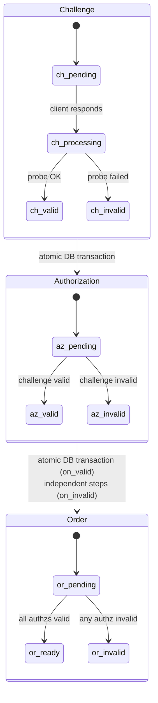

# Challenge Validation

Challenge validation is the process by which `Akāmu` probes applicant servers to verify domain ownership. All validation is asynchronous and intentionally infallible — errors are recorded in the database rather than propagated.

## Dispatch

The entry point is `validation::validate_challenge` in `src/validation/mod.rs`. It is called from `routes::challenge::respond_challenge` after marking the challenge as `processing`.

```rust
pub async fn validate_challenge(
    state: &Arc<AppState>,
    challenge_id: &str,
    authz_id: &str,
    chall_type: &str,
    id_type: &str,
    id_value: &str,
    key_auth: &str,
    token: &str,
)
```

`validate_challenge` calls `dispatch(chall_type, ...)`, which routes to one of four validators:

| `chall_type` | Module | Function |
|---|---|---|
| `"http-01"` | `validation::http01` | `validate(domain, token, key_auth)` |
| `"dns-01"` | `validation::dns01` | `validate(domain, key_auth)` |
| `"tls-alpn-01"` | `validation::tls_alpn01` | `validate(domain, key_auth)` |
| `"dns-persist-01"` | `validation::dns_persist_01` | `validate(domain, account_uri, issuer_domain, resolver_addr)` |
| Any other | — | Returns `AcmeError::IncorrectResponse` |

After `dispatch` returns, `validate_challenge` calls either `on_valid` or `on_invalid` to update the database.

## Validation flow

```mermaid
sequenceDiagram
    participant Client as ACME Client
    participant H as Route Handler
    participant V as validate_challenge (spawned)
    participant D as dispatch()
    participant Ext as Applicant Server / DNS
    participant DB as SQLite

    Client->H: POST to challenge URL
    H->DB: challenge -> processing
    H->V: tokio::spawn(validate_challenge)
    H-->Client: 200 processing (immediate return)

    V->D: dispatch(chall_type, domain, key_auth, ...)

    alt http-01
        D->Ext: GET /.well-known/acme-challenge/TOKEN
        Ext-->D: 200 key_authorization body
    else dns-01
        D->Ext: TXT _acme-challenge.DOMAIN
        Ext->D: TXT record value
    else tls-alpn-01
        D->Ext: TLS connect :443, ALPN acme-tls/1
        Ext->D: Certificate with id-pe-acmeIdentifier
    else dns-persist-01
        D->Ext: TXT _validation-persist.DOMAIN
        Ext->D: TXT record value (issuer;accounturi;policy;persistUntil)
    end

    alt probe succeeded
        V->DB: BEGIN TRANSACTION
        V->DB: challenge -> valid (+ validated timestamp)
        V->DB: authorization -> valid
        V->DB: count non-valid authzs for order
        alt all authorizations now valid
            V->DB: order -> ready
        end
        V->DB: COMMIT
    else probe failed
        V->DB: challenge -> invalid (+ error JSON)
        V->DB: authorization -> invalid
        V->DB: order -> invalid
    end

    Note over Client: Client polls authorization URL (POST-as-GET)
```

## Background execution

Validation runs inside a `tokio::spawn` task, not in the request handler's async context:

```rust
let handle = tokio::spawn(async move {
    validation::validate_challenge(
        &state_clone,
        &challenge_id,
        &authz_id_clone,
        &chall_type_clone,
        &id_type,
        &id_value,
        &key_auth,
        &token,
    )
    .await;
});

// Observer task: log panics without letting them go silent.
tokio::spawn(async move {
    if let Err(e) = handle.await {
        tracing::error!(
            "challenge {challenge_id_for_log}: validation task panicked: {e:?}"
        );
    }
});
```

The challenge handler returns the `processing` status immediately. The client must poll the authorization URL to detect completion.

The observer task pattern ensures that panics inside the validation task are logged via `tracing::error!` rather than silently discarded (which would happen if the `JoinHandle` were simply dropped).

## State cascade diagram



## State transitions on success (`on_valid`)

All three updates run inside a single SQLite transaction:

1. `UPDATE challenges SET status = 'valid', validated = <now> WHERE id = <challenge_id>`
2. `UPDATE authorizations SET status = 'valid' WHERE id = <authz_id>`
3. `SELECT order_id FROM authorizations WHERE id = <authz_id>`
4. `SELECT COUNT(*) FROM authorizations WHERE order_id = <order_id> AND status != 'valid'`
5. If count is zero: `UPDATE orders SET status = 'ready' WHERE id = <order_id>`

If any step fails (e.g., a database error), a warning is logged and the transaction is rolled back. The challenge remains in `processing` status until the next validation attempt or a timeout.

## State transitions on failure (`on_invalid`)

1. `db::challenges::set_invalid(challenge_id, error_json, now)` — marks the challenge `invalid` and stores the error JSON.
2. `db::authz::update_status(authz_id, "invalid", now)` — marks the authorization `invalid`.
3. `db::authz::get_by_id(authz_id)` — finds the parent order ID.
4. `db::orders::update_status(order_id, "invalid", None, now)` — marks the order `invalid`.

Each step is independent; a failure in one step logs a warning but does not prevent the others from running. This is intentional: if the database is in a degraded state, we still attempt to record as much of the failure as possible.

## http-01 validator (`src/validation/http01.rs`)

Uses `hyper` (already a transitive dependency via axum) as the HTTP client.

Validation steps:
1. Construct the URL `http://<domain>/.well-known/acme-challenge/<token>`.
2. Send a GET request via `hyper_util::client::legacy::Client`.
3. Check that the response status is 2xx.
4. Read up to 8192 bytes of the response body.
5. Decode as UTF-8 and trim whitespace.
6. Compare with `key_auth`. Any mismatch returns `AcmeError::IncorrectResponse`.

Error mapping:
- Connection or parse failure → `AcmeError::Connection`
- Non-2xx status → `AcmeError::IncorrectResponse`
- Body too large → `AcmeError::IncorrectResponse`
- Key auth mismatch → `AcmeError::IncorrectResponse`

## dns-01 validator (`src/validation/dns01.rs`)

Uses `hickory_resolver::TokioAsyncResolver` with the system default resolver configuration.

Validation steps:
1. Strip any leading `*.` prefix from the domain (RFC 8555 §8.4 requires this for wildcard orders).
2. Construct the query name `_acme-challenge.<base_domain>`.
3. Compute `expected = base64url(SHA-256(key_auth))`.
4. Perform a TXT record lookup.
5. For each TXT record, join all character-strings (TXT records may be split) and compare the trimmed result with `expected`.
6. If at least one record matches, return `Ok(())`.

Error mapping:
- DNS lookup failure → `AcmeError::Dns`
- No matching TXT record → `AcmeError::IncorrectResponse`

The inner function `validate_with_resolver(domain, key_auth, resolver)` accepts a custom resolver for testability. Unit tests provide a local UDP stub DNS server.

## tls-alpn-01 validator (`src/validation/tls_alpn01.rs`)

Uses `rustls` and `tokio-rustls`.

Validation steps:
1. Compute `expected_hash = SHA-256(key_auth)`.
2. Build a `rustls::ClientConfig` that:
   - Accepts any server certificate without chain validation (`AcceptAnyCert` custom verifier).
   - Advertises only the ALPN protocol `"acme-tls/1"`.
   - Supports both TLS 1.2 and TLS 1.3.
3. TCP-connect to `<domain>:443`.
4. Perform the TLS handshake.
5. Extract the end-entity certificate from the peer certificate chain.
6. Call `verify_acme_cert(domain, cert_der, &expected_hash)`.

`verify_acme_cert` walks the certificate DER manually:
- Finds the `id-pe-acmeIdentifier` extension (OID `1.3.6.1.5.5.7.1.31`).
- Checks it is marked critical.
- Checks its value is `OCTET STRING(32 bytes)` equal to `expected_hash`.
- Finds the SubjectAlternativeName extension.
- Checks it contains `domain` as a `dNSName`.

The DER walker (`find_extension_value`) navigates the `Certificate → TBSCertificate → Extensions` structure using hand-written TLV parsing helpers (`read_tlv`, `decode_length`, `strip_sequence`, etc.). This approach avoids requiring the full synta decoder for a security-critical path.

Error mapping:
- Invalid server name → `AcmeError::Tls`
- TCP connect failure → `AcmeError::Connection`
- TLS handshake failure → `AcmeError::Tls`
- Missing or non-critical `id-pe-acmeIdentifier` → `AcmeError::IncorrectResponse`
- Hash mismatch → `AcmeError::IncorrectResponse`
- Missing SAN → `AcmeError::IncorrectResponse`
- Domain not in SAN → `AcmeError::IncorrectResponse`

### `AcceptAnyCert`

The `AcceptAnyCert` struct implements `rustls::client::danger::ServerCertVerifier`. It returns `Ok(ServerCertVerified::assertion())` unconditionally for every certificate. Chain validation is intentionally bypassed because the tls-alpn-01 certificate is self-signed and issued by the ACME client for validation purposes only. All semantic checks are performed by `verify_acme_cert` instead.

## dns-persist-01 validator (`src/validation/dns_persist_01.rs`)

Uses `hickory_resolver::TokioAsyncResolver`. The resolver is either the system default or the address configured via `server.dns_resolver_addr`.

Unlike the other challenge types, `dns-persist-01` does not use a `token · thumbprint` key authorization. The `key_auth` value passed to the validator is the requesting account's full URI (constructed as `<base_url>/acme/account/<account_id>` in `routes::challenge`). This URI is matched directly against the `accounturi=` field in the TXT record.

Validation steps:
1. Strip any leading `*.` prefix from the domain; record whether the order is a wildcard.
2. Construct the query name `_validation-persist.<base_domain>`.
3. Perform a TXT record lookup.
4. For each TXT record value, call `matches_record(value, issuer_domain, account_uri, is_wildcard, now)`.
5. If at least one record matches, return `Ok(())`.

### `matches_record`

`matches_record` is `pub(crate)` and is unit-tested independently of the DNS stack.

It splits the raw TXT value on `;` and applies the following checks in order:

1. The first token (trimmed, trailing dot stripped, lowercased) equals `expected_issuer` (same normalization applied).
2. Among the remaining tokens, `accounturi=<uri>` is present and the URI matches `expected_account_uri` exactly (case-sensitive).
3. If `require_wildcard_policy` is true, `policy=wildcard` is present among the tokens.
4. If a `persistUntil=<ts>` token is present, `parse_persist_until(ts)` returns a Unix timestamp that is greater than or equal to `now`.

Unknown tokens are silently ignored. The function returns `false` as soon as any required condition is not met.

### `parse_persist_until`

A pure-Rust, zero-dependency parser for the `YYYY-MM-DDTHH:MM:SSZ` timestamp format. It performs the proleptic Gregorian day count from the Unix epoch without using any external date/time crate. Returns `None` for malformed input (wrong separators, out-of-range fields, missing `Z` suffix).

Error mapping:
- DNS lookup failure → `AcmeError::Dns`
- No matching TXT record → `AcmeError::IncorrectResponse`
