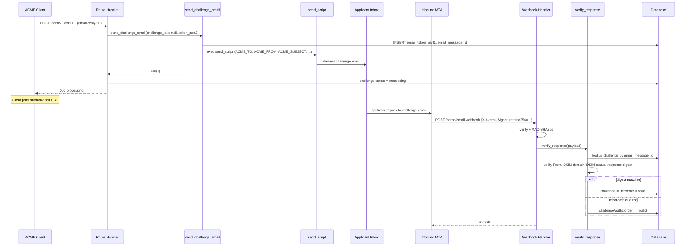
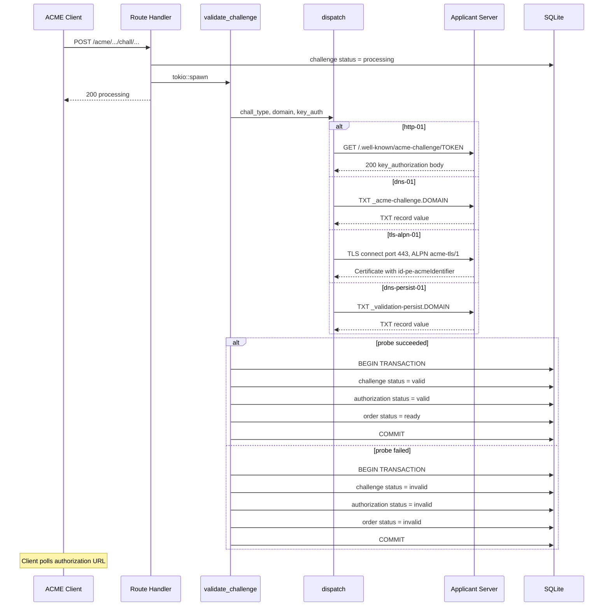
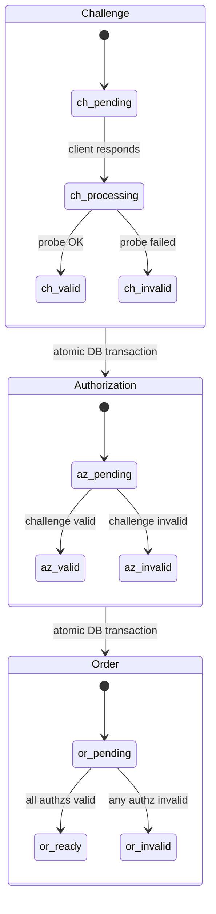

# Challenge Validation

Challenge validation is the process by which `Akāmu` probes applicant servers to verify domain ownership. All validation is asynchronous and intentionally infallible — errors are recorded in the database rather than propagated.

## Dispatch

The entry point is `validation::validate_challenge` in `src/validation/mod.rs`. It is called from `routes::challenge::respond_challenge` after marking the challenge as `processing`.

```rust
pub async fn validate_challenge(
    state: &Arc<AppState>,
    params: ChallengeParams<'_>,
) -> &'static str
```

`ChallengeParams` carries all per-challenge inputs as named fields:

```rust
pub struct ChallengeParams<'a> {
    pub challenge_id: &'a str,
    pub authz_id: &'a str,
    pub order_id: &'a str,
    pub chall_type: &'a str,
    pub id_type: &'a str,
    pub id_value: &'a str,
    pub key_auth: &'a str,
    pub token: &'a str,
    pub onion_csr_der: Option<&'a [u8]>,
    pub account_id: &'a str,
}
```

`validate_challenge` calls `dispatch(...)`, which routes to one of five validators. `email-reply-00` is handled separately — see [email-reply-00 two-phase model](#email-reply-00-two-phase-model) below.

| `chall_type` | Module | Function |
|---|---|---|
| `"http-01"` | `validation::http01` | `validate(domain, token, key_auth, port, allow_private_ips, client)` |
| `"dns-01"` | `validation::dns01` | `validate(domain, key_auth, validate_dnssec, dot_server_name)` |
| `"tls-alpn-01"` | `validation::tls_alpn01` | `validate(id_type, domain, key_auth)` |
| `"dns-persist-01"` | `validation::dns_persist_01` | `validate(domain, account_uri, issuer_domains, resolver_addr, validate_dnssec, dot_server_name)` |
| `"onion-csr-01"` | `validation::onion_csr_01` | `validate(domain, csr_der, key_auth)` |
| Any other | — | Returns `AcmeError::IncorrectResponse` |

> **Note:** `email-reply-00` does NOT appear in the dispatch table above. Client POST to the
> challenge URL triggers `send_challenge_email` (Phase 1), not a network probe. Validation
> completes later via the webhook endpoint. See the section below for the full model.

### email-reply-00 two-phase model

`email-reply-00` (`src/validation/email_reply_00.rs`) works differently from all other
challenge types. Instead of a network probe, it uses a two-channel token delivered by
email, with completion driven by an inbound webhook rather than by `validate_challenge`.

**Phase 1 — client POST triggers `send_challenge_email`**

When the ACME client POSTs to the challenge URL, the route handler calls
`email_reply_00::send_challenge_email(state, challenge_id, email_addr, token_part2_b64)`
instead of spawning a `validate_challenge` task. The function:

1. Generates `token-part1`: 20 random bytes encoded as base64url (≥128 bits of entropy).
2. Generates a unique `Message-ID` of the form `<uuid@from-domain>`.
3. Writes both values to `challenges.email_token_part1` and `challenges.email_message_id`
   in the database **before** invoking the send script, so a script failure leaves the
   token record in a recoverable state.
4. Invokes the configured `send_script` with `env_clear()`, passing `ACME_TO`,
   `ACME_FROM`, `ACME_SUBJECT`, `ACME_MESSAGE_ID`, `ACME_AUTO_SUBMITTED`, and
   `ACME_TOKEN_PART2` as environment variables. The script must exit 0 on success.
5. If the script exits non-zero or times out, returns an error and the route handler
   marks the challenge `"invalid"`. Otherwise the challenge stays `"processing"` and the
   client polls until Phase 2 completes it.

**Phase 2 — webhook receives email reply via `verify_response`**

The MTA that receives the applicant's reply POSTs the parsed reply to
`POST /acme/email-webhook`. This endpoint does not use ACME JWS authentication;
instead it verifies the `X-Akamu-Signature: sha256=<hex>` header against the raw
request body using HMAC-SHA256 with `email_challenge.webhook_hmac_secret`.

After the HMAC check passes, `email_reply_00::verify_response(state, payload)` is called.
The payload is a `WebhookPayload` struct with fields `from`, `in_reply_to`, `dkim_domain`,
`dkim_status`, and `body`. The function:

1. Looks up the challenge via `challenges.email_message_id = payload.in_reply_to` using
   the **write pool** (`state.db`) to avoid stale WAL reads that could miss Phase 1 writes.
2. Checks that the challenge is in `"processing"` state.
3. Checks that the authorization has not expired.
4. Verifies that `payload.from` matches the identifier's email address (local-part
   case-sensitive, domain case-insensitive per RFC 5321 §2.4).
5. Verifies that `payload.dkim_domain` matches the domain part of `payload.from`
   (case-insensitive), enforcing RFC 8823 §3.2.
6. Verifies that `payload.dkim_status` is `"pass"` (case-insensitive to accommodate
   MTAs that report `"Pass"`).
7. Extracts the base64url payload between `-----BEGIN ACME RESPONSE-----` /
   `-----END ACME RESPONSE-----` delimiters; rejects if absent, whitespace-only,
   non-ASCII, or longer than 512 bytes.
8. Computes the expected digest: `SHA-256(token-part1 || token-part2 || "." || thumbprint)`
   where both token parts are the stored base64url strings and `thumbprint` is the
   account's JWK thumbprint (from `accounts.jwk_thumbprint`).
9. Compares the decoded response bytes with the digest using `constant_time_eq`.
10. On match, calls `on_valid`; on any mismatch or error, calls `on_invalid`.

The webhook handler always returns HTTP 200 regardless of outcome (to prevent oracle
attacks on the HMAC or challenge state).



### dns-persist-01 account pre-check

For `dns-persist-01` only, `validate_challenge` performs an account status check **before** calling `dispatch`. Because the TXT record is long-lived and may have been provisioned weeks before the order is placed, the account could have been deactivated or revoked in the intervening time. The pre-check queries the database:

```sql
SELECT status FROM accounts WHERE id = ?
```

- If the account status is `"valid"`, dispatch proceeds normally.
- If the status is anything else (e.g., `"deactivated"`, `"revoked"`), `on_invalid` is called immediately with `AcmeError::Unauthorized` and the challenge is marked `invalid` without any DNS query.
- If the database query itself fails, `on_invalid` is called with `AcmeError::Internal`.

After `dispatch` returns, `validate_challenge` calls either `on_valid` or `on_invalid` to update the database.

## Validation flow



## Background execution

Validation runs inside a `tokio::spawn` task, not in the request handler's async context:

```rust
let handle = tokio::spawn(async move {
    validation::validate_challenge(
        &state_clone,
        ChallengeParams {
            challenge_id: &challenge_id,
            authz_id: &authz_id,
            order_id: &order_id,
            chall_type: &chall_type,
            id_type: &id_type,
            id_value: &id_value,
            key_auth: &key_auth,
            token: &token,
            onion_csr_der: onion_csr_der.as_deref(), // Some(der) for onion-csr-01, None otherwise
            account_id: &account_id,
        },
    )
    .await;
});

// Observer task: log panics without letting them go silent.
tokio::spawn(async move {
    if let Err(e) = handle.await {
        tracing::error!(
            "challenge {challenge_id_for_log}: validation task panicked: {e:?}"
        );
    }
});
```

The challenge handler returns the `processing` status immediately. The client must poll the authorization URL to detect completion.

The observer task pattern ensures that panics inside the validation task are logged via `tracing::error!` rather than silently discarded (which would happen if the `JoinHandle` were simply dropped).

## State cascade diagram



## State transitions on success (`on_valid`)

All three updates run inside a single database transaction:

1. `UPDATE challenges SET status = 'valid', validated = <now> WHERE id = <challenge_id>`
2. `UPDATE authorizations SET status = 'valid' WHERE id = <authz_id>`
3. Conditionally advance the order to `ready` using a single `UPDATE orders SET status = 'ready' WHERE id = <order_id> AND NOT EXISTS (SELECT 1 FROM authorizations WHERE order_id = <order_id> AND status != 'valid')`. This replaces the previous SELECT COUNT(*) + conditional UPDATE pattern; it saves a round-trip on the common single-identifier path.

If any step fails (e.g., a database error), a warning is logged and the transaction is rolled back. The challenge remains in `processing` status.

## State transitions on failure (`on_invalid`)

All three updates run inside a single database transaction:

1. `UPDATE challenges SET status = 'invalid', error = <json> WHERE id = <challenge_id>`
2. `UPDATE authorizations SET status = 'invalid' WHERE id = <authz_id>`
3. Look up the parent order ID and mark the order `invalid`.

If the transaction fails (e.g., a database error), a warning is logged.

## http-01 validator (`src/validation/http01.rs`)

Uses `hyper` (already a transitive dependency via axum) as the HTTP client.

Validation steps:
1. Construct the URL `http://<domain>/.well-known/acme-challenge/<token>`.
2. **SSRF guard — initial target**: before making any connection, resolve the target host and reject it if any returned address is in a private, loopback, link-local, or otherwise non-globally-routable range (RFC 1918, `169.254.0.0/16`, `::1`, `fe80::/10`, `fc00::/7`, etc.). This guard applies to both IP literals and hostnames. Bypassed only when `http_validation_allow_private_ips = true`.
3. Send a GET request via `hyper_util::client::legacy::Client`.
4. Check the response status. 3xx redirects are followed (up to 10 hops, including redirects to HTTPS targets).
5. **SSRF guard — redirect targets**: each redirect target is also subjected to the same IP check before following it.
6. Check that the final response status is 2xx.
7. Read up to 1 MiB of the response body.
8. Decode as UTF-8 and trim whitespace.
9. Compare with `key_auth`. Any mismatch returns `AcmeError::IncorrectResponse`.

Error mapping:
- Connection or parse failure → `AcmeError::Connection`
- Non-2xx status → `AcmeError::IncorrectResponse`
- Body exceeds 1 MiB → `AcmeError::IncorrectResponse`
- Key auth mismatch → `AcmeError::IncorrectResponse`
- Initial or redirect target resolves to blocked IP → `AcmeError::IncorrectResponse`

## dns-01 validator (`src/validation/dns01.rs`)

Uses `crate::dns::dns_query` backed by `hickory_resolver`. DNS-over-TLS (DoT) is supported when `server.dns_dot_server_name` is set.

Validation steps:
1. Strip any leading `*.` prefix from the domain (RFC 8555 §8.4 requires this for wildcard orders).
2. Construct the query name `_acme-challenge.<base_domain>`.
3. Compute `expected = base64url(SHA-256(key_auth))`.
4. Perform a TXT record lookup via `crate::dns::dns_query` (UDP, DNSSEC-aware, or DoT depending on config).
5. For each TXT record, join all character-strings (TXT records may be split) and compare the trimmed result with `expected`.
6. If at least one record matches, return `Ok(())`.

Error mapping:
- DNS lookup failure → `AcmeError::Dns`
- No matching TXT record → `AcmeError::IncorrectResponse`

The inner function `validate_with_resolver(domain, key_auth, resolver_addr, validate_dnssec, dot_server_name)` accepts explicit resolver settings for testability. Unit tests provide a local UDP stub DNS server.

## tls-alpn-01 validator (`src/validation/tls_alpn01.rs`)

Uses `rustls` and `tokio-rustls`. Supports both DNS identifiers (RFC 8737) and IP identifiers (RFC 8738).

Validation steps:
1. Compute `expected_hash = SHA-256(key_auth)`.
2. **For IP identifiers (RFC 8738 §4)**: convert the IP address to its reverse-DNS form for SNI (`1.2.3.4` → `4.3.2.1.in-addr.arpa`; IPv6 uses the nibble-expanded `.ip6.arpa` form). For DNS identifiers, the SNI is the identifier value directly.
3. Build a `rustls::ClientConfig` that:
   - Accepts any server certificate without chain validation (`AcceptAnyCert` custom verifier).
   - Advertises only the ALPN protocol `"acme-tls/1"`.
   - Supports both TLS 1.2 and TLS 1.3.
4. TCP-connect to `<id_value>:443` (the raw IP or DNS name, not the reverse-DNS SNI).
5. Perform the TLS handshake with the SNI from step 2.
6. Extract the end-entity certificate from the peer certificate chain.
7. Call `verify_acme_cert(id_type, id_value, cert_der, &expected_hash)`.

`verify_acme_cert` walks the certificate DER manually:
- Finds the `id-pe-acmeIdentifier` extension (OID `1.3.6.1.5.5.7.1.31`).
- Checks it is marked critical.
- Checks its value is `OCTET STRING(32 bytes)` equal to `expected_hash`.
- Finds the SubjectAlternativeName extension.
- For DNS identifiers: checks it contains `id_value` as a `dNSName` (tag `0x82`).
- For IP identifiers: checks it contains `id_value` as an `iPAddress` (tag `0x87`) encoded as 4 (IPv4) or 16 (IPv6) raw bytes.

The DER walker (`find_extension_value`) navigates the `Certificate → TBSCertificate → Extensions` structure using hand-written TLV parsing helpers (`read_tlv`, `decode_length`, `strip_sequence`, etc.). This approach avoids requiring the full synta decoder for a security-critical path.

Error mapping:
- Invalid server name or IP-to-reverse-DNS conversion failure → `AcmeError::Tls`
- TCP connect failure → `AcmeError::Connection`
- TLS handshake failure → `AcmeError::Tls`
- Missing or non-critical `id-pe-acmeIdentifier` → `AcmeError::IncorrectResponse`
- Hash mismatch → `AcmeError::IncorrectResponse`
- Missing SAN → `AcmeError::IncorrectResponse`
- Identifier not found in SAN → `AcmeError::IncorrectResponse`

### `AcceptAnyCert`

The `AcceptAnyCert` struct implements `rustls::client::danger::ServerCertVerifier`. It returns `Ok(ServerCertVerified::assertion())` unconditionally for every certificate. Chain validation is intentionally bypassed because the tls-alpn-01 certificate is self-signed and issued by the ACME client for validation purposes only. All semantic checks are performed by `verify_acme_cert` instead.

## dns-persist-01 validator (`src/validation/dns_persist_01.rs`)

Uses `crate::dns::dns_query` backed by `hickory_resolver`. The resolver address comes from `server.dns_persist01_resolver_addr` when set; if absent it falls back to `server.dns_resolver_addr`, and if that is also absent it uses the system default. DNS-over-TLS is supported when `server.dns_dot_server_name` is set.

Unlike the other challenge types, `dns-persist-01` does not use a `token · thumbprint` key authorization. The `key_auth` value passed to the validator is the requesting account's full URI (constructed as `<base_url>/acme/account/<account_id>` in `routes::challenge`). This URI is matched directly against the `accounturi=` field in the TXT record.

Validation steps:
1. Strip any leading `*.` prefix from the domain; record whether the order is a wildcard.
2. Construct the query name `_validation-persist.<base_domain>`.
3. Perform a TXT record lookup via `crate::dns::dns_query`.
4. For each TXT record value, call `matches_record(value, issuer_domains, account_uri, is_wildcard, now)`.
5. If at least one record matches, return `Ok(())`.

### `matches_record`

`matches_record` is `pub(crate)` and is unit-tested independently of the DNS stack.

```rust
pub(crate) fn matches_record(
    raw: &str,
    expected_issuers: &[&str],
    expected_account_uri: &str,
    require_wildcard_policy: bool,
    now: i64,
) -> bool
```

It splits the raw TXT value on `;` and applies the following checks in order:

1. The first token (trimmed, trailing dot stripped, lowercased) equals **any** entry in `expected_issuers` (same normalization applied). Multiple issuer domains are supported.
2. Among the remaining tokens, `accounturi=<uri>` is present and the URI matches `expected_account_uri` exactly (case-sensitive).
3. If `require_wildcard_policy` is true, `policy=wildcard` is present among the tokens.
4. If a `persistUntil=<ts>` token is present, `parse_persist_until(ts)` returns a Unix timestamp that is greater than or equal to `now`.

Unknown tokens are silently ignored. The function returns `false` as soon as any required condition is not met.

### `parse_persist_until`

A pure-Rust, zero-dependency parser for the `YYYY-MM-DDTHH:MM:SSZ` timestamp format (lowercase `z` is also accepted). It performs the proleptic Gregorian day count from the Unix epoch without using any external date/time crate. Returns `None` for malformed input (wrong separators, out-of-range fields, missing `Z` suffix).

Error mapping for dns-persist-01:
- DNS lookup failure → `AcmeError::Dns`
- No matching TXT record → `AcmeError::IncorrectResponse`

## onion-csr-01 validator (`src/validation/onion_csr_01.rs`)

Implements server-side validation for hidden-service domain ownership per RFC 9799 §3.2. The client submits a DER-encoded CSR in the challenge response payload (`{"csr": "<base64url>"}`); the handler decodes it and passes it to this validator via `onion_csr_der`.

Validation steps:
1. **Decode hidden-service public key**: extract the 32-byte Ed25519 public key from the v3 `.onion` address label. The label is 56 base32 characters encoding 35 bytes: `[pubkey(32)] || [checksum(2)] || [version=0x03(1)]`. Version byte must be `0x03`; v2 addresses (16-character label) are rejected.
2. **Parse CSR**: decode `csr_der` as a DER PKCS#10 `CertificationRequest` using synta.
3. **Re-encode CRI**: re-encode the `CertificationRequestInfo` to obtain the exact bytes that were signed.
4. **Verify CSR self-signature**: call `BackendPublicKey::verify_signature` on the CRI bytes using the CSR's own public key. Returns `IncorrectResponse` if invalid.
5. **Verify `cabf-onion-csr-nonce` extension** (OID `2.23.140.41`): the extension value must be a DER `UTF8String` (or `IA5String` / raw bytes) whose decoded string equals `key_auth` (`token.thumbprint`). Returns `IncorrectResponse` if absent or mismatched.
6. **Verify hidden-service Ed25519 signature** over the CRI bytes using the public key from step 1. Two cases are accepted:
   - If the outer CSR signature (the `BIT STRING` at the top level) verifies with the hidden-service Ed25519 key, the challenge passes.
   - Otherwise, if the CSR's own public key matches the hidden-service key, the self-signature from step 4 already proves key control and no separate HS signature is required.
   If neither condition holds, `IncorrectResponse` is returned.
7. **Verify SAN**: check that the `.onion` domain appears as a `dNSName` in the CSR's `SubjectAlternativeName` extension.

The `validate_onion_v3(domain)` helper (exported as `pub`) can be called by the order/authorization handler to reject non-v3 `.onion` domains before creating a challenge.

Error mapping:
- Cannot decode `.onion` public key → `AcmeError::IncorrectResponse`
- CSR parse failure → `AcmeError::IncorrectResponse`
- CSR self-signature invalid → `AcmeError::IncorrectResponse`
- Missing or mismatched `cabf-onion-csr-nonce` extension → `AcmeError::IncorrectResponse`
- Hidden-service signature verification failed → `AcmeError::IncorrectResponse`
- Domain not found in CSR SAN → `AcmeError::IncorrectResponse`

## CAA record validation (`src/validation/caa.rs`)

CAA (Certification Authority Authorization) checking runs **at finalization time**, after challenge validation has already succeeded and the order is in the `ready` state. It is not part of the challenge validation dispatch; it is called directly from `routes::finalize::finalize_order` (`src/routes/finalize.rs`, line 209) before the certificate is issued.

### When CAA is checked in the issuance flow

The finalization handler (`finalize_order`) performs operations in this order:

1. JWS verification, order lookup, status checks.
2. Profile resolution and per-profile authorization checks.
3. CSR validation (`ca::csr::validate_csr`).
4. **CAA record check** — iterates over each `dns` identifier in the order and calls `caa::check_caa`.
5. Certificate issuance (`ca::issue::issue_with_params`).

CAA is checked after challenge validation (which happened asynchronously when the challenge was triggered) but before any certificate is signed. IP identifiers are skipped because CAA is a DNS-only mechanism (RFC 8659).

### How CAA checking works

The entry point is `check_caa` (`src/validation/caa.rs`, line 45):

```rust
pub async fn check_caa(
    params: CaaParams<'_>,
    resolver_addr: Option<&str>,
) -> Result<(), AcmeError>
```

`CaaParams` carries all per-request fields:

```rust
pub struct CaaParams<'a> {
    pub domain: &'a str,          // domain without *. prefix
    pub ca_identities: &'a [String],
    pub is_wildcard: bool,
    pub challenge_type: &'a str,  // e.g. "http-01", "dns-01"
    pub account_url: Option<&'a str>,
    pub validate_dnssec: bool,
    pub dot_server_name: Option<&'a str>,
}
```

**Step 1 — Skip when unconfigured.** If `ca_identities` is empty, `check_caa` returns `Ok(())` immediately (open policy). CAA checking is only active when `caa_identities` is configured in `[server]` or the per-CA `[[ca]]` section.

**Step 2 — DNS tree walk.** `build_name_walk` (`src/validation/caa.rs`, line 155) constructs a list of names from the requested domain up to (but not including) the TLD. For example, `sub.example.com` produces `["sub.example.com", "example.com"]`. Single-label names are excluded.

**Step 3 — Query CAA records.** For each name in the walk, a CAA record query is issued via `crate::dns::dns_query` (hickory-resolver). Three outcomes:

- **No records found** (NXDOMAIN or empty answer) — continue walking up the tree.
- **Records found** — pass the record set to `evaluate_caa_record_set` and return its result.
- **DNS error** (SERVFAIL, REFUSED, network failure, DNSSEC failure) — **fail closed** with `AcmeError::Caa`.

**Step 4 — No records found anywhere.** If the entire walk completes without finding any CAA records, issuance is allowed (unconstrained domain, per RFC 8659 section 4).

### Which RFC 8659 record properties are checked

`evaluate_caa_record_set` (`src/validation/caa.rs`, line 187) processes the CAA record set:

| Property | Handling |
|----------|----------|
| `issue` | Checked for non-wildcard certificates. The record's domain value is compared (case-insensitive, trailing-dot-stripped) against each entry in `ca_identities`. |
| `issuewild` | Checked for wildcard certificates. When `issuewild` records are present, they take precedence over `issue` records. When no `issuewild` records exist in the set, `issue` records govern wildcards as a fallback (RFC 8659 section 4). |
| `iodef` | Not evaluated. A record set containing only `iodef` records (no `issue` or `issuewild`) is treated as unconstrained — issuance is allowed. |

An explicit denial record (`CAA 0 issue ";"` with no CA domain) is skipped — it does not match any CA but does not block issuance by itself unless no other authorizing record exists.

### RFC 8657 account URI and validation method binding

When a matching `issue` or `issuewild` record contains RFC 8657 parameters, `evaluate_caa_record_set` enforces them (starting at line 253):

**`validationmethods` (RFC 8657 section 3):** The parameter value is a comma-separated list of challenge types. The challenge type used to validate the order's authorization must appear in the list. If it does not, the record is treated as non-authorizing. The finalization handler looks up the validated challenge type for each authorization via `db::challenges::get_validated_type` (`src/db/challenges.rs`, line 107), which queries `SELECT type FROM challenges WHERE authz_id = ? AND status = 'valid' LIMIT 1`.

**`accounturi` (RFC 8657 section 4):** The full ACME account URL of the requesting client must match the parameter value exactly (case-sensitive). The account URL is constructed as `{base_url}/acme/account/{account_id}` in the finalization handler (`src/routes/finalize.rs`, line 208). If the account URL is `None` (not supplied to the check), any record carrying `accounturi` is denied.

Unknown parameters are silently ignored per RFC 8657.

A record authorizes issuance only when both `validationmethods` and `accounturi` checks pass (if present). If no record in the set authorizes issuance, the function returns `Err(AcmeError::Caa(...))`.

### CAA identity resolution

The finalization handler resolves which CAA identities to use (`src/routes/finalize.rs`, line 165):

1. Per-CA identities (`CaState.caa_identities`, set via `[[ca]].caa_identities`) take precedence.
2. If the per-CA list is empty, the server-level `[server].caa_identities` is used.
3. If both are empty, the entire CAA check is skipped.

### How CAA failures are reported

| Condition | Error type | HTTP status | Problem type |
|-----------|-----------|-------------|--------------|
| CAA policy denies issuance | `AcmeError::Caa(String)` | 403 Forbidden | `urn:ietf:params:acme:error:caa` |
| DNS lookup failure during CAA check | `AcmeError::Caa(String)` | 403 Forbidden | `urn:ietf:params:acme:error:caa` |
| Invalid DNS resolver address | `AcmeError::Internal(String)` | 500 Internal Server Error | `urn:ietf:params:acme:error:serverInternal` |

The `AcmeError::Caa` variant is defined in `src/error.rs` (line 59). The error detail string describes the specific failure (e.g., `"CAA policy denies issuance for example.com"` or `"CAA lookup failed for 'example.com': ..."`) and is included in the `application/problem+json` response body.

### DNSSEC enforcement

CAA queries respect the `server.validate_dnssec` setting (default `true`). When enabled, DNSSEC-invalid responses cause the CAA check to fail closed. DNS-over-TLS is supported when `server.dns_dot_server_name` is set. Both settings are passed through `CaaParams` to the underlying `dns::dns_query` call.

### Test coverage

`src/validation/caa.rs` contains unit tests for `build_name_walk` and DNS-based integration tests using a mock UDP DNS server (`start_mock_dns`). The integration tests cover:

- No CAA records (unconstrained) — `Ok`
- Matching `issue` record — `Ok`
- Non-matching `issue` record — `Err(Caa)`
- Wildcard fallback to `issue` when no `issuewild` exists — `Ok` and `Err`
- `issuewild` matching — `Ok`
- `validationmethods` matching and non-matching
- `iodef`-only record set — `Ok` (no restriction)
- Case-insensitive CA identity matching
- `accounturi` matching and mismatch (RFC 8657 section 4)
