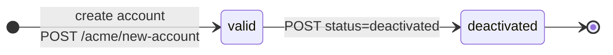
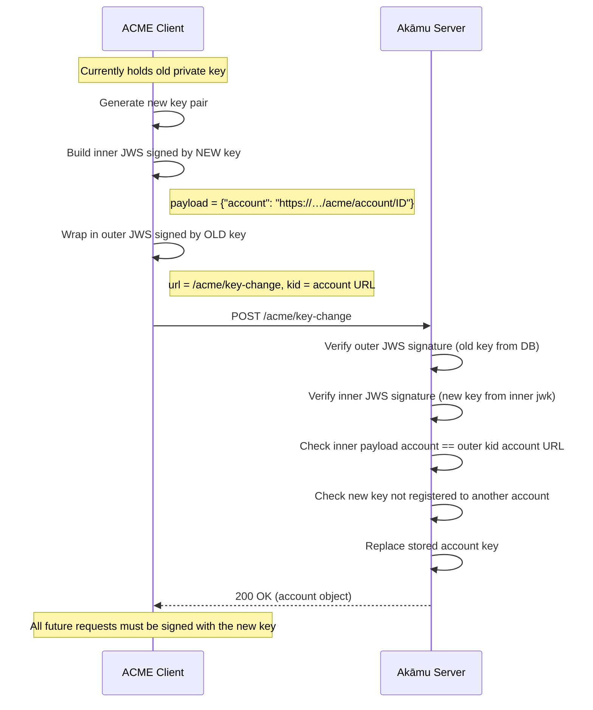

# Account Management

ACME accounts are persistent identities that tie a public key to one or more email addresses. Every order, authorization, and certificate is associated with an account.

## Account lifecycle



Accounts start in `valid` status. A `valid` account can:

- Create new orders.
- Manage existing orders and authorizations.
- Download certificates.
- Revoke certificates it owns.
- Update its contact list.
- Rotate its key.
- Deactivate itself.

A `deactivated` account is permanently disabled. All subsequent requests using a deactivated account's key are rejected.

## Creating an account

Send a POST request to `/acme/new-account` with a JWS signed by the account's public key in `jwk` form. The payload must contain:

| Field | Type | Required | Description |
|---|---|---|---|
| `contact` | array of strings | No | mailto: URIs for contact addresses |
| `onlyReturnExisting` | boolean | No | If `true`, return the existing account or error |

Contact values must be URIs (containing `:`). The server does not restrict schemes — `mailto:`, `tel:`, and other URI schemes are accepted. Reachability is not verified.

**Example payload:**

```json
{
  "contact": ["mailto:admin@example.com"],
  "onlyReturnExisting": false
}
```

**Response on creation (201 Created):**

```json
{
  "status": "valid",
  "contact": ["mailto:admin@example.com"],
  "orders": "https://acme.example.com/acme/orders/<account-id>"
}
```

The `Location` header contains the account URL: `https://acme.example.com/acme/account/<account-id>`.

If an account already exists for the submitted key and `onlyReturnExisting` is `false`, the server returns the existing account with HTTP 200 rather than creating a duplicate.

## Reading account details

POST to the account URL (`/acme/account/<id>`) with an empty payload (POST-as-GET). The `kid` header must reference the account being queried, and it must match the account ID in the URL.

## Updating contact information

POST to `/acme/account/<id>` with a payload containing the new `contact` array:

```json
{
  "contact": ["mailto:new-admin@example.com"]
}
```

Contact addresses are replaced entirely; partial updates are not supported.

## Deactivating an account

POST to `/acme/account/<id>` with:

```json
{
  "status": "deactivated"
}
```

The account is immediately marked `deactivated`. This action is irreversible.

## Key rollover

To replace an account's signing key without losing the account:

1. Construct an outer JWS signed with the **old key** addressed to `/acme/key-change`.
2. Embed an inner JWS signed with the **new key** as the payload. The inner JWS payload must contain `{ "account": "<account-url>" }`.

```
POST /acme/key-change
Content-Type: application/jose+json

{
  "protected": "<outer-header-signed-with-old-key>",
  "payload": "<inner-jws-signed-with-new-key>",
  "signature": "<outer-signature>"
}
```



The server verifies:
- The outer JWS is signed by the current account key.
- The inner JWS is signed by the new key (`jwk` must be present in the inner header).
- The inner payload's `account` field matches the account URL derived from the outer `kid`.
- The new key is not already registered to another account.

On success, the account's stored key and thumbprint are replaced with the new key. Subsequent requests must be signed with the new key.

## Profile grants

Accounts may have a `profile_grants` attribute that restricts which certificate profiles they are allowed to request. When a profile is configured with `require_account_grant = true`, the account's `profile_grants` must include that profile's name or the finalization request is denied.

An account with no grants (the default) can only request profiles that do not require a grant.

**Viewing and modifying grants**

Grants are managed through the Admin API (requires `[admin]` to be configured in `config.toml`):

```
GET    /admin/account/{id}/profile-grants   → {"profile_grants": ["p1"]}
PUT    /admin/account/{id}/profile-grants   ← {"profile_grants": ["p1", "p2"]}
DELETE /admin/account/{id}/profile-grants
```

All admin endpoints require `Authorization: Bearer <token>`.

**EAB grant inheritance**

When an EAB key is provisioned with `profile_grants` via `POST /admin/eab`, any account created using that EAB key automatically inherits those grants at account creation time. The transfer is atomic — the same database transaction that inserts the new account and marks the EAB key as used also sets the `profile_grants` on the account row.

```json
POST /admin/eab
{"kid":"key-1","hmac_key_b64u":"<base64url>","profile_grants":["internal"]}
```

After an account is created using `key-1`, it will have `profile_grants = ["internal"]` without any additional admin action.

## Delegation URL

When `server.delegation_enabled = true`, the account object includes an additional `"delegations"` URL:

```json
{
  "status": "valid",
  "contact": ["mailto:admin@example.com"],
  "orders": "https://acme.example.com/acme/orders/<account-id>",
  "delegations": "https://acme.example.com/acme/delegations/<account-id>"
}
```

POST-as-GET to the `delegations` URL returns the list of delegation objects available for that account. NDC clients use this URL to discover which CSR templates they are authorized to use. See [Orders — Delegation orders](orders.md#delegation-orders-rfc-9115) and the [RFC 9115 configuration reference](configuration.md#server-delegation_enabled) for the full workflow.


## Security considerations

- Each account is identified by the SHA-256 thumbprint of its JWK public key. The server uses this thumbprint to look up accounts without needing to parse or compare full public key material on every request.
- Key rollover is the only mechanism to change the signing key. There is no password or other credential; possession of the private key is the sole proof of identity.
- Contact URIs are not validated for reachability. The server accepts any URI containing `:` (e.g. `mailto:`, `tel:`); it does not restrict the scheme or verify that the address is reachable.
