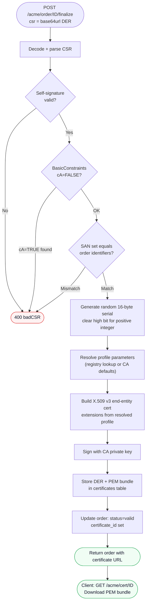
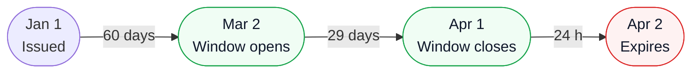

# Certificates

This chapter covers certificate issuance, retrieval, revocation, and the ACME Renewal Information (ARI) extension.

## Issuance

Certificates are issued when an order is finalized. The client submits a PKCS#10 CSR (DER-encoded, base64url) to the finalize endpoint.



The server:

1. Decodes and parses the CSR.
2. Verifies the CSR's self-signature.
3. Checks that the CSR does not request CA authority (`cA=TRUE` in BasicConstraints is rejected).
4. Verifies that the CSR's SubjectAlternativeName extension contains exactly the identifiers from the order — no more, no fewer.
5. Generates a random 16-byte serial number (positive two's complement, high bit cleared).
6. Resolves the certificate parameters from the profile registry (or CA defaults if no profile was requested).
7. Issues an X.509 v3 certificate. The extensions depend on the active profile:

| Extension | Critical | Default (no profile) | With profile |
|---|---|---|---|
| BasicConstraints | No | `cA=FALSE` | `cA=FALSE` |
| KeyUsage | Yes | `digitalSignature` | As configured in profile |
| ExtendedKeyUsage | No | `serverAuth` | As configured in profile |
| SubjectKeyIdentifier | No | RFC 5280 SHA-1 method | RFC 5280 SHA-1 method |
| AuthorityKeyIdentifier | No | RFC 5280 SHA-1 method | RFC 5280 SHA-1 method |
| SubjectAlternativeName | No | Rebuilt from validated CSR SANs | Rebuilt from validated CSR SANs |
| AuthorityInfoAccess (OCSP) | No | If `ocsp_url` configured | If profile or `ocsp_url` set |
| CRLDistributionPoints | No | If `crl_url` configured | If profile or `crl_url` set |
| CertificatePolicies | No | Absent | If profile includes policies |

The Subject Name from the CSR is copied verbatim into the issued certificate.

The validity period runs from the moment of issuance for `validity_days` days (default 90), or the profile-specific validity if a profile is active. See [Certificate Profiles](profiles.md) for how to configure per-profile extension content.

## Downloading a certificate

Send a GET request to the certificate URL provided in the order's `certificate` field:

```
GET /acme/cert/<cert-id>
```

No authentication is required. The response is a PEM bundle with `Content-Type: application/pem-certificate-chain`:

```
-----BEGIN CERTIFICATE-----
<base64-encoded end-entity certificate>
-----END CERTIFICATE-----
-----BEGIN CERTIFICATE-----
<base64-encoded CA certificate>
-----END CERTIFICATE-----
```

The bundle always contains the end-entity certificate followed by the CA certificate. No intermediate certificates are included (there are none in this single-tier CA architecture).

## Certificate storage

The server stores both the DER and PEM representations of the issued certificate in the `certificates` database table, along with:

- The UUID used as the certificate ID in the download URL.
- The hex-encoded serial number.
- Validity window timestamps (Unix epoch).
- The MTC log leaf index (if MTC logging is enabled).
- The suggested renewal window (ARI; computed on first query if not set).

## Revocation

To revoke a certificate, POST to `/acme/revoke-cert` with a JWS signed by either:

- The account key of the account that owns the certificate, or
- The private key that corresponds to the certificate's subject public key.

The payload:

```json
{
  "certificate": "<base64url-encoded-DER-certificate>",
  "reason": 1
}
```

The `certificate` field contains the DER-encoded end-entity certificate (not the PEM bundle).

The `reason` field is optional. When present, it must be a CRL reason code:

| Code | Meaning |
|---|---|
| 0 | Unspecified |
| 1 | Key compromise |
| 2 | CA compromise |
| 3 | Affiliation changed |
| 4 | Superseded |
| 5 | Cessation of operation |
| 6 | Certificate hold |
| 8 | Remove from CRL |
| 9 | Privilege withdrawn |
| 10 | AA compromise |

Codes 7 and values above 10 are invalid and rejected with `badRevocationReason`.

On success, the server returns HTTP 200 with no body. The certificate's status is set to `revoked` in the database with the revocation timestamp and reason code.

Revoking an already-revoked certificate returns `alreadyRevoked`.

## ACME Renewal Information (ARI)

`Akāmu` implements [RFC 9773](https://www.rfc-editor.org/rfc/rfc9773), which allows ACME clients to ask the server when to renew a certificate.

### Endpoint

```
GET /acme/renewal-info/<cert-id>
```

No authentication required.

### Response

```json
{
  "suggestedWindow": {
    "start": "2026-04-01T00:00:00Z",
    "end":   "2026-04-09T00:00:00Z"
  },
  "explanationURL": null
}
```

### Window computation

If the server has not explicitly set a renewal window for the certificate, it computes one as follows:

- **Start**: two-thirds of the way through the certificate's validity period.
- **End**: 24 hours before the certificate expires.

For a 90-day certificate issued on January 1, 2026:
- Validity period: 90 days = 7,776,000 seconds
- Start: January 1 + 60 days = March 2, 2026
- End: April 1, 2026 (one day before April 2 expiry)



> **Note:** The `explanationURL` field is always `null` in the current implementation. RFC 9773 allows an explanation URL to be provided when the server has specific reasons for the suggested window.

### Using ARI with certbot

Certbot 2.7 and later support ARI. It fetches the renewal window when deciding whether to renew:

```
certbot renew --server https://acme.example.com/acme/directory
```

If the current time falls within the `suggestedWindow`, certbot proceeds with renewal even if the certificate has more than 30 days remaining.
