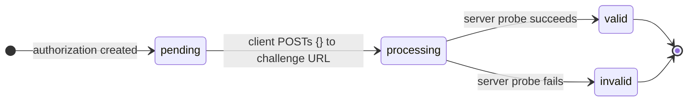
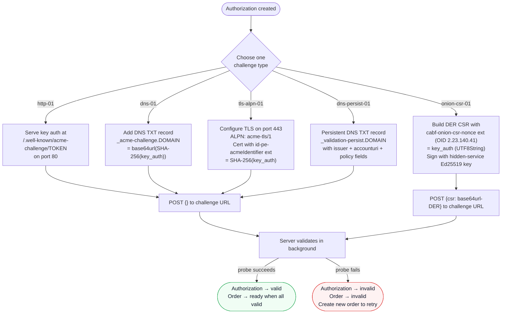

# Challenges

A challenge is the mechanism by which `Akāmu` verifies that an ACME client controls the identifier (domain name, IP address, email address, or telephone-number authority) in an authorization. The server supports seven challenge types: **http-01**, **dns-01**, **tls-alpn-01**, **dns-persist-01**, **onion-csr-01**, **email-reply-00**, and **tkauth-01**.

For each identifier in an order, the server creates one challenge of each supported type. The client chooses which challenge type to complete.

`dns-persist-01` is an opt-in type that requires explicit server configuration. When it is not configured, clients see the standard three types and are not affected. See [dns-persist-01](#dns-persist-01) below for the full description.

`onion-csr-01` is offered exclusively for `.onion` identifiers (Tor hidden services) and uses a CSR-based proof-of-control mechanism rather than a network probe. See [onion-csr-01](#onion-csr-01-rfc-9799) below for the full description.

`email-reply-00` is offered exclusively for `email` identifiers (RFC 8823 S/MIME) and uses a two-channel token delivered by email. It requires explicit server configuration. See [email-reply-00](#email-reply-00-rfc-8823) below for the full description.

`tkauth-01` is offered exclusively for `TNAuthList` and `JWTClaimConstraints` identifiers (RFC 9447/9448). The client obtains a signed JWT from an external Token Authority and submits it in the challenge response. It requires explicit server configuration. See [tkauth-01](#tkauth-01-rfc-9447--rfc-9448) below for the full description.

## Key authorization

Before responding to any challenge, compute the **key authorization** string:

```
key_authorization = token + "." + base64url(SHA-256(JWK-thumbprint-of-account-key))
```

Where:
- `token` is the challenge token provided by the server in the authorization object.
- The SHA-256 is computed over the JWK thumbprint string (itself a base64url-encoded SHA-256 of the canonical JSON of the account public key).
- `base64url` uses the URL-safe alphabet without padding characters.

In practice, ACME client libraries compute this for you.

`dns-persist-01` does not use this formula. Instead of a token, the client receives an `issuer-domain-names` array, and the server matches the account URI directly against the TXT record. See [dns-persist-01](#dns-persist-01) below for details.

`onion-csr-01` uses the standard `token.thumbprint` key authorization formula. The server also includes an `authKey` field in the challenge object containing the JWK thumbprint so the client can construct the key authorization without a separate lookup.

## Responding to a challenge

To signal that the client has provisioned the challenge response, POST to the challenge URL with an empty JSON object payload:

```json
{}
```

`onion-csr-01` is an exception: the POST body must include the DER-encoded CSR (see [onion-csr-01](#onion-csr-01-rfc-9799) for the payload format).

The server immediately marks the challenge as `processing` and spawns a background task to validate it. The response returns the current challenge status:

```json
{
  "type": "http-01",
  "url": "https://acme.example.com/acme/chall/<authz-id>/http-01",
  "status": "processing",
  "token": "<token>"
}
```

Poll the authorization URL (POST-as-GET) to check when validation completes.

## Challenge status transitions



A challenge that is already `processing` or `valid` is returned as-is if the client POSTs to it again.

## Challenge types at a glance



---

## http-01

The server makes an HTTP/1.1 GET request to:

```
http://<domain>/.well-known/acme-challenge/<token>
```

on port 80. The response body (trimmed of whitespace) must equal the key authorization string.

### Provisioning

Create a file at the path `/.well-known/acme-challenge/<token>` on the web server for the domain being validated. The file content must be exactly the key authorization string.

**Example:**

If the token is `abc123` and the key authorization is `abc123.XYZ...`:

```
File path:    /.well-known/acme-challenge/abc123
File content: abc123.XYZ...
```

For Apache or nginx, ensure that requests to `/.well-known/acme-challenge/` are served from the document root without authentication and without redirects.

### Constraints

- Port 80 must be reachable from the ACME server.
- The response body must be less than 1 MiB.
- HTTP 3xx redirects are followed (up to 10 hops), including redirects to HTTPS targets.
- IPv6 addresses are supported as `ip` type identifiers; the URL literal uses bracket notation (e.g., `http://[2001:db8::1]/.well-known/acme-challenge/<token>`).
- Wildcard identifiers (`*.example.com`) cannot be validated with http-01 (RFC 8555 §7.1.3).

---

## dns-01

The server queries the DNS TXT record at:

```
_acme-challenge.<domain>
```

At least one TXT record value must equal:

```
base64url(SHA-256(key_authorization))
```

For example, if `SHA-256(key_authorization)` produces the bytes `\xde\xad...`, the expected TXT value is the base64url encoding of those 32 bytes.

### Provisioning

Add a DNS TXT record:

```
Name:    _acme-challenge.example.com
Type:    TXT
TTL:     60
Content: <base64url-SHA256-of-key-authorization>
```

**Concrete example:**

1. Token: `mytoken`
2. JWK thumbprint: `mythumbprint`
3. Key authorization: `mytoken.mythumbprint`
4. SHA-256 of key auth (hex): `e3b0c4...` (varies; compute for your actual values)
5. base64url of SHA-256: `47DEQp...` (varies)
6. TXT record value: `47DEQp...`

Use `openssl dgst -sha256 -binary <<< "mytoken.mythumbprint" | base64 -w0 | tr '+/' '-_' | tr -d '='` to compute it manually.

### Wildcard domains

For a wildcard identifier `*.example.com`, the leading `*.` is stripped before constructing the DNS query. The TXT record must be placed at `_acme-challenge.example.com`, not `_acme-challenge.*.example.com`.

### DNS propagation

The server uses the system default DNS resolver (or the address configured via `server.dns_resolver_addr`). If the TXT record has not propagated by the time the server queries, validation will fail. Use a short TTL (60 seconds or less) to speed up propagation.

---

## tls-alpn-01

The server opens a TLS connection to port 443 of the domain being validated, advertising the ALPN protocol `acme-tls/1`. The applicant's TLS server must respond with a certificate that:

1. Contains the domain as a dNSName in the SubjectAlternativeName extension.
2. Contains the `id-pe-acmeIdentifier` extension (OID `1.3.6.1.5.5.7.1.31`) marked **critical**, with a value of `OCTET STRING { SHA-256(key_authorization) }`.

### Provisioning

Set up a TLS virtual host that listens on port 443, responds only to ALPN negotiation for `acme-tls/1`, and presents a specially crafted certificate. Most ACME clients handle this automatically.

The certificate must:
- Be self-signed (the server does not verify the trust chain for this challenge type; it only checks the extensions).
- Have `id-pe-acmeIdentifier` as a **critical** extension.
- Have the SHA-256 hash of the key authorization (32 raw bytes) wrapped in an `OCTET STRING` as the extension value.

### TLS version support

The validator accepts both TLS 1.2 and TLS 1.3 connections.

### Constraints

- Port 443 must be reachable from the ACME server.
- Wildcard identifiers are not supported by tls-alpn-01 (RFC 8737 §3).
- IP address identifiers (`ip` type) are supported; the server connects to the IP address directly.
- RFC 8737 §3 requires exactly one SAN entry in the validation certificate. Certificates that contain more than one SAN are rejected.

---

## dns-persist-01

`dns-persist-01` is a DNS-based challenge type that differs from `dns-01` in one important way: the TXT record is **persistent**. It does not change from one certificate renewal to the next. Once an operator provisions the record, it remains valid for every subsequent renewal by the same ACME account — no per-renewal DNS changes are required.

The challenge type is defined by the IETF draft [`draft-ietf-acme-dns-persist`](https://datatracker.ietf.org/doc/html/draft-ietf-acme-dns-persist). It is available only for `dns` type identifiers; IP address identifiers are not supported.

This type is **opt-in**: it is offered to clients only when `server.dns_persist_issuer_domains` is set in `config.toml`. When that field is absent, only the standard three types are advertised and existing clients are unaffected.

### How it works

When `dns-persist-01` is offered, the client does not receive a `token` field. Instead it receives an `issuer-domain-names` array:

```json
{
  "type": "dns-persist-01",
  "url": "https://acme.example.com/acme/chall/<authz-id>/dns-persist-01",
  "status": "pending",
  "issuer-domain-names": ["acme.example.com"]
}
```

The ACME client must ensure that a TXT record exists at `_validation-persist.<domain>` before signalling the challenge. The server queries that name and evaluates each TXT record value against a set of rules.

#### TXT record format

```
_validation-persist.<domain>. IN TXT "<issuer-domain>; accounturi=<account-uri>[; policy=wildcard][; persistUntil=<ISO8601Z>]"
```

Fields are separated by semicolons. Field order is not significant except that the issuer domain must appear first.

| Field | Required | Description |
|-------|----------|-------------|
| `<issuer-domain>` | Yes | First token (before the first `;`). Must match the CA's configured issuer domain, case-insensitively, trailing dot stripped. |
| `accounturi=<uri>` | Yes | Full ACME account URI, e.g. `https://acme.example.com/acme/account/42`. Must match the requesting account exactly. |
| `policy=wildcard` | Only for wildcard orders | Must be present when the identifier starts with `*.`. |
| `persistUntil=<timestamp>` | No | UTC timestamp in `YYYY-MM-DDTHH:MM:SSZ` format. The server rejects records whose timestamp is in the past. |

**Concrete example** for account `https://acme.example.com/acme/account/42` validating `example.com` through a CA with issuer domain `acme.example.com`:

```
_validation-persist.example.com. 300 IN TXT "acme.example.com; accounturi=https://acme.example.com/acme/account/42"
```

For a wildcard certificate (`*.example.com`), add `policy=wildcard`:

```
_validation-persist.example.com. 300 IN TXT "acme.example.com; accounturi=https://acme.example.com/acme/account/42; policy=wildcard"
```

A single TXT record containing `policy=wildcard` also satisfies non-wildcard orders for the same domain.

#### What the server checks

The server performs a TXT lookup at `_validation-persist.<base-domain>` (the `*.` prefix is stripped for wildcard orders). It accepts the challenge as soon as one record satisfies all of:

1. The first `;`-delimited token equals the CA's issuer domain (case-insensitive, trailing dot stripped).
2. `accounturi=<uri>` matches the requesting account's full URI.
3. For wildcard orders, `policy=wildcard` is present.
4. If `persistUntil=<timestamp>` is present, the timestamp is at or after the current time.

Unknown key-value tokens are silently ignored, allowing forward-compatible extensions.

#### Key authorization

Unlike the other challenge types, `dns-persist-01` does not use a `token · thumbprint` key authorization. The server stores the account URI in the `key_auth` database column instead, and matches it directly against the `accounturi=` field in the TXT record.

### Wildcard certificates

To validate `*.example.com`, the TXT record must include `policy=wildcard`. The query name is always `_validation-persist.example.com` — the `*.` prefix is stripped before the DNS lookup.

### `persistUntil` expiry

The optional `persistUntil` field lets an operator set an explicit expiry on the authorization grant, independently of the DNS TTL. Format: `YYYY-MM-DDTHH:MM:SSZ` (literal `Z`; lowercase `z` also accepted).

- Timestamp **at or after** current time → field is valid; evaluation continues.
- Timestamp **before** current time → record rejected, even if all other fields match.
- Timestamp **unparseable** → record rejected.

Records without `persistUntil` never expire through this mechanism; their lifetime is determined by DNS TTL and operator action.

### Configuration

All fields belong to the `[server]` section of `config.toml`.

#### `dns_persist_issuer_domains`

**Optional. Default: absent (dns-persist-01 disabled).**

The issuer domain(s) placed in `issuer-domain-names` challenge objects and matched against the first token of TXT records. When set, `dns-persist-01` is offered alongside the standard types for all `dns` identifiers.

Accepts either a single string or an array of strings. Multi-tenant or multi-identity deployments can list all accepted issuer domains; validation succeeds when any configured domain matches.

```toml
[server]
# Single domain
dns_persist_issuer_domains = "acme.example.com"

# Multiple domains
dns_persist_issuer_domains = ["acme.example.com", "acme.example.org"]
```

#### `dns_resolver_addr`

**Optional. Default: absent (system resolver).**

DNS resolver override for `dns-01`, `dns-persist-01`, and CAA validation. Format: `"<ip>:<port>"`. The `http-01` and `tls-alpn-01` validators are not affected.

```toml
[server]
dns_resolver_addr = "127.0.0.1:5353"
```

Useful for split-horizon DNS (where the ACME server cannot reach the public resolver) and for integration tests against a local stub server.

#### `dns_persist01_resolver_addr`

**Optional. Default: absent (falls back to `dns_resolver_addr`).**

Resolver override used exclusively for `dns-persist-01` validation. When set, this address is used instead of `dns_resolver_addr` for TXT lookups at `_validation-persist.*`. Useful when persistent TXT records are served by a different DNS infrastructure than the one used for `dns-01` and CAA lookups.

```toml
[server]
dns_resolver_addr        = "127.0.0.1:5353"   # used for dns-01 and CAA
dns_persist01_resolver_addr = "127.0.0.1:5354" # used only for dns-persist-01
```

#### `dns_dot_server_name`

**Optional. Default: absent (plain UDP).**

TLS server name (SNI hostname) for DNS-over-TLS (DoT, RFC 7858). When set, all DNS challenge validation queries — `dns-01`, `dns-persist-01`, and CAA record lookups — are sent over TLS instead of plain UDP. `dns_resolver_addr` must be set to the DoT server's IP address and port 853.

Use DoT when the path between the Akāmu server and its resolver is untrusted (e.g. a public resolver reached over the open Internet, an ISP that intercepts cleartext DNS queries, or a network with strict privacy requirements). The TLS certificate presented by the resolver is verified against the system root CA store. LDAP SRV lookups for certificate profile providers are unaffected.

DoT and DNSSEC validation (`validate_dnssec = true`) are independent and can be used together: DoT protects the transport channel while DNSSEC authenticates the response data.

```toml
[server]
# DoT only
dns_resolver_addr   = "1.1.1.1:853"
dns_dot_server_name = "cloudflare-dns.com"

# DoT + DNSSEC
dns_resolver_addr   = "1.1.1.1:853"
dns_dot_server_name = "cloudflare-dns.com"
validate_dnssec     = true
```

### Limitations

- **No IP address identifier support.** `dns-persist-01` is defined only for DNS name identifiers; IP address identifiers are not supported (no TXT record format is specified in `draft-ietf-acme-dns-persist` for IP identifiers).

---

## onion-csr-01 (RFC 9799)

`onion-csr-01` validates control of a Tor v3 hidden service (`.onion`) identifier. Instead of making a network probe, the server verifies a PKCS #10 CSR that the client constructs and submits in the challenge response body. The challenge type is defined by [RFC 9799](https://www.rfc-editor.org/rfc/rfc9799).

This challenge is offered **only for `.onion` DNS identifiers**. It cannot be used for regular DNS names or IP address identifiers. The identifier in the ACME order must use `"type": "dns"` and the value must be a valid v3 `.onion` address (56-character base32 label + `.onion`). v2 `.onion` addresses (16-character label) are rejected.

### Challenge object

When the authorization is created for a `.onion` identifier, the server includes an `onion-csr-01` challenge object. Unlike other challenge types, it also carries an `authKey` field containing the account's JWK thumbprint:

```json
{
  "type": "onion-csr-01",
  "url": "https://acme.example.com/acme/chall/<authz-id>/onion-csr-01",
  "status": "pending",
  "token": "<token>",
  "authKey": "<jwk-thumbprint>"
}
```

The `authKey` field is provided as a convenience: the client needs the JWK thumbprint to compute the key authorization, and `authKey` exposes it directly so the client does not need to derive it from the account key a second time.

### Key authorization

Compute the key authorization using the standard formula:

```
key_authorization = token + "." + authKey
```

Where `authKey` is the `authKey` field from the challenge object (equal to `base64url(SHA-256(JWK-thumbprint-of-account-key))`).

### Client provisioning

The client must build a DER-encoded PKCS #10 CSR that satisfies all of the following:

1. **Subject Alternative Name**: contains the `.onion` domain as a `dNSName`.
2. **`cabf-onion-csr-nonce` extension** (OID `2.23.140.41`): the extension value is a DER `UTF8String` (tag `0x0C`) containing the key authorization string (`token.thumbprint`). This extension does not need to be marked critical.
3. **Signature**: the CSR must be signed by the hidden-service Ed25519 private key — the key whose public key is encoded in the v3 `.onion` address. The most common approach is to use the hidden-service key directly as the CSR key, producing a single self-signature that also proves hidden-service key control.

**Example OID DER encoding for `2.23.140.41`:** `06 04 67 81 0C 29`

### Challenge response

POST to the challenge URL with the base64url-encoded DER CSR as the payload (this is the only challenge type where the POST body is not an empty `{}`):

```json
{
  "csr": "<base64url-encoded DER CSR>"
}
```

The server decodes the `csr` field from base64url immediately and returns `400 Bad Request` if the field is missing or the encoding is invalid.

### Server validation

After the challenge is flipped to `processing`, the server performs these checks synchronously (no network probe is made):

1. Decode the 32-byte Ed25519 public key from the v3 `.onion` address label (56-character lowercase base32, version byte `0x03`).
2. Parse the DER CSR structure.
3. Verify the CSR self-signature.
4. Locate the `cabf-onion-csr-nonce` extension (OID `2.23.140.41`) and verify that its value decodes to the expected key authorization string.
5. Verify that the Ed25519 signature over the `CertificationRequestInfo` DER is valid under the hidden-service public key. This succeeds if the CSR signing key is the hidden-service key (self-signed CSR), or if the outer CSR signature verifies directly with the hidden-service key.
6. Verify that the CSR's SAN extension contains the `.onion` domain as a `dNSName`.

### Challenge types offered for .onion identifiers

RFC 9799 §4 requires that `onion-csr-01` is always offered for `.onion` identifiers and that `dns-01` is never offered. Whether `http-01` and `tls-alpn-01` are also offered depends on the `server.tor_connectivity_enabled` configuration:

- **`tor_connectivity_enabled = false`** (default): only `onion-csr-01` is offered. The server cannot reach `.onion` addresses, so HTTP and TLS probes would always fail.
- **`tor_connectivity_enabled = true`**: `onion-csr-01`, `http-01`, and `tls-alpn-01` are all offered, giving the client a choice.

`dns-persist-01` is never offered for `.onion` identifiers.

### Constraints

- Only valid for `dns` type identifiers whose value ends in `.onion`.
- Only v3 `.onion` addresses (56-character base32 label) are accepted; v2 addresses are rejected at order/pre-authorization creation time.
- `dns-01` and `dns-persist-01` are never offered for `.onion` identifiers.
- Wildcard `.onion` identifiers (`*.xxx...xxx.onion`) are not supported.

### Configuration

No additional server configuration is required to enable `onion-csr-01`; it is always offered when an order or pre-authorization contains a `.onion` identifier. To additionally offer `http-01` and `tls-alpn-01` for `.onion` identifiers (requires Tor network access from the server), set:

```toml
[server]
tor_connectivity_enabled = true
```

---

## Challenge failure

If validation fails, the challenge transitions to `invalid` and an error is recorded:

```json
{
  "type": "http-01",
  "status": "invalid",
  "token": "<token>",
  "error": {
    "type": "urn:ietf:params:acme:error:connection",
    "detail": "connection error during challenge: TCP connect to example.com:80: connection refused"
  }
}
```

Common error types:

| Error type | Meaning |
|---|---|
| `connection` | Could not connect to the applicant server (http-01, tls-alpn-01) |
| `dns` | DNS TXT lookup failed or name not found (dns-01, dns-persist-01) |
| `incorrectResponse` | Server responded but the content did not match; or, for onion-csr-01, the CSR failed validation (missing nonce extension, nonce mismatch, invalid Ed25519 signature, missing SAN, or malformed .onion address) |
| `tls` | TLS handshake failed or extension verification failed (tls-alpn-01) |

For `onion-csr-01`, the server also returns an immediate `400 Bad Request` (before the background validation task starts) if the POST body is not valid JSON with a `csr` field, or if the `csr` value is not valid base64url.

A failed authorization invalidates the parent order. Create a new order to try again.

---

## email-reply-00 (RFC 8823)

`email-reply-00` is defined by [RFC 8823](https://www.rfc-editor.org/rfc/rfc8823). It is the only challenge type offered for `email` identifier orders and proves email address control via a DKIM-authenticated reply email. Issuing S/MIME certificates using this challenge requires the `[email_challenge]` configuration section — see [email_challenge configuration](configuration.md#email_challenge).

### Protocol

1. The client creates an order with `{"type": "email", "value": "user@example.com"}`.
2. The server returns an authorization with an `email-reply-00` challenge object:

   ```json
   {
     "type": "email-reply-00",
     "url": "https://acme.example.com/acme/chall/<id>",
     "status": "pending",
     "token": "<base64url(token-part2)>",
     "from": "acme-validation@example.com"
   }
   ```

   `from` is the address the server will send the challenge email from. `token` is **token-part2** (server-generated, ≥128 bits of random data).

3. The client POSTs `{}` to the challenge URL to trigger the challenge. The server:
   - Generates **token-part1** (≥128 bits of random data) and a `Message-ID`.
   - Stores both in the database.
   - Invokes the configured `send_script` to send an email to the identifier address with subject `ACME: <base64url(token-part1)>` and the generated `Message-ID`.

4. The client reads the email, extracts `token-part1` from the `Subject` header, then computes:

   ```
   full_token  = base64url(token-part1) || base64url(token-part2)
   key_auth    = full_token || "." || base64url(SHA-256(canonical-JWK))
   response    = base64url(SHA-256(key_auth))
   ```

5. The client sends a **reply email** (preserving `In-Reply-To` and DKIM signing) with body:

   ```
   -----BEGIN ACME RESPONSE-----
   <response>
   -----END ACME RESPONSE-----
   ```

6. Mail routing infrastructure (a filter script, procmail rule, or email service webhook) POSTs the reply to `POST /acme/email-webhook`. See [Webhook endpoint](#webhook-endpoint) below.

7. The server verifies the DKIM domain, extracts and verifies the response digest, and marks the challenge and authorization valid.

8. The client finalizes with a CSR containing an `rfc822Name` SAN matching the email address and the `emailProtection` EKU.

### Key authorization formula

`email-reply-00` uses a modified key authorization:

```
full_token = base64url(token-part1) || base64url(token-part2)
key_auth   = full_token || "." || base64url(SHA-256(canonical-JWK))
response   = base64url(SHA-256(key_auth as UTF-8 bytes))
```

Where `base64url(SHA-256(canonical-JWK))` is the JWK thumbprint of the account key per [RFC 7638](https://www.rfc-editor.org/rfc/rfc7638) — the same value used as `thumbprint` in the standard key authorization formula. Do not hash the thumbprint string itself; hash the canonical JWK JSON.

This is different from the standard `token.thumbprint` formula used by http-01/dns-01/tls-alpn-01. The `response` value (not `key_auth`) is what the client sends in the reply body.

### CSR requirements

The CSR submitted at finalize time must:

- Contain an `rfc822Name` Subject Alternative Name matching the email identifier value (case-insensitive).
- Use the `emailProtection` Extended Key Usage (OID 1.3.6.1.5.5.7.3.4).
- Not contain any DNS/IP SANs that were not authorized by a separate authorization.

The certificate profile should be configured to enforce `email_protection` EKU. See the [S/MIME profile example](profiles.md#smime-profile-example) in the profiles documentation.

### Webhook endpoint

`POST /acme/email-webhook` receives the client's reply from any mail routing tool that can POST JSON:

```json
{
  "from":        "user@example.com",
  "in_reply_to": "<uuid@acme-server.example.com>",
  "dkim_domain": "example.com",
  "dkim_status": "pass",
  "body":        "-----BEGIN ACME RESPONSE-----\nABC123==\n-----END ACME RESPONSE-----"
}
```

| Field | Description |
|-------|-------------|
| `from` | Envelope/header From address of the reply email |
| `in_reply_to` | `In-Reply-To` header of the reply email (must match the server's `Message-ID`) |
| `dkim_domain` | DKIM `d=` tag from a valid DKIM signature on the reply |
| `dkim_status` | `"pass"` if DKIM verification succeeded; any other value fails the challenge |
| `body` | Full text body of the reply email |

**DKIM trust model:** The server does not perform DKIM verification itself. DKIM verification is the responsibility of the webhook caller (the mail routing script or MTA filter). The server enforces two properties on every request:

1. `dkim_domain` must match the domain part of `from` (case-insensitively). This prevents a malicious script from claiming DKIM pass for a different domain.
2. `dkim_status` must equal `"pass"` (case-insensitively; some MTAs report `"Pass"` or `"PASS"`).

If your MTA or mail service provides DKIM results in a format other than `"pass"`, normalize it in your routing script before POSTing to the webhook.

**HMAC authentication:** Every POST must include the header:

```
X-Akamu-Signature: sha256=<lowercase-hex(HMAC-SHA256(raw-body, webhook_hmac_secret))>
```

The `webhook_hmac_secret` is configured in `[email_challenge]`. Requests with a missing, malformed, or incorrect signature are rejected with `403 Forbidden`. All other responses are `200 OK` regardless of the challenge outcome (to prevent webhook callers from retrying indefinitely on validation failures).

### Example send script

The server invokes the configured `send_script` with these environment variables:

| Variable | Value |
|----------|-------|
| `ACME_TO` | Recipient email address (the identifier) |
| `ACME_FROM` | Sender address (`from_address` in `[email_challenge]`) |
| `ACME_SUBJECT` | `ACME: <base64url(token-part1)>` |
| `ACME_MESSAGE_ID` | Server-generated `Message-ID` (script must preserve this exactly) |
| `ACME_AUTO_SUBMITTED` | `auto-generated; type=acme` |
| `ACME_TOKEN_PART2` | token-part2 (base64url, from the challenge JSON `token` field); exposed so advanced scripts can pre-compute or log the expected response |

Exit code 0 = success. Non-zero = the challenge is marked invalid and the client must retry.

A minimal script using `sendmail`:

```bash
#!/bin/bash
set -euo pipefail
sendmail -f "$ACME_FROM" "$ACME_TO" <<EOF
From: $ACME_FROM
To: $ACME_TO
Subject: $ACME_SUBJECT
Message-ID: $ACME_MESSAGE_ID
Auto-Submitted: $ACME_AUTO_SUBMITTED
MIME-Version: 1.0
Content-Type: text/plain

This email was sent automatically as part of an ACME S/MIME certificate
issuance request. If you did not request a certificate, ignore this email.
EOF
```

The script is responsible for DKIM signing. The server does not sign outbound email.

---

## tkauth-01 (RFC 9447 / RFC 9448)

`tkauth-01` validates control of a `TNAuthList` or `JWTClaimConstraints` identifier by verifying a signed JWT *authority token* issued by an external Token Authority (TA). This challenge type is defined by [RFC 9447](https://www.rfc-editor.org/rfc/rfc9447); the `TNAuthList` profile is defined by [RFC 9448](https://www.rfc-editor.org/rfc/rfc9448).

Unlike network-based challenges, `tkauth-01` relies on the TA asserting the client's authority over the identifier out-of-band. The server only verifies the cryptographic integrity of the token and the `atc` claim binding.

### Challenge object

When an order contains a `TNAuthList` or `JWTClaimConstraints` identifier, the authorization contains a `tkauth-01` challenge object:

```json
{
  "type": "tkauth-01",
  "url": "https://acme.example.com/acme/chall/<authz-id>/tkauth-01",
  "status": "pending",
  "tkauth-type": "atc",
  "token-authority": "https://ta.example.com"
}
```

| Field | Description |
|-------|-------------|
| `tkauth-type` | Always `"atc"` — the authority token type profile |
| `token-authority` | Optional URL hint for the Token Authority, from `tkauth.token_authority_url` |

### Key authorization

`tkauth-01` uses the standard key authorization formula: `token.thumbprint` where `thumbprint` is the base64url-encoded SHA-256 JWK thumbprint of the account key. The `token` field is not present in the challenge object; the thumbprint is used directly as the `fingerprint` check in the authority token's `atc` claim.

The `fingerprint` field in the `atc` claim must be formatted as:

```
SHA256 XX:XX:XX:...
```

where `XX:XX:XX:...` is the colon-separated uppercase hex encoding of the raw SHA-256 JWK thumbprint bytes.

### Identifier value format (JWTClaimConstraints)

For `JWTClaimConstraints` identifiers, the `tkvalue` in the `atc` claim and the ACME order identifier value must both be the **base64url encoding of a DER-encoded `JWTClaimConstraints` structure** as defined in [RFC 8226 §3](https://www.rfc-editor.org/rfc/rfc8226#section-3):

```asn1
JWTClaimConstraints ::= SEQUENCE {
    mustInclude  [0] JWTClaimNames   OPTIONAL,
    permittedValues [1] JWTClaimValuesList OPTIONAL
}
```

The server validates both `mustInclude` (claim names that must be present in the JWT) and `permittedValues` (allowed values for specific claims). At least one of the two MUST be present.

Example: to require a specific Kerberos principal in the `sub` claim, encode:

```
JWTClaimConstraints {
    permittedValues [1]: [("sub", ["user@REALM"])]
}
```

The resulting DER bytes, base64url-encoded, become the identifier value.

### Obtaining an authority token

The client contacts the Token Authority (identified by `token-authority` or by deployment convention) and requests an authority token for its identifier. The TA issues a compact JWT that must contain:

- **Header**: `alg` and **one of**:
  - `x5c`: inline certificate chain (array of base64-encoded DER certs); the leaf signs the JWT
  - `x5u`: URL from which the server fetches the signing certificate chain
  - `kid`: key identifier used to locate the signing public key in a JWKS endpoint

- **Claims**:
  - `atc`: an object with `tktype` (identifier type), `tkvalue` (identifier value, DER-encoded for `JWTClaimConstraints`), `fingerprint` (account key thumbprint in `SHA256 XX:XX:...` format), and optionally `ca: false`
  - `jti`: a unique token identifier (REQUIRED; enforces one-time use)
  - `exp`: expiry timestamp (REQUIRED)

### Challenge response

POST to the challenge URL with the JWT in the `tkauth` field:

```json
{
  "tkauth": "<compact-JWT>"
}
```

Example (header shown decoded):
```json
{
  "alg": "ES256",
  "x5u": "https://ta.example.com/cert"
}
```

### Validation steps

1. Decode the JWT header to determine the key resolution path:
   - **`x5c`**: parse the inline certificate chain directly
   - **`x5u`**: fetch the certificate chain from the URL (HTTPS only; SSRF guard applies)
   - **`kid`**: look up the signing public key from a JWKS endpoint (see [JWKS trust](#jwks-trust-kid-based-tokens) below)
2. For `x5c`/`x5u`: validate the certificate chain against the configured `trusted_ta_ca_files`. For `kid`: the trust is established by the per-profile `trust_jwks_urls` list.
3. Verify the JWT signature using the resolved public key. The public key algorithm must match `alg`; supported algorithms include ES256/ES384/ES512 (ECDSA), RS256/RS384/RS512/PS256/PS384/PS512 (RSA), EdDSA (Ed25519), and ML-DSA-44/ML-DSA-65/ML-DSA-87.
4. Confirm `exp` has not elapsed and `exp - now` does not exceed `max_validity_secs`.
5. Check the `atc` claim: `tktype` matches the identifier type, `tkvalue` matches the identifier value, `fingerprint` matches the account key thumbprint.
6. For `JWTClaimConstraints`: parse the DER-encoded `tkvalue` and verify that the JWT's own claims satisfy both `mustInclude` (all named claims are present) and `permittedValues` (each constrained claim's value is in the allowed list).
7. Record the `jti` in the replay-prevention store; duplicate JTIs are rejected.

### JWKS trust (kid-based tokens)

When the JWT header contains `kid` instead of `x5c`/`x5u`, the server looks up the signing public key from a JWKS endpoint. Trust is configured **per profile**:

```toml
[profiles.providers.local.profiles.my-profile]
description     = "Example profile"
ca_ids          = ["my-ca"]
trust_jwks_urls = [
    "https://idp.example.com/jwks",
    "http+unix://%2Frun%2Fekishib%2Fekishib.sock/jwks",
]
```

The `trust_jwks_urls` list is searched in order. The first JWKS that contains a key with a matching `kid` is used. If no profile has `trust_jwks_urls` set, `kid`-signed tokens are rejected.

JWKS responses are cached in memory for 5 minutes. Each URL is refreshed independently when the cache entry expires.

**URL schemes:**

| Scheme | Usage |
|--------|-------|
| `https://...` | Standard HTTPS fetch; SSRF guard applies (no RFC-1918 targets without explicit configuration) |
| `http+unix://ENCODED_PATH/request-path` | HTTP over a Unix domain socket; `ENCODED_PATH` is the socket file path with `/` encoded as `%2F` (e.g. `%2Frun%2Fekishib%2Fekishib.sock`) |

The `http+unix://` scheme is intended for co-located Token Authorities (e.g. Ekishib IdP running on the same host) where TLS is unnecessary.

> **Note**: ML-DSA-44/ML-DSA-65/ML-DSA-87 keys are supported in JWKS entries (`kty: "AKP"`). This allows post-quantum Token Authorities to sign authority tokens without an X.509 certificate chain.

### Certificate SAN injection (claim_encoders)

When the server issues a certificate for a `JWTClaimConstraints` identifier, it can inject Subject Alternative Names derived from the `permittedValues` of the validated token. This is controlled by the `[[tkauth.claim_encoders]]` configuration.

Each entry maps a JWT claim name to an encoder that knows how to produce an OtherName SAN:

```toml
[[tkauth.claim_encoders]]
claim   = "sub"
encoder = "krb5-kpn"   # Kerberos principal (id-pkinit-san OtherName, OID 1.3.6.1.5.2.2)

[[tkauth.claim_encoders]]
claim   = "upn"
encoder = "ms-upn"     # Microsoft UPN OtherName (OID 1.3.6.1.4.1.311.20.2.3)

[[tkauth.claim_encoders]]
claim   = "dns"
encoder = "dns-san"    # plain dNSName SAN; wildcards are rejected
```

**Built-in encoders:**

| Encoder name | SAN type | Details |
|---|---|---|
| `krb5-kpn` | OtherName (id-pkinit-san, OID `1.3.6.1.5.2.2`) | `principal@REALM`; if `@` is absent, `default_realm` is appended |
| `ms-upn` | OtherName (OID `1.3.6.1.4.1.311.20.2.3`) | `user@domain` |
| `dns-san` | dNSName | Plain hostname; wildcards rejected; lowercased before injection |

A `permittedValues` entry with exactly **one** value is injected as a SAN using the matching encoder. Entries with multiple permitted values are skipped (the server cannot determine which specific value the TA attested).

For `dns-san`, the DNS name from the token constraint is added alongside any DNS SANs already in the CSR. The ACME client must still include the name in its CSR — the encoder only grants permission to inject it from the token, it does not bypass the CSR.

### Configuration

```toml
[tkauth]
enabled                 = true
trusted_ta_ca_files     = ["/etc/akamu/ta-root.pem"]
token_authority_url     = "https://ta.example.com"   # optional hint surfaced in challenge object
max_validity_secs       = 3600   # reject tokens with exp - now > this value
jti_prune_interval_secs = 3600   # how often to purge expired JTI records from the database

# SAN injection: map JWT claim names to OtherName encoders
[[tkauth.claim_encoders]]
claim   = "sub"
encoder = "krb5-kpn"
```

Per-profile JWKS trust (set in each profile that should accept `kid`-signed tokens):

```toml
[profiles.providers.local.profiles.kerberos-svc]
description     = "Kerberos service certificate"
ca_ids          = ["kerberos-ca"]
trust_jwks_urls = ["https://idp.example.com/jwks"]

[profiles.providers.local.profiles.ipa-ldap]
description     = "IPA LDAP server certificate"
ca_ids          = ["ipa-ca"]
# Co-located Ekishib IdP via Unix socket
trust_jwks_urls = ["http+unix://%2Frun%2Fekishib%2Fekishib.sock/jwks"]
```

## See also

- [Configuration Reference](configuration.md) — challenge solver and DNS resolver configuration keys
- [Certificate Profiles](profiles.md) — challenge type restrictions and per-profile authorization
