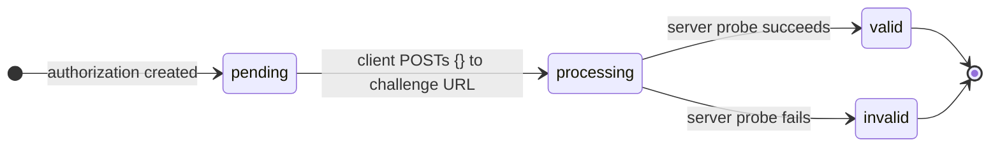
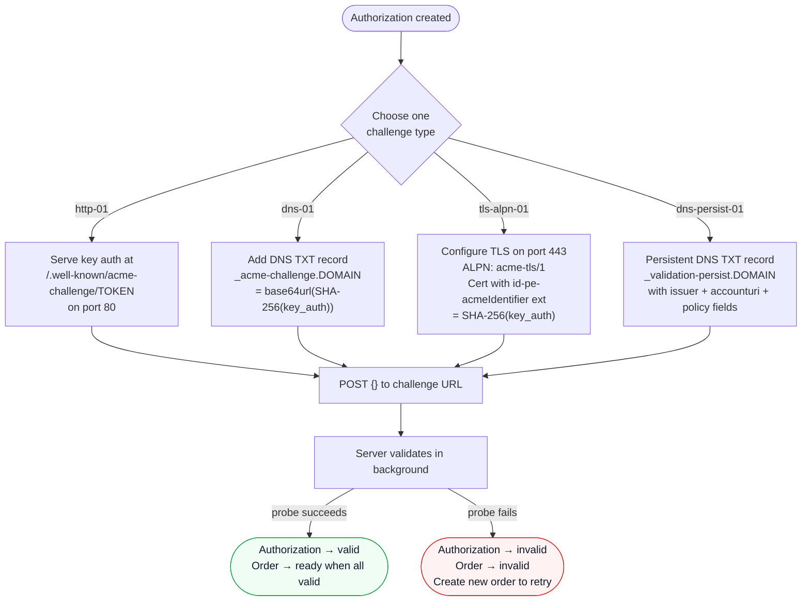

# Challenges

A challenge is the mechanism by which `Akāmu` verifies that an ACME client controls the identifier (domain name or IP address) in an authorization. The server supports four challenge types: **http-01**, **dns-01**, **tls-alpn-01**, and **dns-persist-01**.

For each identifier in an order, the server creates one challenge of each supported type. The client chooses which challenge type to complete.

`dns-persist-01` is an opt-in type that requires explicit server configuration. When it is not configured, clients see the standard three types and are not affected. See [dns-persist-01](#dns-persist-01) below for the full description.

## Key authorization

Before responding to any challenge, compute the **key authorization** string:

```
key_authorization = token + "." + base64url(SHA-256(JWK-thumbprint-of-account-key))
```

Where:
- `token` is the challenge token provided by the server in the authorization object.
- The SHA-256 is computed over the JWK thumbprint string (itself a base64url-encoded SHA-256 of the canonical JSON of the account public key).
- `base64url` uses the URL-safe alphabet without padding characters.

In practice, ACME client libraries compute this for you.

`dns-persist-01` does not use this formula. Instead of a token, the client receives an `issuer-domain-names` array, and the server matches the account URI directly against the TXT record. See [dns-persist-01](#dns-persist-01) below for details.

## Responding to a challenge

To signal that the client has provisioned the challenge response, POST to the challenge URL with an empty JSON object payload:

```json
{}
```

The server immediately marks the challenge as `processing` and spawns a background task to validate it. The response returns the current challenge status:

```json
{
  "type": "http-01",
  "url": "https://acme.example.com/acme/chall/<authz-id>/http-01",
  "status": "processing",
  "token": "<token>"
}
```

Poll the authorization URL (POST-as-GET) to check when validation completes.

## Challenge status transitions



A challenge that is already `processing` or `valid` is returned as-is if the client POSTs to it again.

## Challenge types at a glance



---

## http-01

The server makes an HTTP/1.1 GET request to:

```
http://<domain>/.well-known/acme-challenge/<token>
```

on port 80. The response body (trimmed of whitespace) must equal the key authorization string.

### Provisioning

Create a file at the path `/.well-known/acme-challenge/<token>` on the web server for the domain being validated. The file content must be exactly the key authorization string.

**Example:**

If the token is `abc123` and the key authorization is `abc123.XYZ...`:

```
File path:    /.well-known/acme-challenge/abc123
File content: abc123.XYZ...
```

For Apache or nginx, ensure that requests to `/.well-known/acme-challenge/` are served from the document root without authentication and without redirects.

### Constraints

- Port 80 must be reachable from the ACME server.
- The response body must be less than 8 KiB.
- Redirects are not followed; the initial response must be 200 OK.
- IPv6 addresses are supported as `ip` type identifiers; the URL literal uses bracket notation (e.g., `http://[2001:db8::1]/.well-known/acme-challenge/<token>`).
- Wildcard identifiers (`*.example.com`) cannot be validated with http-01.

---

## dns-01

The server queries the DNS TXT record at:

```
_acme-challenge.<domain>
```

At least one TXT record value must equal:

```
base64url(SHA-256(key_authorization))
```

For example, if `SHA-256(key_authorization)` produces the bytes `\xde\xad...`, the expected TXT value is the base64url encoding of those 32 bytes.

### Provisioning

Add a DNS TXT record:

```
Name:    _acme-challenge.example.com
Type:    TXT
TTL:     60
Content: <base64url-SHA256-of-key-authorization>
```

**Concrete example:**

1. Token: `mytoken`
2. JWK thumbprint: `mythumbprint`
3. Key authorization: `mytoken.mythumbprint`
4. SHA-256 of key auth (hex): `e3b0c4...` (varies; compute for your actual values)
5. base64url of SHA-256: `47DEQp...` (varies)
6. TXT record value: `47DEQp...`

Use `openssl dgst -sha256 -binary <<< "mytoken.mythumbprint" | base64 -w0 | tr '+/' '-_' | tr -d '='` to compute it manually.

### Wildcard domains

For a wildcard identifier `*.example.com`, the leading `*.` is stripped before constructing the DNS query. The TXT record must be placed at `_acme-challenge.example.com`, not `_acme-challenge.*.example.com`.

### DNS propagation

The server uses the system default DNS resolver (or the address configured via `server.dns_resolver_addr`). If the TXT record has not propagated by the time the server queries, validation will fail. Use a short TTL (60 seconds or less) to speed up propagation.

---

## tls-alpn-01

The server opens a TLS connection to port 443 of the domain being validated, advertising the ALPN protocol `acme-tls/1`. The applicant's TLS server must respond with a certificate that:

1. Contains the domain as a dNSName in the SubjectAlternativeName extension.
2. Contains the `id-pe-acmeIdentifier` extension (OID `1.3.6.1.5.5.7.1.31`) marked **critical**, with a value of `OCTET STRING { SHA-256(key_authorization) }`.

### Provisioning

Set up a TLS virtual host that listens on port 443, responds only to ALPN negotiation for `acme-tls/1`, and presents a specially crafted certificate. Most ACME clients handle this automatically.

The certificate must:
- Be self-signed (the server does not verify the trust chain for this challenge type; it only checks the extensions).
- Have `id-pe-acmeIdentifier` as a **critical** extension.
- Have the SHA-256 hash of the key authorization (32 raw bytes) wrapped in an `OCTET STRING` as the extension value.

### TLS version support

The validator accepts both TLS 1.2 and TLS 1.3 connections.

### Constraints

- Port 443 must be reachable from the ACME server.
- Wildcard identifiers are not supported by tls-alpn-01.
- IP address identifiers (`ip` type) are supported; the server connects to the IP address directly.
- RFC 8737 §3 requires exactly one SAN entry in the validation certificate. Certificates that contain more than one SAN are rejected.

---

## dns-persist-01

`dns-persist-01` is a DNS-based challenge type that differs from `dns-01` in one important way: the TXT record is **persistent**. It does not change from one certificate renewal to the next. Once an operator provisions the record, it remains valid for every subsequent renewal by the same ACME account — no per-renewal DNS changes are required.

The challenge type is defined by the Let's Encrypt specification at <https://letsencrypt.org/2026/02/18/dns-persist-01>. It is available only for `dns` type identifiers; IP address identifiers are not supported.

This type is **opt-in**: it is offered to clients only when `server.dns_persist_issuer_domain` is set in `config.toml`. When that field is absent, only the standard three types are advertised and existing clients are unaffected.

### How it works

When `dns-persist-01` is offered, the client does not receive a `token` field. Instead it receives an `issuer-domain-names` array:

```json
{
  "type": "dns-persist-01",
  "url": "https://acme.example.com/acme/chall/<authz-id>/dns-persist-01",
  "status": "pending",
  "issuer-domain-names": ["acme.example.com"]
}
```

The ACME client must ensure that a TXT record exists at `_validation-persist.<domain>` before signalling the challenge. The server queries that name and evaluates each TXT record value against a set of rules.

#### TXT record format

```
_validation-persist.<domain>. IN TXT "<issuer-domain>; accounturi=<account-uri>[; policy=wildcard][; persistUntil=<ISO8601Z>]"
```

Fields are separated by semicolons. Field order is not significant except that the issuer domain must appear first.

| Field | Required | Description |
|-------|----------|-------------|
| `<issuer-domain>` | Yes | First token (before the first `;`). Must match the CA's configured issuer domain, case-insensitively, trailing dot stripped. |
| `accounturi=<uri>` | Yes | Full ACME account URI, e.g. `https://acme.example.com/acme/account/42`. Must match the requesting account exactly. |
| `policy=wildcard` | Only for wildcard orders | Must be present when the identifier starts with `*.`. |
| `persistUntil=<timestamp>` | No | UTC timestamp in `YYYY-MM-DDTHH:MM:SSZ` format. The server rejects records whose timestamp is in the past. |

**Concrete example** for account `https://acme.example.com/acme/account/42` validating `example.com` through a CA with issuer domain `acme.example.com`:

```
_validation-persist.example.com. 300 IN TXT "acme.example.com; accounturi=https://acme.example.com/acme/account/42"
```

For a wildcard certificate (`*.example.com`), add `policy=wildcard`:

```
_validation-persist.example.com. 300 IN TXT "acme.example.com; accounturi=https://acme.example.com/acme/account/42; policy=wildcard"
```

A single TXT record containing `policy=wildcard` also satisfies non-wildcard orders for the same domain.

#### What the server checks

The server performs a TXT lookup at `_validation-persist.<base-domain>` (the `*.` prefix is stripped for wildcard orders). It accepts the challenge as soon as one record satisfies all of:

1. The first `;`-delimited token equals the CA's issuer domain (case-insensitive, trailing dot stripped).
2. `accounturi=<uri>` matches the requesting account's full URI.
3. For wildcard orders, `policy=wildcard` is present.
4. If `persistUntil=<timestamp>` is present, the timestamp is at or after the current time.

Unknown key-value tokens are silently ignored, allowing forward-compatible extensions.

#### Key authorization

Unlike the other challenge types, `dns-persist-01` does not use a `token · thumbprint` key authorization. The server stores the account URI in the `key_auth` database column instead, and matches it directly against the `accounturi=` field in the TXT record.

### Wildcard certificates

To validate `*.example.com`, the TXT record must include `policy=wildcard`. The query name is always `_validation-persist.example.com` — the `*.` prefix is stripped before the DNS lookup.

### `persistUntil` expiry

The optional `persistUntil` field lets an operator set an explicit expiry on the authorization grant, independently of the DNS TTL. Format: `YYYY-MM-DDTHH:MM:SSZ` (literal `Z`; lowercase `z` also accepted).

- Timestamp **at or after** current time → field is valid; evaluation continues.
- Timestamp **before** current time → record rejected, even if all other fields match.
- Timestamp **unparseable** → record rejected.

Records without `persistUntil` never expire through this mechanism; their lifetime is determined by DNS TTL and operator action.

### Configuration

Both fields belong to the `[server]` section of `config.toml`.

#### `dns_persist_issuer_domain`

**Optional. Default: absent (dns-persist-01 disabled).**

The issuer domain placed in `issuer-domain-names` challenge objects and matched against the first token of TXT records. When set, `dns-persist-01` is offered alongside the standard types for all `dns` identifiers.

```toml
[server]
dns_persist_issuer_domain = "acme.example.com"
```

#### `dns_resolver_addr`

**Optional. Default: absent (system resolver).**

DNS resolver override for `dns-01` and `dns-persist-01` validation. Format: `"<ip>:<port>"`. The `http-01` and `tls-alpn-01` validators are not affected.

```toml
[server]
dns_resolver_addr = "127.0.0.1:5353"
```

Useful for split-horizon DNS (where the ACME server cannot reach the public resolver) and for integration tests against a local stub server.

### Limitations

- **No ACME client library support yet.** As of instant-acme 0.4.3, `dns-persist-01` is not implemented. A custom client, a patched library, or direct ACME HTTP calls are required until upstream support arrives.
- **No revocation check during TXT lookup.** If an account is deactivated in the Akāmu database, the TXT record is not invalidated automatically; operators must remove it manually.
- **One issuer domain per server instance.** `dns_persist_issuer_domain` accepts a single string. Deployments with multiple issuer identities should use `dns-01` instead.
- **Resolver override is global.** `dns_resolver_addr` applies to all DNS-based challenge validation; per-type resolver selection is not supported.

---

## Challenge failure

If validation fails, the challenge transitions to `invalid` and an error is recorded:

```json
{
  "type": "http-01",
  "status": "invalid",
  "token": "<token>",
  "error": {
    "type": "urn:ietf:params:acme:error:connection",
    "detail": "connection error during challenge: TCP connect to example.com:80: connection refused"
  }
}
```

Common error types:

| Error type | Meaning |
|---|---|
| `connection` | Could not connect to the applicant server |
| `dns` | DNS TXT lookup failed or name not found |
| `incorrectResponse` | Server responded but the content did not match |
| `tls` | TLS handshake failed or extension verification failed |

A failed authorization invalidates the parent order. Create a new order to try again.
