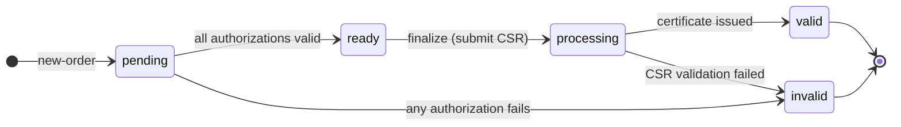

# Orders

An ACME order is the top-level object that represents a request to obtain a certificate. It contains:

- The list of **identifiers** (domain names or IP addresses) to be included in the certificate.
- A set of **authorizations** — one per identifier — that must be completed before the certificate can be issued.
- A **finalize** URL where the ACME client submits a CSR once all authorizations are valid.
- An **expires** timestamp after which the order can no longer be finalized.

## Order lifecycle



| Status | Meaning |
|---|---|
| `pending` | One or more authorizations are not yet valid. |
| `ready` | All authorizations are valid. The client may now submit a CSR. |
| `processing` | CSR submitted; certificate being issued. |
| `valid` | Certificate has been issued. |
| `invalid` | A challenge or CSR validation failed. |

## Creating an order

POST to `/acme/new-order` with a JWS signed by the account key. The payload:

```json
{
  "identifiers": [
    { "type": "dns", "value": "example.com" },
    { "type": "dns", "value": "www.example.com" }
  ]
}
```

Supported identifier types:

| Type | Description | Supported challenges |
|---|---|---|
| `dns` | DNS domain name | http-01, dns-01, tls-alpn-01 |
| `ip` | IP address literal | http-01, tls-alpn-01 |

Wildcard identifiers (`*.example.com`) are accepted as `dns` type identifiers. Only the dns-01 challenge can authorize wildcard identifiers. Attempting to validate a wildcard with http-01 or tls-alpn-01 will fail.

**Response (201 Created):**

```json
{
  "status": "pending",
  "expires": "2026-04-11T12:00:00Z",
  "identifiers": [
    { "type": "dns", "value": "example.com" },
    { "type": "dns", "value": "www.example.com" }
  ],
  "authorizations": [
    "https://acme.example.com/acme/authz/<authz-id-1>",
    "https://acme.example.com/acme/authz/<authz-id-2>"
  ],
  "finalize": "https://acme.example.com/acme/order/<order-id>/finalize"
}
```

The `Location` header contains the order URL.

## Reading an order

POST to `/acme/order/<id>` with an empty payload (POST-as-GET). The response contains the current state of the order, including the `certificate` URL once the order is in `valid` status.

## Completing authorizations

For each authorization URL in the order's `authorizations` array, the client must complete one challenge. See the [Challenges](challenges.md) chapter for details.

## Finalizing an order

Once all authorizations are in `valid` status (order status becomes `ready`), POST a CSR to the finalize URL:

```json
{
  "csr": "<base64url-encoded-DER-CSR>"
}
```

The CSR must:

- Be a valid PKCS#10 DER structure.
- Have a valid self-signature.
- Contain a SubjectAlternativeName extension listing exactly the identifiers from the order (no more, no fewer).
- Not assert `cA=TRUE` in BasicConstraints.

The server validates the CSR and immediately issues the certificate. On success, the order status changes to `valid` and the response includes the `certificate` field:

```json
{
  "status": "valid",
  "certificate": "https://acme.example.com/acme/cert/<cert-id>",
  ...
}
```

## Order expiry

Orders expire after `order_expiry_secs` seconds (default 86400, one day). An expired order cannot be finalized. A new order must be created.

## Error handling

If a challenge fails, the corresponding authorization transitions to `invalid`. The server also marks the order `invalid` and records the error on the order object:

```json
{
  "status": "invalid",
  "error": {
    "type": "urn:ietf:params:acme:error:connection",
    "detail": "connection error during challenge: TCP connect to example.com:80: ..."
  }
}
```

Create a new order and begin the authorization process again.
