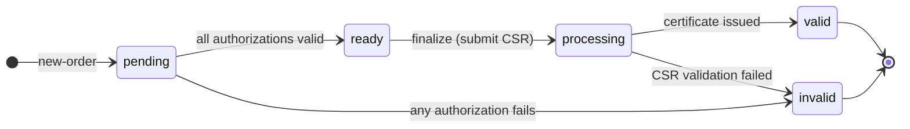

# Orders

An ACME order is the top-level object that represents a request to obtain a certificate. It contains:

- The list of **identifiers** (domain names or IP addresses) to be included in the certificate.
- A set of **authorizations** — one per identifier — that must be completed before the certificate can be issued.
- A **finalize** URL where the ACME client submits a CSR once all authorizations are valid.
- An **expires** timestamp after which the order can no longer be finalized.

## Order lifecycle



| Status | Meaning |
|---|---|
| `pending` | One or more authorizations are not yet valid. |
| `ready` | All authorizations are valid. The client may now submit a CSR. |
| `processing` | CSR submitted; certificate being issued. |
| `valid` | Certificate has been issued. |
| `invalid` | A challenge or CSR validation failed. |

## Creating an order

POST to `/acme/new-order` with a JWS signed by the account key. The payload:

```json
{
  "identifiers": [
    { "type": "dns", "value": "example.com" },
    { "type": "dns", "value": "www.example.com" }
  ]
}
```

Supported identifier types:

| Type | Value | Supported challenges |
|---|---|---|
| `dns` | Regular domain name | http-01, dns-01, tls-alpn-01, dns-persist-01 (when configured) |
| `dns` | Wildcard (`*.example.com`) | dns-01, dns-persist-01 (when configured) |
| `dns` | `.onion` v3 hidden service | onion-csr-01; additionally http-01 and tls-alpn-01 when `tor_connectivity_enabled = true` |
| `ip` | IP address literal | http-01, tls-alpn-01 |

Wildcard identifiers (`*.example.com`) are accepted as `dns` type identifiers. Only dns-01 (and dns-persist-01, when configured) can authorize wildcard identifiers. Attempting to validate a wildcard with http-01 or tls-alpn-01 will fail.

**`dns-persist-01`** (draft-ietf-acme-dns-persist) is offered alongside the standard DNS challenges when the server operator has configured at least one entry in `server.dns_persist_issuer_domains`. If that list is empty the challenge type is not offered.

**`.onion` identifiers** (RFC 9799) are submitted as `type: "dns"` with a v3 `.onion` value (a 56-character base32 label followed by `.onion`, e.g. `bbcweb3hytmzhn5d532owbu6oqadra5z3ar726vq5kgwwn6aucdccrad.onion`). Only v3 addresses are accepted; v2 (16-character label) addresses are rejected. The server always offers `onion-csr-01` for these identifiers. When `server.tor_connectivity_enabled = true`, it also offers http-01 and tls-alpn-01 (for CAs with Tor network connectivity). dns-01 and dns-persist-01 are never offered for `.onion` identifiers.

**Response (201 Created):**

```json
{
  "status": "pending",
  "expires": "2026-04-11T12:00:00Z",
  "identifiers": [
    { "type": "dns", "value": "example.com" },
    { "type": "dns", "value": "www.example.com" }
  ],
  "authorizations": [
    "https://acme.example.com/acme/authz/<authz-id-1>",
    "https://acme.example.com/acme/authz/<authz-id-2>"
  ],
  "finalize": "https://acme.example.com/acme/order/<order-id>/finalize"
}
```

The `Location` header contains the order URL.

## Reading an order

POST to `/acme/order/<id>` with an empty payload (POST-as-GET). The response contains the current state of the order, including the `certificate` URL once the order is in `valid` status.

## Completing authorizations

For each authorization URL in the order's `authorizations` array, the client must complete one challenge. See the [Challenges](challenges.md) chapter for details.

For `onion-csr-01` (RFC 9799), the challenge response payload must carry the validation CSR rather than being empty. The client POSTs:

```json
{ "csr": "<base64url-encoded DER PKCS#10 CSR>" }
```

The CSR must contain:
- The `.onion` domain in a SubjectAlternativeName `dNSName` entry.
- The `cabf-onion-csr-nonce` extension (OID 2.23.140.41) whose value is the key authorization string (`token.thumbprint`).
- A self-signature by the CSR key.
- An Ed25519 signature by the hidden-service key whose public key is encoded in the `.onion` address (the outer CSR signature, or the CSR key itself when it is the hidden-service key).

## Finalizing an order

Once all authorizations are in `valid` status (order status becomes `ready`), POST a CSR to the finalize URL:

```json
{
  "csr": "<base64url-encoded-DER-CSR>"
}
```

The CSR must:

- Be a valid PKCS#10 DER structure.
- Have a valid self-signature.
- Contain a SubjectAlternativeName extension listing exactly the identifiers from the order (no more, no fewer).
- Not assert `cA=TRUE` in BasicConstraints.

The server validates the CSR and immediately issues the certificate. The issued artifact is a standard X.509 PEM chain by default; when the resolved profile sets `issue_as = "mtc"`, a Merkle Tree Certificate `StandaloneCertificate` is issued instead — see [Certificates](certificates.md) for download format details. On success, the order status changes to `valid` and the response includes the `certificate` field:

```json
{
  "status": "valid",
  "certificate": "https://acme.example.com/acme/cert/<cert-id>",
  ...
}
```

## Order expiry

Orders expire after `order_expiry_secs` seconds (default 86400, one day). An expired order cannot be finalized. A new order must be created.

## Error handling

If a challenge fails, the corresponding authorization transitions to `invalid`. The server also marks the order `invalid` and records the error on the order object:

```json
{
  "status": "invalid",
  "error": {
    "type": "urn:ietf:params:acme:error:connection",
    "detail": "connection error during challenge: TCP connect to example.com:80: ..."
  }
}
```

Create a new order and begin the authorization process again.


## Delegation orders (RFC 9115)

When the server has `delegation_enabled = true`, ACME clients can place a delegation order by including a `"delegation"` field in the `new-order` payload. The value is the URL of a delegation object previously created by the IdO via the Admin API.

```json
{
  "identifiers": [
    { "type": "dns", "value": "cdn.example.com" }
  ],
  "delegation": "https://acme.example.com/acme/delegation/b1c2d3e4-…",
  "allow-certificate-get": true
}
```

**Delegation order behaviour differences from regular orders:**

| Property | Regular order | Delegation order |
|----------|--------------|-----------------|
| Initial status | `pending` | `ready` |
| `authorizations` array | One URL per identifier | Always empty (`[]`) |
| Challenge/authz flow | Required | Skipped entirely |
| CSR validation at finalize | SAN match check | SAN match + CSR template check |
| `allow-certificate-get` | Not applicable | Supported (unauthenticated cert GET) |
| Upstream CA leg | None | Driven automatically by `[delegation_upstream]` |

The NDC (delegate client) discovers the delegation URL by fetching the IdO's account object and following the `"delegations"` URL, then POST-as-GETting `POST /acme/delegations/{account_id}` to list available delegation objects.

**Response on creation (201 Created) for a delegation order:**

```json
{
  "status": "ready",
  "identifiers": [
    { "type": "dns", "value": "cdn.example.com" }
  ],
  "authorizations": [],
  "finalize": "https://acme.example.com/acme/order/<order-id>/finalize"
}
```

The NDC may immediately proceed to finalize the order with a CSR. The CSR is validated against the delegation's stored CSR template before issuance proceeds.
