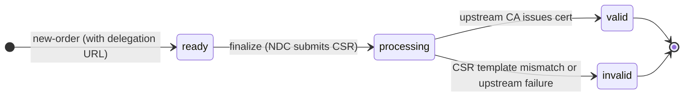

# RFC Support Reference

This page documents every RFC that is relevant to `Akāmu`, explaining what each one specifies, which parts are implemented, and — for RFCs that are intentionally not implemented — why.

## Compliance Matrix

> **Last verified:** 2026-07-20

### Core ACME Protocol

| RFC/Draft | Title | Status | Notes |
|-----------|-------|--------|-------|
| [RFC 8555](#rfc-8555--core-acme) | Automatic Certificate Management Environment (ACME) | Full | All sections including pre-authorization, EAB, key rollover |
| [RFC 7807](#rfc-7807--problem-details-for-http-apis) | Problem Details for HTTP APIs | Full | All error responses use `application/problem+json` with `type`, `detail`, `status`, and `title` |

### ACME Challenge Extensions

| RFC/Draft | Title | Status | Notes |
|-----------|-------|--------|-------|
| [RFC 8737](#rfc-8737--tls-alpn-01-challenge) | ACME TLS-ALPN-01 Challenge Extension | Full | TLS 1.2 and 1.3; IP identifier SNI via reverse-DNS |
| [RFC 8738](#rfc-8738--ip-identifier-validation) | ACME IP Identifier Validation | Full | IPv4 and IPv6; http-01 and tls-alpn-01 for IP identifiers |
| [draft-ietf-acme-dns-persist](#lets-encrypt-dns-persist-01) | Persistent DNS Challenge (dns-persist-01) | Full | Long-lived `_validation-persist` TXT records |

### ACME Certificate Lifecycle

| RFC/Draft | Title | Status | Notes |
|-----------|-------|--------|-------|
| [RFC 8739](#rfc-8739--acme-star) | ACME STAR Certificates | Full | Rolling certificate URL, cancel, auto-reissuance |
| [RFC 9773](#rfc-9773--acme-renewal-information-ari) | ACME Renewal Information (ARI) | Full | Suggested renewal window, `replaces` in new orders |
| [RFC 9444](#rfc-9444--acme-for-subdomains) | ACME for Subdomains | Full | `ancestorDomain` and `subdomainAuthAllowed` |
| [RFC 8823](#rfc-8823--smime-certificates) | ACME Extensions for S/MIME Certificates | Full | `email` identifier, `email-reply-00` challenge, DKIM enforcement |
| [RFC 9799](#rfc-9799--acme-for-onion-domains) | ACME for .onion Domains | Full | `onion-csr-01` with `applicantSigningNonce` age check; `inBandOnionCAARequired` directory metadata; http-01/tls-alpn-01 gated on Tor connectivity. HS descriptor CAA parsing not yet implemented |
| [draft-ietf-acme-profiles-01](#draft-ietf-acme-profiles-01) | ACME Certificate Profiles | Full | Profile advertisement, selection, default auto-selection |

### ACME Delegation

| RFC/Draft | Title | Status | Notes |
|-----------|-------|--------|-------|
| [RFC 9115](#rfc-9115--acme-profile-for-delegated-certificates) | ACME Profile for Delegated Certificates | Full | IdO + NDC roles, CSR template validation, upstream CA client |
| [RFC 9538](#rfc-9538--acme-delegation-metadata-for-cdni) | ACME Delegation Metadata for CDNI | Planned | Single-tier delegation (RFC 9115) works; multi-tier CDNI chaining not yet implemented |

### ACME Authority Tokens (STIR/SHAKEN)

| RFC/Draft | Title | Status | Notes |
|-----------|-------|--------|-------|
| [RFC 9447](#rfc-9447--acme-challenges-using-an-authority-token) | ACME Challenges Using an Authority Token | Full | `tkauth-01` with x5u/x5c, JTI replay prevention |
| [RFC 9448](#rfc-9448--acme-tnauthlist-authority-token) | ACME TNAuthList Authority Token | Full | `TNAuthList` identifier type via `tkauth-01` |
| [draft-ietf-acme-authority-token-jwtclaimcon](#draft-ietf-acme-authority-token-jwtclaimcon) | ACME Authority Token: JWTClaimConstraints | Full | `JWTClaimConstraints` identifier type; no extra config beyond `[tkauth]` |

### DNS and CAA

| RFC/Draft | Title | Status | Notes |
|-----------|-------|--------|-------|
| [RFC 8659](#rfc-8659--caa-dns-resource-record) | DNS Certification Authority Authorization (CAA) | Full | Tree-walk lookup; `issue` and `issuewild` tags |
| [RFC 8657](#rfc-8657--caa-accounturi-and-validationmethods) | CAA Extensions: accounturi and validationmethods | Full | Both parameters enforced at issuance time |

### PKI and X.509

| RFC/Draft | Title | Status | Notes |
|-----------|-------|--------|-------|
| [RFC 5280](#rfc-5280--x509-certificate-profile) | X.509 Certificate and CRL Profile | Full | Via `synta-certificate`; BasicConstraints, AKI/SKI, KU, EKU, SAN, CRL |
| [RFC 6960](#rfc-6960--ocsp-responder) | Online Certificate Status Protocol (OCSP) | Full | GET and POST endpoints; `byName` responder identity |

### Cryptography and Post-Quantum

| RFC/Draft | Title | Status | Notes |
|-----------|-------|--------|-------|
| [RFC 9964](#rfc-9964--ml-dsa-for-jose-and-cose) | ML-DSA for JOSE and COSE | Full | ML-DSA-44/65/87 for ACME account key authentication |
| [draft-ietf-lamps-pq-composite-sigs / draft-reddy-tls-composite-mldsa](#draft-ietf-lamps-pq-composite-sigs--draft-reddy-tls-composite-mldsa) | Composite ML-DSA Signatures | Full (provisional) | All 18 composite-sig CA key variants (OID sub-arcs 37-54); 11 TLS code points for mTLS. All OIDs and `SignatureScheme` code points are TBD pending IANA allocation — values will change |

### Merkle Tree Certificates

| RFC/Draft | Title | Status | Notes |
|-----------|-------|--------|-------|
| [draft-ietf-plants-merkle-tree-certs-05](#draft-ietf-plants-merkle-tree-certs-05--merkle-tree-certificates) | Merkle Tree Certificates (MTC) | Partial | `tile/entries` endpoint not served (only leaf hashes stored); experimental OIDs (pre-IANA). See [coverage table](#coverage-status) for details |

### Industry Policy

| RFC/Draft | Title | Status | Notes |
|-----------|-------|--------|-------|
| [CA/B Forum BR](#cab-forum-baseline-requirements) | CA/Browser Forum Baseline Requirements v2.x | Partial | MPIC (BR SS 3.2.2.9) not implemented; validity limits, SHA-1 ban, DNSSEC, pre-issuance linting all enforced |

### Out of Scope

| RFC/Draft | Title | Status | Notes |
|-----------|-------|--------|-------|
| [RFC 9891](#rfc-9891--acme-dtn-node-id-validation-experimental) | ACME DTN Node ID Validation | Not planned | Experimental; targets DTN/Bundle Protocol (RFC 9171) networks |

---

## RFC 8555 — Core ACME

**[RFC 8555](https://www.rfc-editor.org/rfc/rfc8555)** is the foundation. It defines the full ACME protocol: the HTTP API, the JSON object model, the JWS (JSON Web Signature) authentication scheme, and the challenge validation framework.

### What it covers

| Section | Feature | Status |
|---------|---------|--------|
| §7.1 | Directory (`GET /acme/directory`) | Yes |
| §7.2 | Nonces (`HEAD /acme/new-nonce`, `GET /acme/new-nonce`) | Yes |
| §7.3 | Account creation and management (`/acme/new-account`, `/acme/account/{id}`) | Yes |
| §7.3.4 | `externalAccountRequired` enforcement | Yes |
| §7.4 | Order management (`/acme/new-order`, `/acme/order/{id}`) | Yes |
| §7.4.1 | Pre-authorization (`POST /acme/new-authz`) | Yes |
| §7.1.3 | Honour order `notBefore` / `notAfter` in issued certificates | Yes |
| §7.5 | Authorizations (`/acme/authz/{id}`) | Yes |
| §7.5.1 | Challenge response (`/acme/chall/{authz}/{type}`) | Yes |
| §7.4 finalize | Certificate issuance (`/acme/order/{id}/finalize`) | Yes |
| §7.4.2 | Certificate download (`/acme/cert/{id}`) | Yes |
| §7.6 | Certificate revocation (`/acme/revoke-cert`) | Yes |
| §7.3.5 | Account key rollover (`/acme/key-change`) | Yes |
| §8.3 | http-01 challenge validation | Yes |
| §8.4 | dns-01 challenge validation | Yes |

### Pre-authorization (`newAuthz`)

Pre-authorization lets a client prove domain control ahead of any specific order. Once pre-authorized, the client can request multiple certificates for that domain (or its subdomains, if `subdomainAuthAllowed` is set) without repeating the challenge for each order.

```
POST /acme/new-authz
Content-Type: application/jose+json

payload: {
  "identifier": { "type": "dns", "value": "example.com" }
}
```

The response is identical to a reactive authorization created by `newOrder`.

### External Account Binding

When `server.external_account_required = true`, every `newAccount` request **must** include an `externalAccountBinding` field. Requests without it are rejected with `urn:ietf:params:acme:error:externalAccountRequired` (HTTP 403).

EAB keys can be provisioned in two ways:

**Static provisioning** — keys are declared in the TOML configuration under `[server.eab_keys]` and loaded into the database at startup:

```toml
[server]
external_account_required = true

[server.eab_keys]
"kid-1" = "c2VjcmV0LWhtYWMta2V5LWJ1ZmZlcg"   # base64url-encoded raw key bytes
"kid-2" = "YW5vdGhlci1rZXktaGVyZQ"
```

**GSSAPI self-service derivation** — when `[server].eab_master_secret` is set, authenticated clients call `GET /acme/eab` (authenticating via `Authorization: Negotiate` or via a trusted reverse proxy supplying `X-Remote-User`). The server derives deterministic `(kid, hmac_key)` pairs using HKDF-SHA-256 (RFC 5869) keyed by `(master_secret, principal)`, stores them in the `eab_keys` table on first request, and returns them to the client:

```toml
[server]
external_account_required = true
eab_master_secret = "<base64url-encoded 32-byte secret>"   # see configuration reference
```

The response JSON is `{"principal":"…","kid":"…","hmac_key":"…","alg":"HS256"}`. The client uses the returned `kid` and `hmac_key` to construct the `externalAccountBinding` JWS for `newAccount`. Once a `kid` has been consumed by an account registration, re-fetching `GET /acme/eab` for the same principal returns HTTP 409 Conflict.

Regardless of the provisioning method, the server performs full HMAC verification per RFC 8555 §7.3.4: it checks the `kid`, validates the algorithm and URL, verifies the HMAC signature, and confirms the EAB payload contains the account public key. Account creation and EAB key consumption happen atomically so that a key can never be used more than once even under concurrent requests.

### Certificate validity window

If the `newOrder` request includes `notBefore` and/or `notAfter` fields, the issued certificate's validity period will honour them, subject to the CA's configured `validity_days` limit and a 5-minute clock-skew grace on `notBefore`.

---

## RFC 8659 — CAA DNS Resource Record

**[RFC 8659](https://www.rfc-editor.org/rfc/rfc8659)** requires a CA to look up DNS Certification Authority Authorization (CAA) records before issuing a certificate. A domain owner can publish CAA records to restrict which CAs are allowed to issue certificates for that domain.

### How Akāmu implements it

Before issuing any certificate, Akāmu queries CAA records for each DNS identifier in the order:

1. It starts at the requested domain (e.g., `sub.example.com`) and walks up the DNS tree (`example.com`, `com`) until it finds a CAA record set or exhausts the tree.
2. If no CAA records are found anywhere, issuance proceeds (unconstrained domain).
3. If a CAA record set is found, Akāmu checks whether any `issue` record (or `issuewild` record for wildcard certs) contains one of the CA's configured domain names (`server.caa_identities`).
4. If none match, issuance is denied with `urn:ietf:params:acme:error:caa` (HTTP 403).

### Configuration

```toml
[server]
caa_identities = ["acme.example.com"]
```

When `caa_identities` is empty (the default), CAA checking is disabled entirely.

### Example CAA record

A domain owner who trusts only this Akāmu instance would publish:

```dns
example.com. IN CAA 0 issue "acme.example.com"
```

To also allow wildcard certificates:

```dns
example.com. IN CAA 0 issuewild "acme.example.com"
```

IP identifiers are not subject to CAA checking (CAA is a DNS mechanism).

---

## RFC 8657 — CAA accounturi and validationmethods

**[RFC 8657](https://www.rfc-editor.org/rfc/rfc8657)** extends CAA with two optional parameters that give domain owners finer-grained control:

- **`accounturi`** — Restricts issuance to a specific ACME account URI.
- **`validationmethods`** — Restricts issuance to specific challenge types (e.g., only `dns-01`).

### validationmethods

When Akāmu finds a matching `issue` or `issuewild` CAA record that contains a `validationmethods` parameter, it checks whether the challenge type used to validate the order appears in the list. If not, issuance is denied.

**Example:**

```dns
; Only allow dns-01 for this CA
example.com. IN CAA 0 issue "acme.example.com; validationmethods=dns-01"
```

With this record, an http-01-validated order for `example.com` would be denied at finalization time.

### accounturi

When a matching `issue` or `issuewild` CAA record contains an `accounturi` parameter, Akāmu enforces it: the full ACME account URL of the requesting client (e.g. `https://acme.example.com/acme/account/42`) must match the parameter value exactly. If it does not match, the record is treated as non-authorizing and issuance is denied unless another record in the set authorizes it without an `accounturi` constraint.

**Example:**

```dns
; Only the named account may obtain a certificate from this CA
example.com. IN CAA 0 issue "acme.example.com; accounturi=https://acme.example.com/acme/account/42"
```

### Duplicate parameter handling

Per RFC 8657 §3, a CAA record containing more than one `accounturi` or more than one `validationmethods` parameter is malformed. Akāmu skips such records during evaluation — they are treated as non-authorizing rather than producing an error, so issuance proceeds only if another record in the set is valid.

---

## RFC 8737 — TLS-ALPN-01 Challenge

**[RFC 8737](https://www.rfc-editor.org/rfc/rfc8737)** defines the `tls-alpn-01` challenge, which proves domain control by serving a specially crafted TLS certificate on port 443 using the ALPN protocol identifier `acme-tls/1`.

### How it works

1. Akāmu computes the SHA-256 of the key authorization.
2. It opens a TLS connection to port 443 of the domain, advertising `acme-tls/1` as the ALPN protocol.
3. It verifies that the server presents a certificate with:
   - The domain as a `dNSName` SAN (exactly one SAN entry).
   - A critical `id-pe-acmeIdentifier` extension (OID `1.3.6.1.5.5.7.1.31`) containing the SHA-256 hash of the key authorization as a DER `OCTET STRING`.
4. For IP identifiers, the server connects directly to the IP address; the reverse-DNS name is used as the TLS SNI value.

### Constraints

- Port 443 must be reachable from the Akāmu server.
- Wildcard identifiers cannot be validated with `tls-alpn-01`.
- Both TLS 1.2 and TLS 1.3 are accepted.
- RFC 8737 §3 requires exactly one SAN entry in the validation certificate. Certificates with multiple SANs are rejected.

---

## RFC 8738 — IP Identifier Validation

**[RFC 8738](https://www.rfc-editor.org/rfc/rfc8738)** extends ACME to issue certificates for IP addresses (IPv4 and IPv6), not just domain names.

### Supported identifier type

```json
{ "type": "ip", "value": "192.0.2.1" }
{ "type": "ip", "value": "2001:db8::1" }
```

IPv4 values use dotted-decimal notation. IPv6 values use the compressed text representation defined in RFC 5952.

### Supported challenge types for IP identifiers

| Challenge | Supported |
|-----------|-----------|
| http-01 | Yes — connects directly to the IP; `Host` header is the IP address literal |
| tls-alpn-01 | Yes — connects to the IP; SNI uses the reverse-DNS name (e.g., `1.2.0.192.in-addr.arpa`) |
| dns-01 | No — MUST NOT be used for IP identifiers per RFC 8738 §7 |
| dns-persist-01 | No — DNS-based, not applicable to IP identifiers |

---

## RFC 8739 — ACME STAR

**[RFC 8739](https://www.rfc-editor.org/rfc/rfc8739)** (Short-Term, Automatically Renewed) allows a client to place a single order and receive a continuous stream of short-lived certificates without repeating domain validation. The CA automatically reissues each certificate before the previous one expires.

### Use case

STAR is designed for scenarios where certificate revocation is unreliable. Instead of revoking a compromised certificate, the operator simply cancels the STAR order; the attacker's window is limited to the remaining validity of the current short-lived certificate.

Another key use case is CDN delegation (see [RFC 9115](#rfc-9115--acme-profile-for-delegated-certificates)): the domain owner holds the STAR order and can revoke the CDN's access at any time by canceling it.

### Creating a STAR order

Include an `auto-renewal` object in the `newOrder` payload:

```json
{
  "identifiers": [{ "type": "dns", "value": "example.com" }],
  "auto-renewal": {
    "start-date": "2025-01-01T00:00:00Z",
    "end-date":   "2025-12-31T00:00:00Z",
    "lifetime":   86400
  }
}
```

| Field | Required | Description |
|-------|----------|-------------|
| `end-date` | Yes | The latest date of validity of the last certificate issued (RFC 3339). |
| `lifetime` | Yes | Validity period of each certificate, in seconds. |
| `start-date` | No | The earliest `notBefore` of the first certificate. Defaults to when the order becomes ready. |
| `lifetime-adjust` | No | Pre-dates each certificate's `notBefore` by this many seconds (for clock-skew tolerance). Default: 0. |
| `allow-certificate-get` | No | If `true`, the rolling certificate URL can be fetched with an unauthenticated `GET`. |

> `notBefore` and `notAfter` must NOT be present in a STAR order.

### Rolling certificate URL

After finalization, the order response includes a `star-certificate` URL instead of `certificate`:

```json
{
  "status": "valid",
  "star-certificate": "https://acme.example.com/acme/cert/star/<order-id>"
}
```

`GET /acme/cert/star/<order-id>` always returns the currently active PEM certificate, along with `Cert-Not-Before` and `Cert-Not-After` HTTP headers matching the certificate's validity window.

### Canceling a STAR order

POST to the order URL with `{"status": "canceled"}` to stop automatic renewal:

```json
POST /acme/order/<id>
{ "status": "canceled" }
```

Once canceled, the `star-certificate` endpoint returns HTTP 403 (`autoRenewalCanceled`). The currently active short-lived certificate continues to be usable until it expires naturally.

### Server configuration

Advertise STAR capability in the directory by configuring minimum lifetime and maximum duration:

```toml
[server]
star_min_lifetime_secs = 86400     # 1 day minimum cert lifetime
star_max_duration_secs = 31536000  # 1 year maximum renewal period
```

When either field is set, the directory `meta` object includes the `auto-renewal` advertisement.

---

## RFC 9444 — ACME for Subdomains

**[RFC 9444](https://www.rfc-editor.org/rfc/rfc9444)** allows a client to prove control of an ancestor domain (e.g., `example.com`) and then obtain certificates for any subdomain (e.g., `api.example.com`, `www.example.com`) without repeating the challenge for each one.

### ancestorDomain in new orders

When placing an order for a subdomain, the client can declare which ancestor domain it controls:

```json
{
  "identifiers": [
    {
      "type": "dns",
      "value": "api.example.com",
      "ancestorDomain": "example.com"
    }
  ]
}
```

Akāmu validates that `ancestorDomain` is a genuine ancestor (label-aligned DNS suffix) of the requested identifier. If accepted, the authorization challenge is issued against `example.com` rather than `api.example.com`.

### subdomainAuthAllowed in pre-authorization

When pre-authorizing an ancestor domain, include `subdomainAuthAllowed: true`:

```json
POST /acme/new-authz
{
  "identifier": { "type": "dns", "value": "example.com" },
  "subdomainAuthAllowed": true
}
```

The returned authorization object includes the same flag:

```json
{
  "identifier": { "type": "dns", "value": "example.com" },
  "status": "valid",
  "subdomainAuthAllowed": true,
  ...
}
```

A client can reuse this authorization for any subsequent order that specifies `ancestorDomain: "example.com"`.

### Server advertisement

To advertise subdomain authorization support in the directory:

```toml
[server]
allow_subdomain_auth = true
```

This adds `"subdomainAuthAllowed": true` to the directory `meta` object.

---

## RFC 8823 — S/MIME Certificates

**[RFC 8823](https://www.rfc-editor.org/rfc/rfc8823)** defines the `email` identifier type and the `email-reply-00` challenge for issuing S/MIME end-user certificates. Proof of email address control is established via a DKIM-authenticated reply to a challenge email.

### Identifier type

Orders may include `{"type": "email", "value": "user@example.com"}` identifiers. The server validates the format (non-empty local-part, non-empty domain, exactly one `@`, no wildcard prefix) and returns `400 unsupportedIdentifier` for malformed addresses.

### Challenge type

`email-reply-00` is the only challenge offered for `email` identifiers. The challenge object includes a mandatory `from` field (the server's validation address) in addition to the standard `token` and `url` fields:

```json
{
  "type": "email-reply-00",
  "url": "https://acme.example.com/acme/chall/<id>",
  "status": "pending",
  "token": "<base64url(token-part2)>",
  "from": "acme-validation@example.com"
}
```

### Two-channel token

The token is split across two channels per RFC 8823 §3:

- **token-part2** (≥128 bits): returned in the challenge JSON. The client stores it.
- **token-part1** (≥128 bits): sent by the server in the challenge email `Subject: ACME: <base64url(token-part1)>`. The client reads it from the email.

The client concatenates them: `full_token = base64url(token-part1) || base64url(token-part2)`, then computes the key authorization and digest.

### DKIM enforcement

RFC 8823 §3.2 requires that the DKIM `d=` tag on the reply email matches the domain of the From address. `Akāmu` enforces this via the webhook payload: `dkim_domain` must equal the domain portion of `from`, and `dkim_status` must be `"pass"`.

DKIM verification itself is performed by the mail routing infrastructure (the webhook caller), not by `Akāmu`. The server trusts the `dkim_domain` and `dkim_status` fields in the webhook payload — secure HMAC authentication of the webhook endpoint is therefore essential.

### Certificate requirements

Issued S/MIME certificates contain:

- An `rfc822Name` Subject Alternative Name matching the validated email address.
- The `emailProtection` Extended Key Usage (OID 1.3.6.1.5.5.7.3.4).

These are enforced at CSR validation time (the server rejects CSRs where the `rfc822Name` SANs do not match the authorized email identifiers).

### Configuration

Requires `[email_challenge]` in the server configuration with `enabled = true`. See the [email_challenge configuration reference](configuration.md#email_challenge) and the [challenges documentation](challenges.md#email-reply-00-rfc-8823) for the full webhook payload format and send script interface.

---

## RFC 9773 — ACME Renewal Information (ARI)

**[RFC 9773](https://www.rfc-editor.org/rfc/rfc9773)** defines the Renewal Information extension, which lets the server tell ACME clients when to renew their certificates — even before the certificate expires. This is useful when a CA needs to revoke and reissue certificates en masse (e.g., due to a key compromise or mis-issuance event).

### Endpoints

```
GET /acme/renewal-info/<cert-id>
```

`<cert-id>` is the RFC 9773 certificate identifier: `base64url(AKI keyIdentifier) "." base64url(DER-encoded serial number bytes)`.

The response includes a suggested renewal window:

```json
{
  "suggestedWindow": {
    "start": "2025-03-15T00:00:00Z",
    "end":   "2025-03-20T00:00:00Z"
  }
}
```

The server includes a `Retry-After` header indicating how often to poll.

### Renewal replacement

When placing a renewal order for a certificate that is being replaced, include the predecessor's `cert-id` in the order:

```json
{
  "identifiers": [...],
  "replaces": "<cert-id-of-predecessor>"
}
```

Akāmu validates:

1. The predecessor cert belongs to the same account.
2. The new order's identifiers have at least one overlap with the predecessor's identifiers (RFC 9773 §5 MUST).
3. The predecessor has not already been replaced — returns HTTP 409 (`alreadyReplaced`) if a replacement order has already been finalized.

### Configuration

```toml
[server]
ari_retry_after_secs = 21600  # 6 hours between renewal-info polls (default)
# ari_explanation_url = "https://acme.example.com/docs/renewal-policy"  # optional
```

---

## RFC 9799 — ACME for .onion Domains

**[RFC 9799](https://www.rfc-editor.org/rfc/rfc9799)** defines how ACME can issue certificates for Tor Hidden Services (`.onion` Special-Use Domain Names). These are not DNS names — the second-level label encodes the hidden service's Ed25519 public key.

### Supported challenges for .onion identifiers

| Challenge | Supported | Notes |
|-----------|-----------|-------|
| `onion-csr-01` | Yes | Key validation via CSR; no Tor network access needed server-side |
| `http-01` | Conditional | Only offered when `server.tor_connectivity_enabled = true` |
| `tls-alpn-01` | Conditional | Only offered when `server.tor_connectivity_enabled = true` |
| `dns-01` | No | MUST NOT be used for .onion identifiers |

### Tor connectivity configuration

RFC 9799 §4 prohibits offering `http-01` or `tls-alpn-01` for `.onion` identifiers unless the CA can actually reach the Tor network. By default, Akāmu offers only `onion-csr-01`. To enable the additional challenge types, set:

```toml
[server]
tor_connectivity_enabled = true
```

Only set this when the Akāmu server process can make outbound Tor connections to hidden services (e.g. via `torsocks` or a SOCKS5 proxy configured at the OS level).

### onion-csr-01 challenge

`onion-csr-01` is the recommended challenge type for .onion domains because it does not require the ACME server to connect to the Tor network. Proof of control comes from a cryptographic signature by the hidden service's private key (the same key embedded in the `.onion` address).

**Protocol:**

1. Akāmu returns a challenge object with `type: "onion-csr-01"`, a `token`, and an `authKey` (the JWK thumbprint of the ACME account key).
2. The client builds a CSR that:
   - Contains the `.onion` SAN.
   - Includes a `cabf-onion-csr-nonce` extension (OID `2.23.140.41`) containing the key authorization (`token.thumbprint`).
   - Is signed with both the CSR subject key and the hidden service's Ed25519 private key.
3. The client POSTs `{"csr": "<base64url-CSR-DER>"}` to the challenge URL.
4. Akāmu:
   - Extracts the 32-byte Ed25519 public key from the `.onion` address.
   - Verifies the `cabf-onion-csr-nonce` extension contains the correct key authorization.
   - Verifies the `applicantSigningNonce` extension (OID `2.23.140.42`) is present and matches the server-issued nonce.
   - Enforces a 30-day maximum age on the nonce (RFC 9799 §5.1).
   - Verifies the CSR signature using the extracted hidden-service public key.
   - If all checks pass, marks the authorization as valid.

### Identifier format

Only v3 (Ed25519) `.onion` addresses are accepted. A v3 address has a 56-character base32 second-level label:

```
bbcweb3hytmzhn5d532owbu6oqadra5z3ar726vq5kgwwn6aucdccrad.onion
```

Version 2 addresses (16-character label) are rejected per RFC 9799 §2.

### In-band .onion CAA (RFC 9799 §6)

RFC 9799 §6 defines an optional mechanism for checking CAA records embedded in the Hidden Service Descriptor. The directory metadata field `inBandOnionCAARequired` advertises whether the CA enforces this check.

```toml
[server]
in_band_onion_caa = true
```

When `in_band_onion_caa = true`, the directory `meta` includes `"inBandOnionCAARequired": true`. If a `.onion` identifier fails the in-band CAA check, the server returns `urn:ietf:params:acme:error:onionCAARequired` (HTTP 403).

> **Limitation:** Akāmu advertises the `inBandOnionCAARequired` metadata and returns the `onionCAARequired` error type, but does not yet parse Hidden Service Descriptors to extract embedded CAA records. The HS descriptor CAA parsing is a planned addition.

---

## RFC 6960 — OCSP Responder

**[RFC 6960](https://www.rfc-editor.org/rfc/rfc6960)** defines the Online Certificate Status Protocol (OCSP), which allows relying parties to query a CA for the real-time revocation status of a specific certificate.

### Endpoints

```
POST /ca/ocsp                   # body: DER OCSPRequest, Content-Type: application/ocsp-request
GET  /ca/ocsp/{request}         # {request}: base64url-encoded DER OCSPRequest (RFC 6960 §A.1)
```

Both endpoints return a signed `OCSPResponse` with `Content-Type: application/ocsp-response`. No authentication is required.

### Status mapping

For each serial number in the OCSPRequest, the server looks up the certificate in the database:

| DB state | CertStatus |
|---|---|
| Certificate not found | `unknown` |
| `status = "revoked"` | `revoked` |
| Any other status | `good` |

The response is signed with the CA private key. The responder identity is `byName` using the CA's subject Name DER.

### Configuration

Set `ocsp_url` in `[ca]` to the public URL of the OCSP endpoint so the URL is embedded in issued certificates:

```toml
[ca]
ocsp_url = "http://acme.example.com/ca/ocsp"
```

See [CRL and OCSP](crl-ocsp.md) for the complete deployment guide.

---

## RFC 5280 — X.509 Certificate Profile

**[RFC 5280](https://www.rfc-editor.org/rfc/rfc5280)** defines the structure of X.509 v3 certificates and Certificate Revocation Lists (CRLs). Akāmu issues certificates that conform to the RFC 5280 PKIX profile via the `synta-certificate` library.

Conformance includes:
- Correct `BasicConstraints` (CA: false on end-entity certs).
- `SubjectKeyIdentifier` and `AuthorityKeyIdentifier` extensions.
- `KeyUsage` and `ExtendedKeyUsage` extensions.
- `SubjectAlternativeName` extensions carrying dNSName (including `.onion` domains) or iPAddress.
- CRL Distribution Points and OCSP Access Information when `crl_url` / `ocsp_url` are configured.

---

## CA/B Forum Baseline Requirements

The [CA/Browser Forum Baseline Requirements for TLS Server Certificates](https://cabforum.org/working-groups/server/baseline-requirements/requirements/) (BR) is not an RFC but a policy document maintained by the CA/Browser Forum and enforced by browser trust-store membership. Any CA intending to issue publicly-trusted TLS certificates must comply with it. Akāmu enforces several BR requirements at startup and at certificate-issuance time.

### Compliance status

| Requirement | Section | Deadline | Status | Implementation |
|-------------|---------|----------|--------|----------------|
| Maximum validity 200 days | §6.3.2 | 2026-03-15 | Enforced (warning) | Startup warning when `ca.validity_days > 200` |
| Maximum validity 100 days | §6.3.2 | 2027-03-15 | Enforced (warning) | Startup warning when `ca.validity_days > 100` |
| SHA-1 prohibited in signatures | §7.1.3.2.1 | 2026-09-15 | Enforced (hard error) | Startup hard error when `ca.hash_alg` is `sha1` or `sha-1` |
| DNSSEC validation for DNS challenges | §3.2.2.4, §3.2.2.8.1 | 2026-03-15 | Enforced by default | `server.validate_dnssec` (default `true`) |
| Pre-issuance linting | §4.3.1.2 | 2025-03-15 | Enforced | Every issued certificate is verified via `synta-x509-verification` before delivery |
| Multi-perspective validation | §3.2.2.9 | 2025-03-15 | To do, not a priority | Requires validation from multiple network vantage points |

### §6.3.2 — Certificate Validity Period

The CA/B Forum has progressively shortened the maximum certificate validity period:

- **200 days** — hard limit since 2026-03-15
- **100 days** — hard limit from 2027-03-15

Akāmu enforces these limits as startup **warnings** rather than hard errors, because the restriction applies only to publicly-trusted WebPKI certificates. Private or enterprise deployments may legitimately use longer validity periods when not chaining to a public root. The warning makes the misconfiguration visible without breaking private-CA use cases.

Configure `ca.validity_days` in your `config.toml`:

```toml
[ca]
validity_days = 90   # ≤ 100 is fully compliant through 2027-03-15
```

### §7.1.3.2.1 — SHA-1 Sunset

SHA-1 signatures in certificates and CRLs are prohibited from 2026-09-15. Akāmu enforces this as a **startup hard error**: if `ca.hash_alg` is set to `sha1` or `sha-1`, the server refuses to start with an explicit error message citing the BR section.

Compliant hash algorithms: `sha256`, `sha384`, `sha512`.

### §3.2.2.4 / §3.2.2.8.1 — DNSSEC Validation

DNS-based challenge validation (dns-01, dns-persist-01) and CAA record checking must use DNSSEC-validated answers as of 2026-03-15.

Akāmu enables DNSSEC validation by default. The behaviour is controlled by `server.validate_dnssec`:

```toml
[server]
validate_dnssec = true   # default — required for BR compliance
```

Set `validate_dnssec = false` only for testing environments or private deployments where the DNS infrastructure is not DNSSEC-signed. **Disabling DNSSEC makes the server non-compliant with CA/B Forum BR and ineligible for public WebPKI inclusion.**

### §4.3.1.2 — Pre-Issuance Linting

CAs must programmatically verify every certificate before signing and delivering it, using a linting tool that checks structural and policy conformance. Akāmu satisfies this requirement by running the `synta-x509-verification` policy engine against every issued certificate immediately after signing and before delivering it to the client.

The linter checks:

- X.509 version = v3
- Serial number: ≤ 20 octets, positive integer
- Validity window present and well-formed
- SPKI algorithm on the WebPKI allowlist (no SHA-1, no weak RSA)
- RSA keys: minimum 2048 bits; EC keys: named curves only
- Signature algorithm on the WebPKI allowlist (includes ML-DSA / composite post-quantum)
- `AuthorityKeyIdentifier` extension present
- `BasicConstraints: cA=FALSE` on end-entity certificates
- CA signature is cryptographically valid over the certificate body

If linting fails, the certificate is **not delivered** and the order moves to the `invalid` state with an internal error. The malformed certificate is never exposed to the client.

### §3.2.2.9 — Multi-Perspective Issuance Corroboration (MPIC)

As of 2025-03-15, CAs are required to validate domain control from multiple network vantage points — at minimum two remote perspectives in addition to the primary validation — to mitigate BGP hijacking attacks against ACME challenge responses.

**To do, not a priority.** Satisfying this requirement demands either integration with a set of geographically distributed MPIC agents or reliance on an external MPIC service. Akāmu is intended for private and enterprise deployments where the network topology is controlled; public CAs using Akāmu as a backend must implement MPIC at the infrastructure layer until this is supported natively.

---

## RFC 7807 — Problem Details for HTTP APIs

**[RFC 7807](https://www.rfc-editor.org/rfc/rfc7807)** defines a JSON format for HTTP error responses. All Akāmu error responses use this format with `Content-Type: application/problem+json`:

```json
{
  "type":   "urn:ietf:params:acme:error:malformed",
  "title":  "Malformed request",
  "detail": "JWS url mismatch: got '...', expected '...'",
  "status": 400
}
```

Every response includes the `title` field with a human-readable summary of the error type, as recommended by RFC 7807 §3.1. All ACME-specific error URNs are defined in RFC 8555 §6.7 and its extensions.

---

## Let's Encrypt dns-persist-01

The **[dns-persist-01 specification](https://letsencrypt.org/2026/02/18/dns-persist-01)** is a non-standard ACME challenge type published by Let's Encrypt. Unlike the standard `dns-01` challenge, which requires a fresh DNS TXT record for every renewal, `dns-persist-01` uses a single long-lived TXT record that remains in place across renewals. This eliminates the need to modify DNS on every certificate renewal cycle.

### How it differs from dns-01

| Property | dns-01 | dns-persist-01 |
|----------|--------|----------------|
| TXT record name | `_acme-challenge.<domain>` | `_validation-persist.<domain>` |
| Record changes per renewal | Required | Not required |
| Token in record | Yes (changes each time) | No |
| Record format | `<key-auth>` | `"<issuer-domain>; accounturi=<uri>[; policy=wildcard][; persistUntil=<unix-ts>]"` |
| Wildcard support | Requires explicit `policy=wildcard` parameter |

### Configuration

```toml
[server]
dns_persist_issuer_domains = "acme.example.com"
```

When `dns_persist_issuer_domains` is set, the server offers `dns-persist-01` as an additional challenge type alongside `http-01`, `dns-01`, and `tls-alpn-01`. Without it, the challenge type is not advertised.

### TXT record format

The domain owner publishes (and keeps permanently):

```dns
_validation-persist.example.com. IN TXT "acme.example.com; accounturi=https://acme.example.com/acme/account/abc123"
```

Optional extensions:
- `policy=wildcard` — authorizes wildcard certificate issuance.
- `persistUntil=1798761600` — caps the record's validity (base-10 UNIX timestamp). After this timestamp, the record must be renewed.

### Validation

Akāmu queries the `_validation-persist.<domain>` TXT record, verifies the issuer domain matches one of the configured `dns_persist_issuer_domains`, and checks that the `accounturi` matches the requesting ACME account URL. If both match, the authorization is marked valid.

IP address identifiers are rejected upfront — `dns-persist-01` is a DNS-based mechanism and cannot validate IP addresses.

---

## draft-ietf-acme-profiles-01

**[draft-ietf-acme-profiles-01](https://datatracker.ietf.org/doc/draft-ietf-acme-profiles/)** defines a mechanism for an ACME server to advertise named certificate profiles and for clients to request a specific profile when placing an order. This moves policy selection from CSR extensions and post-issuance inspection into the order object itself, making the server's issuance policy explicit and machine-readable.

### What it adds

| Feature | Location | Status |
|---------|----------|--------|
| `meta.profiles` in directory | `GET /acme/directory` | Yes |
| `profile` field in `newOrder` payload | `POST /acme/new-order` | Yes |
| `profile` field in order response | `GET/POST /acme/order/{id}` | Yes |
| `invalidProfile` error type | All order and finalize endpoints | Yes |
| Finalize-time profile re-validation | `POST /acme/order/{id}/finalize` | Yes |

### Directory advertisement

When `[profiles]` providers are configured, the directory `meta` includes a `profiles` object mapping each profile name to its description:

```json
"meta": {
  "profiles": {
    "tlsserver":  "Standard TLS server certificate",
    "clientauth": "Client authentication certificate"
  }
}
```

### Requesting a profile in newOrder

Clients include the `profile` field in the `newOrder` payload:

```json
{
  "identifiers": [{ "type": "dns", "value": "example.com" }],
  "profile": "tlsserver"
}
```

The server validates that the requested profile is loaded in the registry. If not, it returns:

```json
{
  "type": "urn:ietf:params:acme:error:invalidProfile",
  "status": 400,
  "detail": "profile 'unknown-profile' is not served by any configured provider"
}
```

The `profile` field is echoed back in every subsequent order response so that clients can confirm which profile applies.

### Default profile auto-selection

When a `newOrder` request omits the `profile` field and a profile named `"default"` exists in the registry, the server automatically applies `"default"` and echoes it in the order response. This means clients that do not specify a profile will receive `"profile": "default"` in the order JSON rather than an absent field, giving operators a clean way to enforce a baseline policy without requiring client-side changes.

If no `"default"` profile is configured and the client omits `profile`, the order is issued under the CA's built-in defaults (no profile applied).

### Finalize-time enforcement

At finalize time the server reads the profile registry once and uses the result for both authorization and certificate parameter construction. Per-profile authorization checks (`allowed_identifiers`, `auth_hook`, `require_account_grant`) run **before** CSR validation so that authorization failures are reported before the server expends effort parsing and validating the CSR.

The server resolves the profile's `CertificateParameters` (key usage bits, EKU OIDs, validity, CRL/OCSP URLs, certificate policies) and issues the certificate with those exact extension values. If the profile is no longer loaded (e.g. removed since the order was placed), the request is rejected with `invalidProfile`.

### Configuration

```toml
[profiles.providers.local]
type = "builtin"

[profiles.providers.local.profiles.tlsserver]
description   = "Standard TLS server certificate"
validity_days = 90
key_usage     = ["digital_signature", "key_encipherment"]
eku           = ["server_auth"]
```

See [Certificate Profiles](profiles.md) for the full configuration reference including Dogtag and IPA providers. When no providers are configured, the `profile` field in `newOrder` is accepted but ignored — the server issues under its default policy.

---

## RFC 9964 — ML-DSA for JOSE and COSE

**[RFC 9964](https://www.rfc-editor.org/rfc/rfc9964)**
defines how ML-DSA (Module-Lattice-Based Digital Signature Algorithm, formerly
CRYSTALS-Dilithium, standardized in FIPS 204) keys and signatures are represented in JOSE
(JSON Object Signing and Encryption) and COSE (CBOR Object Signing and Encryption). Akāmu
implements it for ACME account key authentication, meaning ACME clients can register an
ML-DSA key pair and sign every subsequent ACME request with it.

### JWK key type: `AKP`

ML-DSA keys use the key type `"AKP"` (Algorithm Key Pair). Unlike classical key types, the
algorithm is encoded inside the JWK itself (not only in the JWS protected header), so the
`alg` field is **required** in the JWK:

```json
{
  "kty": "AKP",
  "alg": "ML-DSA-65",
  "pub": "<base64url-encoded raw public key bytes>"
}
```

| JWK field | Required | Description |
|-----------|----------|-------------|
| `kty`     | Yes      | Always `"AKP"` for ML-DSA keys |
| `alg`     | Yes      | `"ML-DSA-44"`, `"ML-DSA-65"`, or `"ML-DSA-87"` |
| `pub`     | Yes      | Base64url-encoded raw public key bytes (no padding) |
| `priv`    | No       | 32-byte seed (private key); **never sent to the server** and ignored if present |

### Supported variants

| Algorithm  | FIPS 204 parameter set | Public key size | Signature size | OID (SPKI) |
|------------|------------------------|-----------------|----------------|------------|
| ML-DSA-44  | Parameter set 2 (k=4, l=4) | 1312 bytes | 2420 bytes | 2.16.840.1.101.3.4.3.17 |
| ML-DSA-65  | Parameter set 3 (k=6, l=5) | 1952 bytes | 3309 bytes | 2.16.840.1.101.3.4.3.18 |
| ML-DSA-87  | Parameter set 5 (k=8, l=7) | 2592 bytes | 4627 bytes | 2.16.840.1.101.3.4.3.19 |

### JWK thumbprint

Per RFC 9964 §6, the JWK thumbprint for an `AKP` key is the
SHA-256 hash of the following canonical JSON object with members in lexicographic order:

```json
{"alg":"ML-DSA-65","kty":"AKP","pub":"<base64url-key>"}
```

This is the same SHA-256 / base64url procedure as RFC 7638, applied to the three required
members `alg`, `kty`, and `pub` (in that order).

### Signature format

ML-DSA signatures in JOSE are **raw bytes** as defined by FIPS 204 §7.2. They are
**not** DER-encoded. The server validates the signature length before attempting
verification and returns `HTTP 400` if the length does not match the declared algorithm.

The signing context MUST be an empty byte string per RFC 9964 §4.
Signature failures return `HTTP 401 Unauthorized`.

### ACME client integration notes

An ACME client registering with an ML-DSA key must:

1. Generate an ML-DSA key pair (any of the three variants).
2. Construct the `AKP` JWK from the raw public key bytes (base64url-encode them into `pub`).
3. Include the JWK in the `new-account` protected header (the `jwk` field).
4. Sign all ACME requests with the ML-DSA private key using an empty context string.
5. Set `alg` in the JWS protected header to match the JWK's `alg` field.

Existing ACME clients designed for classical algorithms require ML-DSA support in their
underlying JOSE library. There is no server-side configuration to enable or disable
ML-DSA; the feature is always available.

---

## draft-ietf-lamps-pq-composite-sigs / draft-reddy-tls-composite-mldsa

**[draft-ietf-lamps-pq-composite-sigs](https://datatracker.ietf.org/doc/draft-ietf-lamps-pq-composite-sigs/)** defines the X.509/PKIX OIDs for hybrid ML-DSA+classical composite signature algorithms (sub-arcs 37–54 under the id-CompositeSig arc). The TLS 1.3 `SignatureScheme` code points for use in `CertificateVerify` are defined in the companion draft **[draft-reddy-tls-composite-mldsa](https://datatracker.ietf.org/doc/draft-reddy-tls-composite-mldsa/)**.

### CA signing keys (draft-ietf-lamps-pq-composite-sigs-19)

All 18 composite ML-DSA variants defined in sub-arcs 37–54 are supported as CA signing keys. When `ca.key_type` is set to a composite variant (e.g. `"composite-mldsa65-ecdsa-p384-sha512"`), Akāmu generates a composite CA key and issues all end-entity certificates with that composite signature. Issued certificates pass pre-issuance lint via `synta-x509-verification`.

Requires OpenSSL 3.5 or later (same requirement as pure ML-DSA keys). The full list of 18 supported variants and their OID sub-arcs is documented in the [`ca.key_type` configuration reference](configuration.md#key_type).

### Mutual TLS client authentication (draft-reddy-tls-composite-mldsa)

Composite ML-DSA schemes also appear in the TLS `CertificateVerify` message when a client presents a certificate signed with a composite ML-DSA scheme. The 11 composite scheme code points implemented for mTLS are:

| Code point | Scheme |
|------------|--------|
| 0x0901 | MLDSA44-ECDSA-P256-SHA256 |
| 0x0902 | MLDSA44-RSA2048-PKCS15-SHA256 |
| 0x0903 | MLDSA44-RSA2048-PSS-SHA256 |
| 0x0904 | MLDSA44-Ed25519-SHA512 |
| 0x0905 | MLDSA65-ECDSA-P256-SHA512 |
| 0x0906 | MLDSA65-ECDSA-P384-SHA512 |
| 0x0907 | MLDSA65-RSA3072-PKCS15-SHA512 |
| 0x0908 | MLDSA65-RSA3072-PSS-SHA512 |
| 0x0909 | MLDSA65-Ed25519-SHA512 |
| 0x090A | MLDSA87-ECDSA-P384-SHA512 |
| 0x090C | MLDSA87-Ed448-SHAKE256 |

### Stability warning

All OID sub-arcs (37–54) and all `SignatureScheme` code points (`0x090x`) are TBD pending IANA allocation. The `0x0901`–`0x090C` values used in the implementation are internally-assigned provisionals that do **not** match any published draft version. They **will** change when IANA publishes final allocations. Additionally, `MLDSA65-ECDSA-P256-SHA512` (`0x0905`) is a valid LAMPS composite algorithm (sub-arc 46) but is not mapped in `draft-reddy-tls-composite-mldsa` at the ML-DSA-65 level — the TLS draft only maps `mldsa65_ecdsa_secp384r1_sha384`. The P-256 variant may need removal from the TLS scheme list if it is not added in a future draft revision.

Before deploying to production, verify the current draft version against the values listed above.

---

## RFC 9115 — ACME Profile for Delegated Certificates

**[RFC 9115](https://www.rfc-editor.org/rfc/rfc9115)** defines a three-party ACME delegation model in which an Identifier Owner (IdO) pre-authorizes a Name Delegation Consumer (NDC) to obtain certificates for the IdO's domain names. The CA enforces a JSON CSR template that constrains what the NDC may request. Akāmu implements both roles: it acts as the IdO-facing ACME CA (serving NDC clients) and as an IdO ACME client that drives the upstream CA leg automatically.

### Roles

| Role | Description |
|------|-------------|
| **IdO** | The domain owner. Creates delegation objects (CSR templates + CNAME maps) and holds the STAR or regular order on Akāmu. |
| **NDC** | The delegate (e.g., a CDN PoP). Discovers the delegation URL via the IdO's account, submits a `new-order` referencing it, and finalizes with a CSR that satisfies the template. |
| **Upstream CA** | An external ACME CA that issues to the IdO. Akāmu drives this leg automatically using `[delegation_upstream]`. |

### What it adds to the ACME API

| Feature | RFC 9115 section | Status |
|---------|-----------------|--------|
| `delegation-enabled` in directory `meta` | §2.3.1 | Yes — when `server.delegation_enabled = true` |
| `allow-certificate-get` in directory `meta` | §2.3.5 | Yes — when `server.allow_certificate_get = true` |
| `delegations` URL in account object | §2.3.2 | Yes — appears when `delegation_enabled = true` |
| `POST /acme/delegations/{account_id}` — list delegations | §2.3.2 | Yes |
| `POST /acme/delegation/{id}` — fetch one delegation | §2.3.3 | Yes |
| `"delegation"` field in `new-order` payload | §2.3.4 | Yes |
| `"allow-certificate-get"` field in `new-order` payload | §2.3.5 | Yes |
| Delegation orders start in `ready` status (no challenge/authz flow) | §2.3.4 | Yes |
| `"authorizations": []` on delegation orders | §2.3.4 | Yes |
| CSR template validation at `finalize` | §4 | Yes |
| Unauthenticated `GET /acme/cert/{id}` when `allow_cert_get = 1` | §2.3.5 | Yes |

### CSR template format (RFC 9115 §4)

The delegation object's `csr_template` field is a JSON object that constrains what an NDC may put in its CSR:

```json
{
  "keyTypes": [{"type": "EC", "curve": "P-256"}],
  "subject": {
    "commonName": {},
    "organization": "ExampleCorp"
  },
  "extensions": {
    "subjectAltName": {},
    "keyUsage": ["digitalSignature"],
    "extendedKeyUsage": ["1.3.6.1.5.5.7.3.1"]
  }
}
```

Field value semantics:

| Value | Meaning |
|-------|---------|
| `{}` | MandatoryWildcard — the field MUST be present in the CSR |
| `null` | OptionalWildcard — the field MAY be present in the CSR |
| `"ExampleCorp"` | Literal — the field must equal this exact value |
| absent | The field is forbidden in the CSR |

Akāmu validates the CSR against the stored template at `finalize` time. CSRs that violate the template are rejected with `urn:ietf:params:acme:error:badCSR`.

### Server configuration (IdO-server role)

```toml
[server]
# Enable the delegation API surface and advertise it in the directory.
delegation_enabled      = true

# Advertise and allow unauthenticated GET of delegation order certificates.
allow_certificate_get   = true
```

When `delegation_enabled = true`, the directory `meta` object includes `"delegation-enabled": true` and every account response includes a `"delegations"` URL. The delegation endpoints become active:

```
POST /acme/delegations/{account_id}   — list delegations (POST-as-GET)
POST /acme/delegation/{id}             — fetch one delegation object (POST-as-GET)
```

When `allow_certificate_get = true`, the directory `meta` also includes `"allow-certificate-get": true`, and orders placed with `"allow-certificate-get": true` in their payload allow the NDC (or any bearer) to fetch the certificate with an unauthenticated `GET`.

### Upstream CA configuration (IdO-client role)

The `[delegation_upstream]` section configures Akāmu to act as an ACME client toward an upstream CA. A background task polls orders whose `status = 'processing'` and a non-null `delegation_id`, drives the upstream ACME flow (account registration, order creation, dns-01 challenge, finalize), and stores the resulting certificate URL back on the order.

```toml
[delegation_upstream]
# ACME directory URL of the upstream CA.
directory_url = "https://upstream-ca.example.com/acme/directory"

# PEM file containing the ACME account key for the upstream CA.
account_key_file = "/etc/akamu/upstream-acme.key.pem"

# Contact email(s) used when registering the upstream account.
contacts = ["mailto:admin@example.com"]

# Challenge type for the upstream authz flow.  Only "dns-01" is supported.
challenge_solver = "dns-01"

# Executable that deploys the dns-01 TXT record.
# Called with env_clear(); receives CERTBOT_DOMAIN and CERTBOT_VALIDATION.
challenge_deploy_script = "/etc/akamu/upstream-dns-deploy.sh"

# Optional cleanup script called after the authz transitions to valid.
# Receives CERTBOT_DOMAIN, CERTBOT_VALIDATION, and CERTBOT_AUTH_OUTPUT="".
# challenge_cleanup_script = "/etc/akamu/upstream-dns-cleanup.sh"

# Polling interval for the upstream order status (seconds). Default: 10.
# poll_interval_secs = 10

# PEM file containing an additional CA certificate to trust for the upstream
# CA's TLS connection.  Use when the upstream server uses a private CA.
# ca_cert_file = "/etc/akamu/upstream-ca-trust.pem"
```

The deploy script is invoked after Akāmu has triggered the challenge at the upstream CA. The cleanup script is called once the authorization has transitioned to `valid` — not immediately after the deploy script, which allows the TXT record to remain in place long enough for the upstream CA's validators to query it.

### Admin API — delegation CRUD

Delegations are managed through the Admin API. The `delegation_enabled` config flag must be set; the `[admin]` section must be configured with at least one operator.

| Method | Path | Role required |
|--------|------|---------------|
| `GET` | `/admin/delegations` | any authenticated role |
| `GET` | `/admin/delegations?account_id={id}` | any authenticated role |
| `POST` | `/admin/delegations` | `ca_operations`, `administrator` |
| `GET` | `/admin/delegations/{id}` | any authenticated role |
| `PUT` | `/admin/delegations/{id}` | `ca_operations`, `administrator` |
| `DELETE` | `/admin/delegations/{id}` | `ca_operations`, `administrator` |

`DELETE` returns `409 Conflict` when one or more orders still reference the delegation.

The CSR template syntax is validated at write time (`POST` and `PUT`). A malformed template is rejected with `400 Bad Request` before it reaches the database.

Every write operation emits a structured audit event: `delegation.create` (POST), `delegation.update` (PUT), or `delegation.delete` (DELETE).  These events are queryable via `GET /admin/audit` and the `akamuctl audit --type delegation.*` filter.

Delegation management is also available through `akamuctl delegation` — see [akamuctl — Admin CLI](akamuctl.md#delegation-management) for the full command reference.

### Delegation order lifecycle



Delegation orders skip the `pending` state and the challenge/authorization flow entirely. The `authorizations` array in the order response is always empty. The order transitions from `ready` to `processing` when the NDC calls `finalize`, and from `processing` to `valid` when the background upstream task has retrieved the certificate from the upstream CA.

---

## RFC 9447 — ACME Challenges Using an Authority Token

**[RFC 9447](https://www.rfc-editor.org/rfc/rfc9447)** defines the `tkauth-01` ACME challenge type. Instead of a network probe, the client proves control of the identifier by presenting a signed JWT (an *authority token*) issued by an external Token Authority (TA). This enables ACME automation for identifier types — such as telephone numbers — that cannot be validated by `http-01` or `dns-01`.

The authority token is a compact JWT carrying an `atc` claim that binds:
- `tktype` — the identifier type (e.g., `"TNAuthList"`)
- `tkvalue` — the identifier value (base64url-encoded DER)
- `fingerprint` — the ACME account's JWK thumbprint
- `ca` — must be absent or `false` (CA-cert issuance not supported)

Akāmu validates the TA's signing certificate chain against a locally-configured set of trust anchors, verifies the JWT signature and expiry, and enforces one-time use via a JTI replay-prevention cache.

### What it adds to the ACME API

| Feature | Status |
|---------|--------|
| `tkauth-01` challenge type | Yes |
| `tkauth-type` field in challenge object | Yes — always `"atc"` |
| `token-authority` hint in challenge object | Yes — optional, from `tkauth.token_authority_url` |
| x5u cert fetch for TA signing cert | Yes |
| x5c inline cert for TA signing cert | Yes |
| JTI replay prevention | Yes — database-backed `tkauth_jti_cache` table |
| Automatic JTI cache pruning | Yes — background task, interval from `tkauth.jti_prune_interval_secs` |

### Configuration

```toml
[tkauth]
enabled                 = true
trusted_ta_ca_files     = ["/etc/akamu/ta-root.pem"]
token_authority_url     = "https://ta.example.com"   # optional hint
max_validity_secs       = 3600
jti_prune_interval_secs = 3600
```

`trusted_ta_ca_files` must list one or more PEM files containing the CA certificates that sign Token Authority certificates. The signing cert presented in the authority token (via `x5u` or `x5c`) must chain to one of these anchors.

### JTI cache management

Expired JTI entries accumulate over time. The background task prunes them automatically. Operators can also trigger manual pruning via:

```
akamuctl tkauth prune-jti
akamuctl tkauth prune-jti --dry-run   # count without deleting
```

Or via the Admin API:

```
POST /admin/tkauth/prune-jti
POST /admin/tkauth/prune-jti?dry_run=true
```

---

## RFC 9448 — ACME TNAuthList Authority Token

**[RFC 9448](https://www.rfc-editor.org/rfc/rfc9448)** defines the `TNAuthList` ACME identifier type and its use with the RFC 9447 `tkauth-01` challenge for STIR/SHAKEN telephone number automation. The identifier value is a base64url-encoded DER-encoded `TNAuthorizationList` structure as defined in RFC 8226.

When a `new-order` request contains a `TNAuthList` identifier, Akāmu creates a `tkauth-01` challenge. The client obtains a signed authority token from the Token Authority — attesting that the account holds the telephone number authority — and submits it in the challenge response.

---

## draft-ietf-acme-authority-token-jwtclaimcon

**[draft-ietf-acme-authority-token-jwtclaimcon](https://datatracker.ietf.org/doc/draft-ietf-acme-authority-token-jwtclaimcon/)** defines a second RFC 9447 profile for the `JWTClaimConstraints` identifier type. The identifier value is a base64url-encoded DER-encoded `JWTClaimConstraints` ASN.1 structure (from RFC 8226), constraining which PASSporT claims may appear on issued certificates.

The `tkauth-01` validation is identical to RFC 9448 — the only differences are the identifier type string (`"JWTClaimConstraints"`) and the corresponding `atc.tktype` value in the authority token. Akāmu validates these generically; no separate configuration is required beyond enabling `[tkauth]`.

An order may contain both `TNAuthList` and `JWTClaimConstraints` identifiers simultaneously. Each gets its own authorization and `tkauth-01` challenge; all authorizations must be valid before the order may be finalized.

---

## draft-ietf-plants-merkle-tree-certs-05 — Merkle Tree Certificates

**[draft-ietf-plants-merkle-tree-certs-05](https://datatracker.ietf.org/doc/draft-ietf-plants-merkle-tree-certs/05/)** defines Merkle Tree Certificates (MTC): a transparency-log-backed certificate format in which certificate validity is anchored to a signed Merkle tree rather than an individual CA signature. Relying parties verify a Merkle inclusion proof against a periodically published, cosigned checkpoint rather than fetching OCSP or CRL data.

The format uses experimental OIDs (pre-IANA). OID arcs will change when the draft is published as an RFC; until then, deployments must treat the OIDs as provisional.

### Coverage status

| Section | Feature | Status |
|---------|---------|--------|
| §4.2 | TLS-encoded `TBSCertificateLogEntry` wire format | Yes — via `synta-mtc` |
| §4.3.1 | Subtree alignment (`start % BIT_CEIL(size) == 0`) | Yes — enforced in validator and server |
| §5.3 | Null entry at log index 0 | Yes — server seeds each new log with a `null_entry` |
| §5.4 | Checkpoint signing (`Ed25519`, `ECDSA`, `ML-DSA-44`) | Yes — background checkpoint task |
| §5.4.1 | Cosignature gathering and `CosignedMessage` framing | Yes — external cosigner HTTP client |
| §5.4.2 | `TrustAnchorID` OID identity check on cosignatures | Yes — when `trust_anchor_id` is configured |
| §5.5 | Signing key distinct from CA key | Yes — enforced at startup |
| §5.6 | Revoked log entry index ranges | Yes — `GET /acme/mtc/revoked-ranges` |
| §6.1 | `StandaloneCertificate` construction | Yes — checkpoint-driven and profile-driven paths |
| §6.2 | Checkpoint DER encoding and storage | Yes — `mtc_checkpoints` database table |
| §6.3.1 | `LandmarkCertificate` construction | Yes — landmark background task |
| §7 | Relying-party verification (server side) | Not applicable — Akāmu is the log operator |
| C2SP tlog-tiles | Hash tile serving (`tile/0/…`, `tile/1/…`) | Yes — `GET /acme/mtc/tlog/tile/{*path}` |
| C2SP tlog-tiles | Signed-note checkpoint | Yes — `GET /acme/mtc/tlog/checkpoint` |
| C2SP tlog-tiles | `tile/entries/…` | Not implemented — Akāmu stores only leaf hashes |

### Compliance testing

Byte-for-byte compatibility with the Go reference implementation is verified by the `akamu-mtc-validator` tool (`crates/akamu-mtc-validator/`). It runs 14 checks in two layers:

- **Layer B** (10 checks, offline): internal consistency of leaf hashes, subtree alignment, inclusion proofs, and the Merkle root over 2036 test-vector entries from `contrib/test-vectors/mtc/mtc.json`.
- **Layer A** (4 checks): byte-for-byte comparison of every leaf hash and the tree root against pre-generated Go reference artifacts in `contrib/test-vectors/mtc/reference/`.

```bash
# Run all 14 checks
cargo run -p akamu-mtc-validator -- check

# Run with explicit paths
cargo run -p akamu-mtc-validator -- check \
  --vectors contrib/test-vectors/mtc/mtc.json \
  --reference contrib/test-vectors/mtc/reference
```

See [MTC Implementation — MTC validator and test vector tooling](../developer/mtc.md#mtc-validator-and-test-vector-tooling) for the full check list and encoding correctness details.

### Stability note

All OIDs used by the MTC format (including `id-pe-mtcCertificationAuthority` at `1.3.6.1.4.1.44363.47.2`) are experimental and pre-IANA. They will change when the draft advances to RFC status, requiring a coordinated update of the `synta-mtc` library, the server, and any relying implementations.

---

## Not implemented

### RFC 9538 — ACME Delegation Metadata for CDNI

Extends RFC 9115 for CDN Interconnection (CDNI) scenarios where multiple CDN tiers chain certificate delegation.

**Not implemented.** RFC 9115 single-tier delegation is fully supported (see above). Chained multi-tier delegation across CDN interconnects as defined in RFC 9538 is not yet implemented.

### RFC 9891 — ACME DTN Node ID Validation (Experimental)

An experimental RFC that defines a `bundleEID` identifier type and a Bundle Protocol (BP) challenge for validating Delay-Tolerant Networking node identities.

**Not considered.** Experimental status; targets space/satellite networks using the Bundle Protocol (RFC 9171), outside the scope of Akāmu's target deployments.
